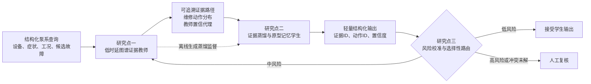
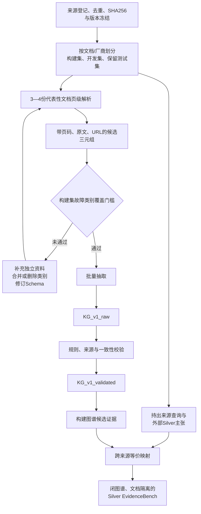
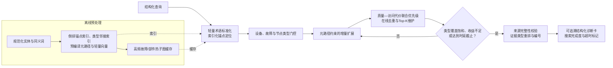
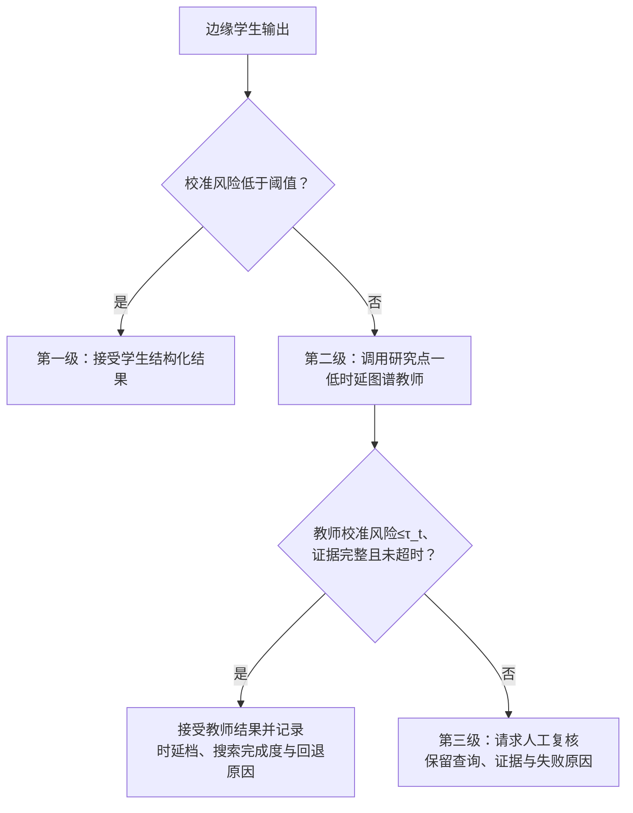
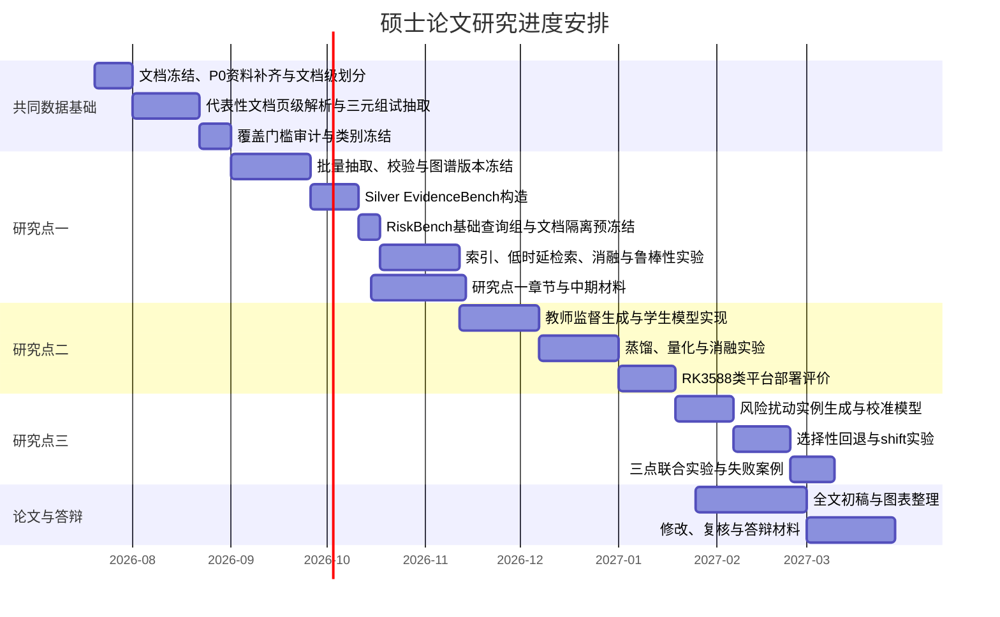

# 面向远洋船舶边缘端的机舱泵系故障证据增强辅助诊断方法研究

> 历史版本说明：本文保留用于记录2026年7月的方案演变，不再作为当前研究点编号和执行依据。后续统一遵循 [`MASTER_THESIS_THREE_RESEARCH_POINTS_PLAN.md`](MASTER_THESIS_THREE_RESEARCH_POINTS_PLAN.md)。

## 硕士论文研究规划（研究对象与研究目标调整修订版）

**版本：** V1.2  
**日期：** 2026年7月23日  
**研究对象：** 船舶机舱泵系  
**总体主线：** 低时延检索—蒸馏部署—风险控制

---

## 摘要

远洋船舶机舱泵系具有设备分散、故障传播链较长、公开传感器样本有限以及船端算力与通信条件受限等特点。单纯依赖大语言模型生成诊断说明，容易出现依据不清、机理跳跃和维修建议不可追溯等问题；在船端对大规模知识图谱执行无约束扩展、候选评分和结果序列化，又会带来明显的在线计算与尾时延开销。为此，本研究拟以船舶机舱泵系为统一研究对象，保留原研究方案中相互递进的三个研究点：首先，构建来源可追溯的泵系诊断知识图谱和 Silver EvidenceBench，研究低算力约束下的低时延图谱证据检索与自适应剪枝方法；其次，将图谱教师的证据选择和维修动作判断能力蒸馏到带原型记忆的边缘轻量模型；最后，面向高风险辅助诊断建立置信度校准、选择性回答和分级回退机制。三点分别解决“证据如何快速取得”“能力如何进一步轻量部署”和“错误如何控制”三个问题，共同形成从技术文档证据到船端风险可控输出的完整方法链。研究点一以目标硬件上的端到端检索时延为主优化目标，以证据质量、溯源完整性和峰值内存为约束；输出token数仅作为可选下游生成环节的次要诊断指标。

当前阶段只实施研究点一，但这属于研究次序安排，不代表删减研究点二和研究点三。截至2026年7月23日，已冻结文档级试验划分，并使用百炼 `qwen3.7-max` 完成4份代表性资料各1页的三元组试抽取；模型原始提出56条，31条通过候选阈值，其中23条达到当前Silver置信度阈值、8条待复核，25条因原文跨度无法验证而拒绝。MP008开发页仅保留2/23条原始提议，说明跨厂商表格迁移尚不稳定。构建集10类故障中尚无类别通过跨文档证据覆盖门槛，因此下一步是复核待审候选并围绕检查/维修证据、第二来源族和未覆盖故障类进行定向补抽，而不是批量构图。由于不进行全量人工标注，本研究形成的三元组、证据路径、查询标签和扰动样本均统一定义为 Silver 数据，相关实验结论也限定在 Silver 证据判据范围内。

**关键词：** 船舶机舱泵系；知识图谱；低时延证据检索；自适应剪枝；知识蒸馏；原型记忆；边缘部署；选择性回退

---

## 1 规划修订说明

本规划基于原研究方案重新编制，修订原则如下。

第一，论文仍由三个研究点构成，不将“当前先做研究点一”误解为“论文只做研究点一”。三点的主题和递进关系保持不变，即研究点一构建低时延、可追溯的图谱证据教师，研究点二构建边缘轻量学生，研究点三构建风险闸门。

第二，主研究对象由原方案中的通用机械设备、轴承及其公开信号数据，统一调整为船舶机舱泵系。泵本体、驱动电机、联轴器、轴承、机械密封、叶轮、吸排管路、阀件和过滤器均纳入系统边界；主机燃烧故障、整船全部辅机、液压泵以及货油泵危险品专属过程故障暂不作为主研究对象。

第三，研究逻辑由“信号分类后调用图谱生成报告”调整为“技术文档证据治理—低时延图谱证据教师—能力蒸馏—风险控制”。信号前端仅负责提供异常现象、工况和候选故障，不承担本论文的核心分类创新。

第四，同级旧目录 `Edge_Fault_LLM` 仅作为只读算法原型参考。旧轴承图谱、旧查询标签和旧实验结论不迁入新主数据线；可复用的仅是查询解析、领域门控、图扩散、路径评分、自适应剪枝和实验脚本等算法思想，并补充离线索引、提前终止、缓存及分阶段性能剖析，全部在新数据上重新实现和验证。旧原型中的token预算选择只可作为可选输出整理组件，不再承担研究点一的核心优化目标。

第五，数据建设采用“先划分、再抽取、后构图”的顺序。任何词法命中、模型生成内容或现有检索算法高分路径，都不能直接视为正确证据。全部自动或半自动构造标签统一称为 Silver。

---

## 2 研究背景、问题与总体目标

### 2.1 研究背景

船舶机舱泵系承担舱底排水、压载、海淡水冷却、消防和通用服务等功能。泵系故障往往涉及泵、电机、联轴器、密封、阀件、过滤器和管路之间的耦合，表现为无流量、低扬程、流量波动、振动、噪声、温升、泄漏或功率异常。实际辅助诊断不仅要给出候选故障，还应回答该判断由哪些症状支持、可能的原因和机理是什么、应继续检查什么以及应采取何种维护动作。

检索增强生成通过外部知识支持模型回答，为降低模型内部知识不足和事实幻觉提供了通用途径[1]。GraphRAG、KG引导检索和图结构问答进一步利用实体关系、子图或层次结构组织证据[2-6]。然而，面向机舱泵系的任务并不是开放域问答：其输入通常已经包含设备、工况、症状和候选故障，目标是从有限且可追溯的技术资料中快速取得逻辑完整、来源可靠的诊断证据。若先无约束遍历全部相关路径再做后置压缩，虽然最终输出可能较短，却不会减少前端锚点定位、邻接访问、路径生成和评分开销，因而不能证明在低算力条件下实现低时延。

另一方面，远洋船舶存在算力、内存、散热和网络可用性限制。研究点一首先在仍需在线访问图谱的前提下，通过索引、门控、受限增量扩展、提前终止和缓存降低检索时延；研究点二再将教师能力蒸馏到小型学生模型，取消大部分在线图访问，以适应更严格的边缘资源条件；研究点三通过置信度校准与选择性回退处理低置信、证据冲突和分布偏移场景。

### 2.2 总体研究定位

本论文不以“大语言模型直接替代传统故障分类器”为目标，而聚焦于候选故障已知或已由前端模块给出的条件下，如何完成船舶机舱泵系诊断证据的组织、轻量化内化与风险可控输出。总体定位可概括为：

> 面向船舶机舱泵系，以具有页级溯源的技术文档证据为基础，研究低算力约束下的低时延图谱证据检索与自适应剪枝方法，将证据选择能力进一步蒸馏到边缘轻量模型，并以校准和分级回退控制辅助诊断风险。

### 2.3 核心科学与工程问题

| 编号 | 核心问题 | 对应研究点 |
|---|---|---|
| RQ1 | 在候选故障、异常现象、设备和工况已知时，如何在受限CPU、内存和端到端时延条件下，通过索引、领域门控、受限扩展与提前终止快速取得相关、完整且可追溯的泵系图谱证据？ | 研究点一 |
| RQ2 | 如何将图谱教师的路径排序、证据类型覆盖和维修动作判断能力，蒸馏到可在 RK3588 类平台运行的轻量学生模型？ | 研究点二 |
| RQ3 | 如何利用模型不确定性和证据状态，在给定经验风险预算下决定直接回答、回退图谱教师或请求人工复核？ | 研究点三 |

### 2.4 总体目标

本研究拟完成以下总体目标：

1. 建立文档隔离、页级溯源、类型明确且可版本化的船舶机舱泵系诊断知识数据线。
2. 提出面向诊断元路径和来源可信度的低时延图谱检索与自适应剪枝方法，形成可在低算力环境评估和部署的结构化图谱教师。
3. 提出结合教师蒸馏和原型记忆的轻量学生模型，在尽量不在线访问完整图谱的条件下输出证据与维修动作。
4. 建立基于校准置信度的选择性辅助诊断与三级回退机制，在 Silver 判据下评价风险—覆盖率—成本关系。
5. 在统一的数据划分和统计协议下完成三点联合实验、RK3588类平台部署评价和失败案例分析。

---

## 3 相关研究基础与研究缺口

### 3.1 图结构检索与证据组织

RAG将外部检索结果与生成模型结合，奠定了知识增强生成的基本框架[1]。GraphRAG利用图索引及社区级信息支持局部和全局查询[2]；KG引导的RAG通过知识图谱扩展并组织检索片段[3]；GRAG和G-Retriever分别从图检索增强生成和成本感知子图检索角度推进了文本属性图问答[4-5]；LeanRAG进一步强调语义聚合和结构感知检索以减少无效搜索[6]。

上述工作主要面向通用问答和开放文本知识组织。船舶机舱泵系辅助诊断具有固定的“症状—原因/机理—故障—检查—维修”语义层级，并要求每条证据回溯到原文页码和来源。因此，本研究需要把通用图检索转化为具有诊断类型约束、来源约束和可审计输出的证据选择问题。

### 3.2 资源受限图检索、上下文整理与RAG评价

G-Retriever和LeanRAG表明，成本感知子图检索、语义聚合与结构约束可以减少无效搜索[5-6]。上下文压缩方法进一步说明，输出给生成模型的检索内容并非越多越好，选择性压缩可减少无关上下文和下游推理负担[8]；但减少最终上下文长度不等同于降低图谱在线检索时延。RAGAS与RAGChecker等工作强调将检索质量、证据支撑和生成质量拆分评价[9-10]，本研究在此基础上进一步将图访问规模、端到端时延和峰值内存独立报告。

在最终结构化证据卡的内容整理阶段，固定成本下选择覆盖充分且低冗余的证据集合与预算约束集合优化存在联系[7]。Sviridenko方法的近似保证要求目标函数满足非负、单调和次模等条件并采用相应算法[7]；本研究不以该问题作为研究点一的核心理论目标，也不据此推导低时延结论。若保留该启发式组件，只把它作为搜索结束后的次要输出整理方法，除非后续证明目标性质并实现匹配算法，否则不宣称具有相同近似保证。

### 3.3 知识蒸馏、参数记忆与边缘模型

知识蒸馏通过教师软分布向小模型传递类别关系和决策信息[11]。面向RAG的蒸馏研究进一步表明，教师可输出证据相关性或图结构监督，而不只提供最终答案[12-13]。工业文档通常包含表格、公式和图文结构，已有工作在造船和电气设备文档上验证了跨模态知识蒸馏到紧凑领域检索器的可行性[14]。

原型网络为类别原型和距离判别提供了经典基础[15]；参数化索引、TS-Memory与MEMTS则展示了将检索收益或领域规律内化到参数记忆中的不同思路[16-18]。其中，TS-Memory和MEMTS面向时间序列预测，不能直接证明泵系图谱证据蒸馏有效。本研究仅借鉴其“离线教师—参数化记忆—减少在线检索”的设计思想，并通过本任务实验重新验证。

### 3.4 校准、选择性预测与学习回退

神经网络的预测概率可能与真实正确率不一致，温度缩放等后校准方法可作为置信度校准基线[19]。选择性分类研究以风险—覆盖率关系刻画“模型何时回答”[20]；Learning to Defer进一步将无法可靠处理的样本转交外部决策者[21-22]。Conformal Risk Control为单调损失的期望风险控制提供了有限样本框架，但其基础条件包括交换性等假设，不能被解释为任意分布偏移下的安全保证[23]。

RAG场景中的不确定性还受到检索质量、证据缺失和上下文矛盾影响，单一生成概率难以充分反映回答正确性[24]。搜索增强系统在不可回答或证据不足场景下还可能出现过度搜索和拒答能力下降[25]。因此，本研究拟把“模型状态”和“证据状态”分开建模，并设计学生、图谱教师和人工复核之间的分级路由。该多源风险融合器属于本论文拟研究的方法，而不是对某一现成框架的直接复现。

### 3.5 研究缺口与论文切入点

现有研究为图检索、上下文整理、知识蒸馏和选择性预测分别提供了方法基础，但仍缺少一条面向船舶机舱泵系、以页级技术文档证据为核心、同时考虑船端低时延部署和风险回退的统一研究链。具体缺口包括：

1. 通用GraphRAG较少同时显式建模泵系诊断元路径、来源等级，以及低算力硬件上的节点/边访问规模、尾时延、峰值内存与证据类型覆盖。
2. 工业轻量化研究多聚焦最终类别或文本生成，较少蒸馏“证据路径分布—维修动作分布—来源可信度”等中间能力。
3. 选择性预测方法通常建立在独立、完整标签上，而本研究只能构造 Silver 数据，需要对相关扰动样本、文档分组和可声称的风险边界作更严格限制。
4. 现有研究较少在冻结硬件和统一查询负载下，同时报告证据正确性、端到端时延、资源占用以及回退后系统整体收益。

---

## 4 三研究点总体框架

三个研究点不是并列拼接，而是按“教师—学生—风险闸门”递进。研究点一提供可在低算力条件下在线运行的可追溯图谱证据教师及其软标签；研究点二把教师能力内化为基本不访问完整图谱的轻量学生；研究点三决定何时接受学生输出、何时调用研究点一的低时延图谱教师、何时转交人工。完整无剪枝搜索只作为同一候选空间和评分器下的高召回、高成本离线参照，不作为在线回退服务；若其发生超时或内存不足，按失败如实记录。



**图1 三研究点总体逻辑**

### 4.1 共同输入与输出

统一输入采用结构化查询：

```json
{
  "equipment_type": "self_priming_centrifugal_pump",
  "candidate_fault": "air_ingress_or_loss_of_prime",
  "observed_symptoms": ["no_flow", "unstable_discharge_pressure"],
  "operating_condition": {
    "service": "bilge",
    "valve_state": "reported_open"
  }
}
```

统一应用输出为结构化诊断卡，至少包含：

```text
candidate_fault
supporting_symptoms
cause_or_mechanism
inspection_actions
maintenance_actions
evidence_ids
confidence
need_fallback
```

自然语言说明只由上述结构化字段生成，不允许新增无证据支持的故障机理或维修动作。

### 4.2 研究范围边界

第一版系统纳入舱底泵、压载泵、海淡水冷却泵、消防泵、通用泵和甲板冲洗泵，以及与其直接连接的电机、联轴器、轴承、密封、叶轮、阀件、过滤器和吸排管路。第一版候选故障类别为：

1. 汽蚀；
2. 空气侵入或失去自吸；
3. 流道、叶轮、过滤器或管路堵塞；
4. 叶轮或耐磨部件磨损、损坏；
5. 机械密封失效与泄漏；
6. 轴承磨损、润滑不良或过热；
7. 泵—电机联轴器或轴系不对中；
8. 电机缺相、过载或电气驱动异常；
9. 管路或阀件泄漏、卡滞或完整性失效；
10. 干运转、错误操作或维护引入故障。

这些类别目前只是试抽取候选项。无流量、低扬程、流量波动、功率过大、温升、振动和噪声统一建模为 `Symptom`，不与 `FaultMode` 混为同级标签。最终类别数量以跨文档证据覆盖门槛为准。

---

## 5 共同数据基础与Silver治理方案

### 5.1 当前数据基础

截至2026年7月25日，新项目已收集并校验11份公开PDF，共1706页，来源覆盖ABS船级社资料以及DESMI、Grundfos、Sulzer、SPX FLOW/Johnson Pump和Xylem/Jabsco厂商手册[29-33,35-36]。另已登记MAIB事故报告来源，拟用于真实船舶工况、故障演化、处置动作和后果链构造[34]。文档级v2划分已冻结：9份本地文档进入构建集、1份进入开发集、1份进入非严格盲测保留集，另有4份尚未本地化的MAIB文档保持严格外部测试身份。词法覆盖结果只用于定位候选页面；在此基础上，已对MP001 PDF p.52、MP004 PDF p.11、MP005 PDF p.60和MP008 PDF p.26完成试抽取，4次模型调用均成功。模型原始提出56条，31条通过旧候选阈值；严格v2本地复验后仅3条保留为严格Silver候选、11条待复核、17条拒绝。该结果只说明小规模试抽取与严格校验流程已打通，不能视为正式图谱、证据路径集合或Silver EvidenceBench已经形成。

当前必须保持以下事实边界：

- 新船舶机舱泵系图谱尚未构建；
- Silver EvidenceBench尚未构建；
- 当前没有正式 `KG_v1_raw` 或 `KG_v1_validated` 版本；
- 10类故障的构建集三元组级覆盖门槛均未通过，MP008的开发集候选不计入门槛；
- 31条旧试抽取候选经严格v2复验后仅3条进入严格Silver候选层、11条待复核、17条拒绝；历史7条长跨度重建证据保持E3，不得通过事后定位升级为E1；这不是完整人工标注；
- 旧项目实验不能作为新对象上的效果结论；
- ESPset等离岸泵信号资料不得描述为船舶机舱真实运行数据，也不得作为本图谱的主标签来源。

### 5.2 文档级划分

数据必须在抽取和构图前按文档来源隔离。当前已冻结 `marine_pump_document_split_pilot_v1` 试验划分；待P0级MAIB资料落地、去重和版本登记后再发布正式划分版本：

| 数据子集 | 初步来源 | 用途 | 约束 |
|---|---|---|---|
| 构建/训练集 | ABS、DESMI | Schema试验、三元组抽取、主图谱构建、教师训练与蒸馏样本生成 | 必须独立通过构图覆盖门槛 |
| 开发集 | Grundfos | 抽取规则迁移检查、阈值选择、权重与超参数选择 | 不补足构建集覆盖数量，不进入最终测试统计 |
| 保留测试集 | Sulzer、MAIB | 跨厂商与真实事故来源迁移测试、最终Silver查询与标签构造 | 参数冻结前不得用于调参 |

保留测试文档不进入主图谱 `KG_v1_validated`。主测试采用“持出来源查询—构建图谱证据”的闭图谱迁移协议：从Sulzer/MAIB等持出文档形成查询场景与外部Silver主张，再由构建集中的独立资料提供可检索目标证据；两者通过冻结的跨来源等价映射关联。映射记录 `query_source_claim_id`、`target_graph_evidence_id`、故障/部件/证据类型一致性和蕴含判据，不以当前算法得分决定。若某项持出主张在构建图谱中没有独立等价证据，则不进入闭图谱主测试，只进入覆盖缺口分析。

在主模型、索引、阈值和硬件协议全部冻结后，可另建 `KG_v1_source_extension`，把持出文档的校验三元组追加到主图谱，评价真实新来源证据ID的检索能力。该来源扩展实验与闭图谱主测试分开编号、分开报告，不用扩展图谱结果回调主方法。



**图2 数据划分、试抽取与阶段门槛**

### 5.3 代表性文档试抽取

第一轮页级解析和试抽取已完成以下4份资料：

1. ABS《Guidance Notes on Equipment Condition Monitoring Techniques》PDF p.52，用于获得状态监测方法、失效模式和机理术语[29]；
2. DESMI T1345自吸离心泵操作维护手册PDF p.11，用于抽取结构化的故障—原因—措施表[30]；
3. DESMI T1542 NSL泵操作维护手册PDF p.60，用于检验同一厂商不同泵型之间的术语一致性[31]；
4. Grundfos消防泵系统安装运行资料PDF p.26，用作独立厂商开发来源，检查抽取规则的可迁移性[32]。

4个页面均已逐页渲染核对版面，模型调用4/4成功。模型原始提出56条，31条通过候选阈值并保留物理PDF页、印刷页、连续原文、来源URL和文档SHA；23条达到当前Silver置信度阈值，8条待复核，25条因原文跨度无法验证而拒绝。MP008只用于开发集迁移检查且仅保留2/23条原始提议，当前不能声称跨厂商表格迁移通过，其候选也不补足构建集门槛。后续扩展仍须同时保留正文段落和表格行列结构；禁止先拼接全篇文本再推测页码，跨页表格应保存页范围、表名、表头和行号等定位信息。

### 5.4 三元组与溯源Schema

每条候选三元组至少包含以下12个必需字段：

| 字段组 | 必需字段 | 说明 |
|---|---|---|
| 标识 | `triple_id` | 全局唯一标识 |
| 头实体 | `head`, `head_type` | 实体名称与类型 |
| 关系 | `relation` | 受Schema约束的有向关系 |
| 尾实体 | `tail`, `tail_type` | 实体名称与类型 |
| 来源 | `doc_id`, `page_or_section`, `evidence_text`, `source_url` | 文档、具体页码或页范围、连续原文与公开来源 |
| 质量 | `triple_confidence`, `extractor` | 置信度与抽取器版本 |

节点类型至少区分 `Equipment`、`Component`、`Symptom`、`Cause`、`FailureMechanism`、`FaultMode`、`InspectionMethod`、`InspectionAction`、`MaintenanceAction`、`OperatingCondition` 和 `Risk`。对于PDF资料，`page_or_section` 必须保存具体页码或页范围，章节名只能作为辅助定位；只有原始来源确实没有分页时才允许仅记录章节。推断边必须与原文直述边分开标记，Silver正例路径不能完全由推断边构成。

候选库可保留置信度不低于0.60的记录，以支持误差分析；进入高置信Silver证据层的记录原则上不低于0.80，并同时通过类型、关系方向、来源完整性和文本蕴含规则。具体阈值只可在开发集上调整。

### 5.5 故障类别覆盖门槛

正式覆盖门槛只使用构建/训练集资料计算；开发集只检查抽取规则和术语迁移性，其证据不用于补足构建集数量，保留测试集也不得用于决定类别去留。每个候选故障类别在进入批量构图前，必须同时满足：

- 至少5条症状证据；
- 至少3条原因或失效机理证据；
- 至少2条检查或维修证据；
- 上述证据来自至少2份相互独立的文档，并覆盖至少2个独立来源族。

证据条数按去重后的唯一“文档—页码范围—原文主张”计数，同一原文被不同抽取器重复抽取只能计1条。同一厂商、同一系列或沿用相同故障表模板的多份手册不能单独满足“独立来源”要求，例如两份DESMI手册可用于验证泵型间一致性，但仍需ABS等另一构建来源族支持。未达到门槛的类别应优先向构建集补充独立权威资料；若仍不足，则合并近义类别或从第一版研究范围中删除。不得用模型自行生成知识补足数量。

### 5.6 Silver EvidenceBench构造原则

覆盖门槛通过并冻结 `KG_v1_validated` 后，拟构造30—50条基础结构化查询，并为每条查询从构建图谱中冻结30—80条候选路径及Silver相关性判据。该冻结候选池只用于比较路径评分和排序质量；端到端低时延实验必须从“结构化查询 + 冻结图谱”开始，不能预先向方法提供候选路径。闭图谱主测试的Silver正例由持出文档中的明确故障表、规范性陈述或事故确认因果链，与构建图谱中的独立等价证据共同确定；正例不由当前检索算法的得分决定。困难负例包括同症状异故障、同部件异机理、弱关系路径、不可追溯路径和与目标故障无关的近邻事件链。

评价基准与蒸馏训练语料严格分离。30—50条基础查询只承担独立证据质量评价；另由构建/开发范围内的未标注结构化查询形成较大性能回放负载，仅用于时延、吞吐和资源测量，不产生新的质量样本。研究点二的蒸馏语料拟由冻结的研究点一教师仅在构建/训练文档上生成，规模初步设为1000—3000条实例，不得用保留测试文档扩充训练量。

---

## 6 研究点一：低算力约束下的船舶机舱泵系低时延图谱证据检索与自适应剪枝

### 6.1 研究目标

研究点一拟构建可在RK3588类低算力平台上独立运行、可评估且可追溯的图谱证据教师。给定候选故障、观察症状、设备类型和运行工况，方法从冻结的泵系知识图谱出发，在检索过程中主动减少无效锚点、邻接访问、候选路径生成和重复评分，以较低端到端时延返回覆盖症状、原因/机理、检查和维修信息的高质量证据集合。

本研究点的主目标是“低算力条件下仍能低时延运行”，而不是压缩Token。核心计时终点为带证据编号和溯源字段的结构化诊断卡；其序列化采用确定性程序，不依赖大语言模型。可选自然语言润色不计入核心检索时延，单独报告其延迟和输入Token数，避免用文本变短替代对图访问和在线计算的真实测量。

### 6.2 方法流程



**图3 研究点一方法流程**

拟采用的诊断元路径包括但不限于：

```text
Symptom → FailureMechanism → FaultMode
Symptom → Cause → FaultMode
OperatingCondition → Cause → FailureMechanism → FaultMode
FaultMode → InspectionAction → Component
FaultMode → MaintenanceAction → Component
FaultMode → Risk
```

元路径只限定合法诊断语义，不预先规定某条具体路径一定正确。最大跳数暂设为4跳，但不要求每个查询走满；候选上限、每层扩展宽度和跳数均作为开发集超参数，并受在线提前终止规则控制。离线阶段预计算规范化实体、类型化邻接表、元路径可达索引和可选轻量向量；在线阶段优先使用词法锚点，只有锚点置信不足时才调用小型查询编码器。NPU若被使用，仅承担该轻量编码，不把大模型生成混入图检索计时。

### 6.3 路径评分

设结构化查询为 \(q\)，候选证据路径为 \(p\)，路径评分拟写为：

\[
s(p\mid q)=
\alpha r_{\mathrm{rel}}
+\beta r_{\mathrm{fault}}
+\gamma r_{\mathrm{meta}}
+\delta r_{\mathrm{edge}}
+\epsilon r_{\mathrm{source}}
-\eta c_{\mathrm{len}}
-\zeta c_{\mathrm{infer}}
\]

其中，\(r_{\mathrm{rel}}\) 表示查询语义相关性，\(r_{\mathrm{fault}}\) 表示与候选故障的一致性，\(r_{\mathrm{meta}}\) 表示诊断元路径有效性，\(r_{\mathrm{edge}}\) 表示关系强度，\(r_{\mathrm{source}}\) 表示来源可靠性；\(c_{\mathrm{len}}\) 和 \(c_{\mathrm{infer}}\) 分别惩罚过长路径和推断边占比。该式刻画证据质量，不把路径长度惩罚解释为真实运行时。在线队列优先级另加入预计邻接访问次数、剩余元路径分支数和缓存命中状态等代价代理，最终效率结论只依据冻结硬件上的实测时延与资源占用。

### 6.4 时延与资源约束下的自适应搜索控制

对查询 \(q\)、图谱 \(G\)、目标硬件 \(h\) 和检索策略参数 \(\theta\)，核心端到端时延定义为：

\[
T_{\mathrm{e2e}}
=T_{\mathrm{norm}}
+T_{\mathrm{anchor}}
+T_{\mathrm{expand}}
+T_{\mathrm{score}}
+T_{\mathrm{select}}
+T_{\mathrm{serialize}} .
\]

研究点一的主要优化目标为降低目标查询分布上的尾时延：

\[
\theta^\ast=
\arg\min_{\theta}
\operatorname{P95}_{q}
\left[T_{\mathrm{e2e}}(q;G,h,\theta)\right],
\]

\[
\text{s.t.}\qquad
\mathrm{EvidenceRecall@K}\ge R_0,\quad
\mathrm{TypeCoverage}\ge C_0,\quad
\mathrm{ProvenanceComplete}=1,\quad
\mathrm{CompletionRate}\ge A_0,\quad
\mathrm{TimeoutRate}\le \tau_0,\quad
M_{\mathrm{peak}}\le M_0 .
\]

其中，\(\theta\) 包括锚点候选上限、最大跳数、逐层扩展宽度、候选队列容量、提前终止阈值和缓存策略；\(R_0\)、\(C_0\)、\(A_0\)、\(\tau_0\) 与 \(M_0\) 在开发阶段依据任务需求和目标硬件冻结，保留测试集不得用于回调阈值。对查询 \(q\)，只有返回非空证据、覆盖其预注册必需证据类型、全部证据溯源完整且未超时，才记为完成；`CompletionRate`为完成查询比例。`ProvenanceComplete=1`要求每条非空返回证据均包含文档ID、页码或章节、连续原文和来源URL，空结果不能据此视为满足约束。若时延截止前无法满足最低证据类型覆盖，系统必须返回 `incomplete=true` 或 `timeout=true`，不得以无来源内容补齐结果；该查询计为未完成，缺失证据计为假阴性，且不得从质量或时延统计中剔除。

第 \(t\) 轮增量扩展后，若必需证据类型已经覆盖，且基于当前评分器估计的未访问前沿质量增益上界低于阈值 \(\varepsilon\)，或绝对截止时间 \(D\) 已到，则停止搜索；若类型仍不完整，则按缺失类型执行定向扩展，直至达到截止时间。该估计量只用于工程提前终止，不宣称是未经证明的严格数学上界。实验拟观察100、250和500毫秒三个查询截止档，并同时报告不设硬截止时的连续质量—时延Pareto曲线。若某档在目标硬件上不可达到，该档按超时结果保留，不事后移动门槛；同一截止档内的所有在线方法使用相同外部超时、硬件、线程和缓存条件。

结构化序列化优先保留原文短句、关系链、文档ID、页码和来源URL。输出证据长度及Token数可作为下游显示或生成成本的次要指标，但不作为研究点一的优化变量、约束条件或主实验横轴。

### 6.5 对照实验与消融

核心对照方法包括：

1. 关键词/BM25文本检索；
2. 稠密向量检索；
3. 完整无剪枝图搜索，作为同一候选空间与评分器下不设硬截止的高召回、高成本离线参照；
4. 无类型约束的固定跳数图扩散与路径得分Top-K；
5. 仅使用设备、故障和节点类型门控的受限扩展；
6. 旧原型自适应剪枝思想在新数据上的重新实现；
7. 完整的“离线索引 + 领域门控 + 元路径增量扩展 + 代价感知优先级 + 提前终止 + 缓存”方法。

消融实验分别移除离线索引、领域门控、元路径约束、候选故障一致性、来源可靠性、在线去重、提前终止和热子图缓存；另以固定跳数、固定扩展宽度和固定Top-K替换自适应剪枝，判断各模块对证据质量、尾时延和内存的独立贡献。噪声鲁棒性分为两种协议：在冻结候选池中加入20%、50%和70%干扰路径时只评价排序质量；在冻结图谱副本中加入相同比例干扰边并从结构化查询开始运行时，才同时评价证据质量、端到端时延和资源退化。

### 6.6 评价指标与统计协议

评价采用“证据质量轨”和“端到端性能轨”两条相互关联但不混用的协议：

- 证据质量指标：`Evidence Recall@K`、`Precision@K`、MRR、nDCG、Silver路径保留率、证据类型覆盖率、来源完整率、来源多样性、冗余率、无效关系比例、维修动作命中率和逐故障类别结果；
- 低时延与资源指标：单查询端到端p50/p95、性能回放总体p99、超时率、查询吞吐量、锚点数、访问节点/边数、邻接表访问次数、生成/评分/保留的候选路径数、缓存命中率、峰值RSS、CPU占用，以及硬件可测时的能耗；
- 分阶段计时：分别报告术语标准化、锚点定位、图扩展、路径评分、集合选择和结构化序列化耗时，以定位性能瓶颈；
- 缓存条件：冷启动/冷缓存与预热后的热缓存结果分开报告，不用热缓存均值掩盖冷启动尾时延；
- 应用层指标：诊断卡的证据支持率、无支持陈述率、JSON有效率及可选自然语言模块的单独时延和Token数。

目标硬件、CPU线程数、频率或功耗模式、可用内存、存储介质、图存储实现、索引版本和缓存容量在测试前冻结。主结果采用CPU受限配置，可选NPU查询编码器作为单独扩展；不同线程配置分开报告。每个方法对每条性能查询在5次预热后重复运行至少30次，冷启动以独立进程首次查询重复至少30次；重复运行只用于估计时延分布，不作为额外质量样本。30—50条Silver基础查询用于质量统计，较大的无标注性能回放负载用于吞吐和稳定性测试。单查询热态报告p50/p95；p99只在每个“方法—硬件—线程—缓存”配置累计不少于1000次独立请求的性能回放总体上报告。冷启动不足1000次时只报告p50/p95和完整分布，不声称稳定p99。超时运行以预注册外部截止值计入时延分布，同时单独报告超时率，不删除或用已完成子集重算p95。

统计比较采用以基础查询为单位的配对bootstrap或非参数配对检验，报告95%置信区间；涉及同一文档的查询时，另进行文档分组bootstrap。大模型裁判不得作为主结论的唯一依据。预注册的首版验收目标为：在相同硬件、线程、缓存和外部截止条件下，相对满足相同质量约束的最强固定范围图检索基线，完整方法的p95端到端时延降低至少30%，`Evidence Recall@5`下降不超过3个百分点，完成率不降低，返回证据溯源完整率为100%，峰值RSS不高于对照。完整无剪枝搜索只提供高召回、高成本离线参照，不能被表述为质量或成本的数学上界。该阈值属于待验证目标；若未达到，则如实报告失败，不宣称获得低时延优势。

### 6.7 研究点一预期交付

- 冻结的文档划分与 `source_docs_v1`；
- 页级解析语料和试抽取覆盖报告；
- `KG_v1_raw` 与 `KG_v1_validated`；
- 30—50条基础查询构成的 Silver EvidenceBench；
- 冻结的目标硬件、性能回放负载与分阶段计时协议；
- 可复现实验配置、证据质量—时延—资源结果和统计检验；
- 结构化诊断卡示例及完整证据追溯链。

---

## 7 研究点二：基于图谱证据蒸馏与原型记忆的边缘轻量化辅助诊断模型

### 7.1 研究目标

研究点二在研究点一低时延图谱教师冻结后开展。研究点一解决“仍在线访问图谱时如何降低动态搜索开销”，研究点二则进一步解决“如何取消大部分在线图访问”。其目标不是再实现一套在线GraphRAG，也不是直接训练小型生成模型复写长诊断报告，而是在候选故障已经由输入给定的条件下，将教师的高分证据路径、证据类型覆盖、维修动作分布和置信代理蒸馏到轻量学生，使其在不在线访问完整图谱或仅使用极小缓存的条件下，直接输出证据ID、维修动作ID和回退置信度。核心学生不设置故障分类头，也不把候选故障分类准确率作为论文指标。

### 7.2 教师监督与数据构造

教师仅在构建/训练文档形成的图谱上生成蒸馏监督：

```text
soft_path_distribution
action_distribution
evidence_type_distribution
source_reliability
teacher_confidence_proxy
```

蒸馏训练语料拟构造1000—3000条实例，可通过症状组合、工况扰动、候选故障困难负例和证据遮蔽扩展，但必须以基础查询和源文档为组进行划分。Silver EvidenceBench中的独立评价查询不得回流训练。

### 7.3 学生模型结构

主方案采用“轻量文本编码器 + 原型记忆 + 多任务结构化头”：

- 轻量编码器将设备、症状、工况和候选故障编码为查询向量；
- 原型记忆按故障、机理、证据类型和维修动作维护若干可学习原型；
- 证据头预测路径或证据ID分布；
- 动作头预测检查与维修动作；
- 置信头输出供研究点三校准的风险特征；
- 可选重构头约束学生保留教师证据结构。

板端随模型固化一个只读的小型证据字典，用于把构建图谱中的高频证据ID和动作ID映射为 `evidence_text / doc_id / page_or_section / source_url` 及可显示的维修动作；该字典不是完整图谱，不执行在线扩散。学生主实验采用闭集ID协议：证据ID输出空间在训练前冻结，持出查询和外部主张可完全未见，但其目标必须通过跨来源等价映射落到冻结字典和学生训练标签空间中已有的构建图谱证据ID，评价的是未见查询对已知证据类别的泛化，而不是发现新证据ID。字典版本与学生模型绑定且不可在测试期间改写；`KG_v1_source_extension` 中新增的持出来源证据ID不用于学生ID头主指标，只用于评价学生的分布外识别与回退，以及研究点一教师对新来源证据的检索能力。

设教师与学生的证据分布分别为 \(p_t(e\mid x)\) 和 \(p_s(e\mid x)\)，动作分布分别为 \(q_t(a\mid x)\) 和 \(q_s(a\mid x)\)，综合损失拟定义为：

\[
\begin{aligned}
\mathcal L ={}&
\lambda_{\mathrm{task}}\mathcal L_{\mathrm{task}}
+\lambda_{\mathrm{kd}}T^2\mathrm{KL}(p_t^{(T)}\Vert p_s^{(T)})\\
&+\lambda_{\mathrm{act}}T^2\mathrm{KL}(q_t^{(T)}\Vert q_s^{(T)})
+\lambda_{\mathrm{rec}}\mathrm{BCE}(z_{\mathrm{path}},\hat z_{\mathrm{path}})\\
&+\lambda_{\mathrm{proto}}\mathcal L_{\mathrm{prototype}}
+\lambda_{\mathrm{conf}}\mathcal L_{\mathrm{Brier}} .
\end{aligned}
\]

其中，\(\mathcal L_{\mathrm{task}}\) 是证据与动作的多标签任务损失，不包含候选故障分类；蒸馏项传递教师路径和动作排序，重构项约束关键证据保留，原型损失使查询接近当前候选故障条件下的机理/动作原型，Brier项为后续校准提供可用的置信输出。

### 7.4 边缘部署路线

目标硬件为RK3588类平台。Rockchip公开资料显示RK3588集成CPU与NPU，并提供Linux/Android支持[26]；RKNN-Toolkit2支持模型转换、推理和性能评估，适合编码器、MLP和原型模块部署[27]。因此，主部署路线拟采用：

```text
PyTorch训练
→ ONNX导出
→ RKNN转换
→ INT8后训练量化
→ 实板精度与性能复测
→ 必要时进行量化感知训练
```

生成式小模型只作为扩展对照。若需要本地语言润色，将优先验证官方工具链和实际板卡已支持的Qwen2-0.5B或Qwen2.5-1.5B等型号，并通过RKLLM完成兼容性测试[28]；任何官方通用基准速度都不能替代本任务实板测量。

### 7.5 对照、指标与验收目标

对照方法包括Student-MLP、Student-Encoder、Encoder+KD、Encoder+Prototype、Encoder+KD+Prototype、研究点一低时延教师，以及只作高召回、高成本离线参照的完整无剪枝搜索。消融分别移除路径蒸馏、动作蒸馏、原型记忆、证据重构和置信头。

能力指标包括 `Evidence Recall@K`、`Evidence Macro-F1`、`Action Hit@K`、`Action Macro-F1`、教师—学生KL、路径排序一致性和原型覆盖率；工程指标包括参数量、模型文件体积、p50/p95延迟、峰值内存、CPU/NPU占用和失败率。首版工程目标暂定为：学生相对研究点一低时延教师的核心证据/动作指标下降控制在5个百分点以内，同时在端到端延迟或峰值内存上进一步获得至少2倍改善。最终数值在研究点一硬件协议和教师实现冻结后预注册，不依据研究点二测试结果回调。该目标属于待实验证实的验收阈值，不作为预设结论。

### 7.6 研究点二预期交付

- 独立于评价基准的蒸馏训练语料；
- 冻结的教师软标签缓存；
- 轻量学生、原型记忆和多任务蒸馏实现；
- 量化前后精度退化曲线；
- RK3588类平台部署日志、延迟和内存结果；
- 教师、学生及消融方法的能力—成本对比。

---

## 8 研究点三：面向高风险船舶泵系场景的置信度校准与选择性回退

### 8.1 研究目标

研究点三解决“边缘学生输出不可靠时如何处理”的问题。系统不以无条件回答为目标，而是在给定经验风险预算下最大化可接受查询覆盖率，并将高风险样本依次回退到本地图谱教师和人工复核。

### 8.2 多源风险特征

第一级学生风险融合器拟使用：

- 预测熵、类别间隔和证据/动作分布集中度；
- 查询到最近故障、机理和动作原型的距离；
- 原型覆盖率与训练分布外检测分数；
- 预测证据类型完整性；
- 预测来源可靠性与冲突代理；
- 输入缺失、症状矛盾和设备—故障不匹配特征。

调用研究点一教师后，可进一步使用检索得分间隔、来源多样性、证据矛盾率、时延截止前的证据类型覆盖率、搜索完成度、提前终止裕量、是否超时和教师—学生一致性，决定接受教师结果还是转交人工。由此避免在所有样本上先运行图谱教师再判断学生是否可靠。

### 8.3 校准与选择性决策

设结构化损失 \(\ell(x)\) 综合候选故障已知条件下的证据选择错误、维修动作错误和关键证据类型缺失。学生接受门和教师接受门必须分开定义：

\[
g_s(x;\tau_s)=
\mathbb I[\widehat r_s(x)\le \tau_s],
\]

\[
g_t(x;\tau_t,D)=
\mathbb I[
\widehat r_t(x)\le \tau_t,\ 
\mathrm{Completion}_t(x;D)=1,\ 
\mathrm{Timeout}_t(x;D)=0
].
\]

其中，\(\widehat r_s\) 由学生置信、原型距离和输入状态得到，\(\widehat r_t\) 由教师证据得分、来源、冲突和搜索状态得到，\(D\) 为教师时延档。级联路由为：

\[
\mathrm{Route}(x)=
\begin{cases}
\mathrm{student}, & g_s(x;\tau_s)=1,\\
\mathrm{teacher}, & g_s(x;\tau_s)=0,\ g_t(x;\tau_t,D)=1,\\
\mathrm{human}, & \text{otherwise}.
\end{cases}
\]

令 \(a(x)=\mathbb I[\mathrm{Route}(x)\ne\mathrm{human}]\)，最终级联覆盖率与接受结果风险定义为：

\[
\mathrm{Coverage}_{\mathrm{cas}}=
\Pr[a(x)=1],\qquad
\mathrm{Risk}_{\mathrm{cas}}=
\mathbb E[\ell_{\mathrm{Route}}(x)\mid a(x)=1].
\]

其中，\(\ell_{\mathrm{Route}}\) 表示级联中最终被接受层输出相对于Silver证据与动作判据的结构化损失。研究目标是在经验风险上限 \(\rho\) 下选择阈值对 \((\tau_s,\tau_t)\)，最大化最终级联覆盖率，并同时报告学生直接接受率、教师条件接受率、人工转交率和总计算成本。首先比较未校准置信度、温度缩放、等渗回归（isotonic regression）和多源风险融合；随后在满足损失单调性、校准样本交换性等条件时研究Conformal Risk Control阈值[23]。跨厂商、跨文档和故障类别偏移单独设置shift split，报告目标风险超限率，不宣称在任意偏移下仍具有分布无关保证。

### 8.4 三级回退机制



**图4 选择性辅助诊断与三级回退**

该机制默认公网不可用。主实验在同一RK3588类设备上部署轻量学生、小型证据字典和研究点一低时延图谱教师：学生常态运行，只有风险闸门触发时才启动图谱检索。教师的“正常时限档”和“放宽时限的质量优先档”首先作为两种独立、预注册的回退策略比较，结果不混算；若增加“正常档失败后再尝试放宽档”的顺序重试，则作为第三种级联策略单列，端到端回退时延必须包含第一次检索、路由判断、第二次检索及任何索引加载时间。

同板实验同时报告学生、字典、图谱与索引的常驻内存，教师调用期间的峰值内存，以及按需加载方案的冷加载和首次查询时间，不能只报告已加载后的热态调用成本。若实际船载条件允许使用同船上位机、机舱工控机或维护工作站，则把更大索引或质量优先教师作为扩展实验，单独报告其硬件配置、局域网传输成本和回退收益，不与单板结果混算。完整无剪枝搜索仍只作为同一候选空间与评分器下的高召回、高成本离线参照，不进入在线回退链；其超时或内存不足照实记录。人工复核是高风险或证据冲突样本的最终出口，系统只提供证据化辅助，不替代船员、轮机管理人员或专业维修人员的责任判断。

### 8.5 扰动数据与评价协议

风险评价另建两套互不混用的数据：

1. `RiskBench-Silver-ID` 用于同分布校准与测试。在研究点二生成蒸馏样本之前，预先从ABS/DESMI等具有多份文档的同一来源族中冻结60—80个校准基础查询组和40—60个ID测试基础查询组；其目标证据必须存在于已经冻结的构建图谱、只读证据字典和学生训练标签空间中，但对应基础查询、查询模板、外部主张及全部变体不得进入学生或风险模型训练。该协议评价未见查询对闭集证据ID的泛化，不评价学生发现新ID。校准与ID测试按整份文档分组、按来源族分层，同一文档、原文主张、基础查询及其变体不得跨集合。风险训练数据使用剩余蒸馏训练池，学生与风险模型固定后才能使用校准组确定阈值。只有该同来源族、文档隔离的ID测试用于讨论Conformal Risk Control。
2. `RiskBench-Silver-Shift` 用于跨来源经验测试，直接采用从Sulzer/MAIB持出文档形成的30—50条Silver EvidenceBench查询，并以闭图谱协议下冻结的跨来源等价证据映射作为主判据。实际Sulzer/MAIB新证据ID只在全部方法与阈值冻结后的 `KG_v1_source_extension` 扩展实验中使用；固定ID学生在该扩展中只评价分布外识别与是否正确回退，新ID检索能力只评价研究点一教师。该部分只报告校准迁移、经验风险超限和回退表现，不主张标准conformal保证。

在上述基础查询上总计构造400—800个风险实例。每个基础查询使用同一套预注册扰动协议，包括1个无扰动版本和固定数量的症状缺失、症状冲突、设备替换、候选故障错误、来源降级、证据遮蔽、噪声路径注入或分布外表述版本；所有基础组的扰动类型、数量和强度层级保持一致，避免组级最大损失随变体数量变化。由同一基础查询派生的实例不是相互独立的统计样本，因此数据划分及bootstrap必须以基础查询和源文档为组；有效样本量按基础组数量解释，不能用扰动数量夸大统计证据。

Conformal Risk Control以“基础查询组”而不是单个扰动为交换单位。主要组级损失预注册为同组全部版本结构化损失的最大值 \(L_g=\max_{v\in V_g}\ell(v)\)，以固定权重平均组损失作为敏感性分析。ID校准池少于60个不同基础查询组时，Conformal Risk Control只作为探索性结果。受最终每类基础查询数限制，逐故障类别ECE、逐类风险控制和来源级shift超限率统一作为描述性分析；除非后续能够为每个类别补充至少20个独立基础查询组，否则不作稳定的逐类统计推断。

主要指标包括ECE、Brier Score、NLL、AURC、固定风险下覆盖率、固定覆盖率下风险、回退率、回退纠错率、人工转交率、平均调用成本、最坏故障类别召回率和shift下风险超限率。对照策略包括始终接受学生、始终调用教师、原始最大概率阈值、只用模型熵、只用原型距离以及完整多源风险融合。

### 8.6 风险结论边界

由于本研究不进行全量人工标注，研究点三的“正确性”和“风险”均相对于Silver证据与动作判据定义。即使在测试中满足目标风险，也只能说明系统对当前公开文档构造的Silver任务具有相应经验表现，不能据此宣称获得真实船舶运行安全保证或替代法定检验、维修规程和人工决策。

### 8.7 研究点三预期交付

- 风险特征与校准数据集；
- 置信度校准和多源风险融合器；
- 风险—覆盖率曲线、AURC与风险超限统计；
- 学生—教师—人工三级回退策略；
- 扰动、跨来源偏移和典型失败案例分析；
- 回退收益与额外计算成本对比。

---

## 9 三研究点联合实验与可复现性

### 9.1 联合实验矩阵

| 系统形态 | 在线图谱 | 边缘学生 | 风险回退 | 主要回答的问题 |
|---|---:|---:|---:|---|
| 文本/BM25基线 | 否 | 否 | 否 | 无图结构时能检索多少有效证据 |
| 完整无剪枝搜索 | 是 | 否 | 否 | 同一候选空间/评分器下的高召回、高成本离线参照 |
| 常规固定范围图检索 | 是 | 否 | 否 | 固定跳数/Top-K在低算力设备上的质量与时延 |
| 研究点一低时延教师 | 是 | 否 | 否 | 自适应剪枝是否改善质量—时延—资源关系 |
| 轻量学生 | 否或极小缓存 | 是 | 否 | 蒸馏后保留多少教师能力 |
| 学生+低时延教师回退 | 按需 | 是 | 是 | 选择性调用是否减少风险和平均成本 |
| 学生+图谱+人工 | 按需 | 是 | 是 | 高风险级联能否形成完整失败出口 |

联合比较至少报告五组核心结果：完整无剪枝搜索、常规固定范围图检索、研究点一低时延教师、轻量学生、学生+分级回退。三点之间使用同一查询标识、文档划分、证据Schema和可比硬件剖析协议，以避免不同实验口径无法对齐。

### 9.2 可复现要求

1. 原始PDF只读保存，记录来源URL、版本、下载日期和SHA256。
2. 页级解析、表格抽取、三元组生成、校验、构图和基准生成均提供可重复命令入口。
3. 图谱、词表、查询、候选路径、Silver标签和模型分别版本化。
4. 每次实验保存随机种子、配置、代码版本、数据版本和运行环境。
5. 开发集只用于阈值与超参数选择；测试集结果不得反向修改方法。
6. 同时报告全量Silver集和高置信Silver子集，分析结论对标签质量的敏感性。
7. 所有涉及相关扰动的数据分析均按基础查询或文档分组。
8. 旧目录不作为运行时依赖，复现实验必须在 `Fault_llm_v2` 内独立完成。

---

## 10 可行性、主要风险与应对策略

| 风险 | 可能表现 | 应对与停止条件 |
|---|---|---|
| 公开资料覆盖不足 | 部分故障只有症状，缺少原因或维修证据 | 先补充独立资料；仍未达门槛则合并或删除类别，不进入批量构图 |
| 自动抽取误差较高 | 类型混淆、关系反向、表格行错配 | 强制页级原文、Schema规则、多抽取器一致性和抽样审计；低置信记录不进入高置信Silver层 |
| 查询—证据泄漏 | 同一文本被改写成查询又作为证据 | 先按文档/厂商划分；查询、标签和证据生成遵守来源隔离 |
| 剪枝漏失关键证据 | 尾时延下降但关键机理或维修路径召回明显降低 | 设置质量硬约束、缺失类型定向扩展和 `incomplete` 标记；未满足质量门槛不宣称有效 |
| 时延代理与真实运行时不一致 | 访问代价评分改善但实板p95不降 | 只以冻结目标硬件的端到端实测为主结论，并分阶段剖析锚点、扩展、评分、序列化耗时 |
| 冷缓存、图规模或负载导致尾时延恶化 | 热缓存均值良好但首次查询、扩图或并发时超时 | 分开报告冷/热缓存，设置图规模和并发敏感性实验；超时结果不剔除 |
| 索引与缓存占用过大 | 时延降低但峰值内存超出板端预算 | 同时约束峰值RSS，比较索引粒度与缓存容量；必要时采用分区索引和只读热子图 |
| 学生蒸馏收益不足 | 精度下降大且成本优势有限 | 优先采用编码器+结构化头；减少生成任务；保留按需图谱回退 |
| 原型记忆长尾不足 | 少见故障或新措辞距离过大 | 使用多原型、困难负例和OOD检测；低覆盖样本进入回退 |
| RK3588工具链受限 | 转换失败、量化退化、延迟不稳 | 先完成ONNX/x86基线，再迁移RKNN；必要时采用QAT或缩减模型 |
| 校准在偏移下失效 | 跨厂商时选择性风险超限 | 设置独立shift split，报告超限率并提高回退；不扩大理论保证范围 |
| Silver标签存在系统偏差 | 风险曲线过度乐观 | 分层报告置信度、来源类型和故障类别；加入人工抽查与失败案例，不使用安全保证措辞 |
| 研究进度失衡 | 研究点一数据建设占用过多时间 | 以覆盖门槛控制类别规模；研究点二采用结构化轻量模型；研究点三优先实现可复现的后校准与路由基线 |

---

## 11 研究进度与阶段成果

研究按“先证据基准、再蒸馏部署、后风险控制”的依赖关系推进。研究点二与研究点三保留在论文中，但只有在其上游交付冻结后才进入正式实验。



**图5 研究进度安排**

阶段性成果安排如下：

| 阶段 | 关键交付 | 进入下一阶段的门槛 |
|---|---|---|
| 数据试验阶段 | 文档划分、4份页级解析、候选三元组、覆盖报告 | 核心故障类别达到跨文档覆盖标准 |
| 研究点一 | 两个图谱版本、Silver EvidenceBench、RiskBench基础查询组划分、低时延检索与资源结果 | 教师协议、硬件剖析协议、RiskBench组与测试划分冻结 |
| 研究点二 | 蒸馏语料、学生模型、量化与板端结果 | 学生输出和置信特征稳定可复现 |
| 研究点三 | 校准器、风险曲线、三级回退与偏移实验 | 联合实验、统计和失败案例完整 |
| 论文整合 | 三个方法章节、总实验与局限性分析 | 引用、数据版本和全部结论可追溯 |

---

## 12 预期创新点、成果形式与论文结构

### 12.1 预期创新点

以下内容为拟研究与待验证贡献，不作为已经取得的结论：

1. **面向低算力船端的可追溯低时延图谱证据检索。** 将离线索引、诊断元路径、故障与类型门控、访问代价感知优先级、增量扩展和提前终止统一到在线图检索流程，在证据质量、峰值内存和溯源完整性约束下优化端到端尾时延。
2. **面向边缘端的图谱证据蒸馏与原型记忆。** 不只蒸馏最终故障标签，而是联合蒸馏路径排序、维修动作和证据结构，使学生在减少在线图谱调用的同时保留可解释诊断能力。
3. **面向Silver证据任务的分组校准与分级回退。** 将模型不确定性、原型覆盖和证据状态结合，在相关扰动和跨来源偏移下评价风险—覆盖率—成本，并形成学生、图谱教师和人工之间的三级路由。
4. **统一的能力—成本—风险评价协议。** 在同一文档划分与查询体系下连接证据检索、边缘部署和风险控制，避免只比较生成文本观感或单一准确率。

### 12.2 预期成果形式

- 船舶机舱泵系页级技术文档语料与来源审计清单；
- 版本化诊断知识图谱及完整溯源索引；
- 文档隔离的 Silver EvidenceBench；
- 低算力低时延图谱证据教师；
- 原型记忆轻量学生及RK3588类平台部署结果；
- 校准与三级回退模块；
- 可重复实验代码、配置、统计结果和典型案例；
- 硕士学位论文及相应阶段论文/技术报告。

### 12.3 建议论文结构

| 章节 | 主要内容 |
|---|---|
| 第1章 绪论 | 研究背景、对象调整、问题定义、研究内容与论文结构 |
| 第2章 相关理论与技术 | 泵系故障知识、GraphRAG、图索引与搜索剪枝、蒸馏、原型学习、校准与回退 |
| 第3章 数据治理与实验基础 | 文档划分、页级解析、Schema、图谱、Silver EvidenceBench和评价协议 |
| 第4章 低算力约束下的低时延图谱证据检索与自适应剪枝 | 研究点一方法、硬件剖析、实验、消融与鲁棒性 |
| 第5章 图谱证据蒸馏与边缘轻量模型 | 研究点二方法、蒸馏、量化和部署评价 |
| 第6章 置信度校准与选择性回退 | 研究点三方法、风险—覆盖率、偏移和失败案例 |
| 第7章 三点联合系统与综合实验 | 教师、学生、回退联合比较和典型泵系案例 |
| 第8章 总结与展望 | 结论、局限、真实船舶数据与多设备扩展 |

---

## 13 近期立即执行的工作

正式方法实验开始前，按以下顺序推进：

1. 补齐并登记P0级MAIB事故报告，完成全部资料去重、版本和SHA256记录；
2. 保持 `marine_pump_document_split_pilot_v1` 冻结，P0资料落地后发布新的正式划分版本；
3. 复核当前8条待复核候选，保留二次AI语义审计发现的错误关联降审记录；
4. 针对检查/维修证据、第二来源族及当前为零的故障类，从构建集文档和已选页相邻页面定向补抽；
5. 在构建集内按规范化实体和“文档—PDF页—连续原文跨度”去重，重新统计症状、原因/机理、检查和维修证据及独立文档、来源族数量，并以开发集单独检查规则迁移性；
6. 对仍未达门槛类别补充资料、合并或删除；
7. 只有最终保留的候选故障类别全部通过覆盖门槛后，才启动批量抽取、图谱冻结和 Silver EvidenceBench构造；
8. 图谱与基准冻结后，确定RK3588类目标硬件、线程/功耗/存储条件和冷/热缓存测量协议，再构建类型邻接索引、元路径索引、提前终止与缓存模块；
9. 在生成任何研究点二蒸馏样本前，预冻结 `RiskBench-Silver-ID` 的校准/测试基础查询组、源文档和查询模板，防止其回流学生或风险模型训练；
10. 研究点一低时延教师及评价协议冻结后，再启动研究点二；学生输出和置信特征冻结后，再生成预冻结组的扰动实例并启动研究点三校准与路由实验。

这一顺序既保证当前阶段聚焦研究点一，也确保硕士论文最终保留并完成三个相互支撑的研究点。

---

## 参考文献

[1] LEWIS P, PEREZ E, PIKTUS A, et al. Retrieval-augmented generation for knowledge-intensive NLP tasks[C]//Advances in Neural Information Processing Systems 33. 2020: 9459-9474.  

[2] EDGE D, TRINH H, CHENG N, et al. From local to global: A graph RAG approach to query-focused summarization[EB/OL]. arXiv:2404.16130, 2024[2026-07-20]. https://arxiv.org/abs/2404.16130. DOI:10.48550/arXiv.2404.16130.  

[3] ZHU X, XIE Y, LIU Y, et al. Knowledge graph-guided retrieval augmented generation[C]//Proceedings of the 2025 Conference of the Nations of the Americas Chapter of the Association for Computational Linguistics: Human Language Technologies. 2025: 8912-8924. DOI:10.18653/v1/2025.naacl-long.449.  

[4] HU Y, LEI Z, ZHANG Z, et al. GRAG: Graph retrieval-augmented generation[C]//Findings of the Association for Computational Linguistics: NAACL 2025. 2025: 4145-4157. DOI:10.18653/v1/2025.findings-naacl.232.  

[5] HE X, TIAN Y, SUN Y, et al. G-Retriever: Retrieval-augmented generation for textual graph understanding and question answering[C]//Advances in Neural Information Processing Systems 37. 2024: 132876-132907. DOI:10.52202/079017-4224.  

[6] ZHANG Y, WU R, CAI P, et al. LeanRAG: Knowledge-graph-based generation with semantic aggregation and hierarchical retrieval[J]. Proceedings of the AAAI Conference on Artificial Intelligence, 2026, 40(41): 34862-34869. DOI:10.1609/aaai.v40i41.40789.  

[7] SVIRIDENKO M. A note on maximizing a submodular set function subject to a knapsack constraint[J]. Operations Research Letters, 2004, 32(1): 41-43. DOI:10.1016/S0167-6377(03)00062-2.  

[8] XU F, SHI W, CHOI E. RECOMP: Improving retrieval-augmented LMs with context compression and selective augmentation[C]//The Twelfth International Conference on Learning Representations. 2024. https://openreview.net/forum?id=mlJLVigNHp.  

[9] ES S, JAMES J, ESPINOSA ANKE L, et al. RAGAs: Automated evaluation of retrieval augmented generation[C]//Proceedings of the 18th Conference of the European Chapter of the Association for Computational Linguistics: System Demonstrations. 2024: 150-158. DOI:10.18653/v1/2024.eacl-demo.16.  

[10] RU D, QIU L, HU X, et al. RAGChecker: A fine-grained framework for diagnosing retrieval-augmented generation[C]//Advances in Neural Information Processing Systems 37. 2024: 21999-22027. DOI:10.52202/079017-0692.  

[11] HINTON G, VINYALS O, DEAN J. Distilling the knowledge in a neural network[EB/OL]. arXiv:1503.02531, 2015[2026-07-20]. https://arxiv.org/abs/1503.02531.  

[12] IZACARD G, GRAVE E. Distilling knowledge from reader to retriever for question answering[C]//The Ninth International Conference on Learning Representations. 2021. https://openreview.net/forum?id=NTEz-6wysdb.  

[13] CHEN J, MYRZAKHAN A, LUO Y, et al. DRAG: Distilling RAG for SLMs from LLMs to transfer knowledge and mitigate hallucination via evidence and graph-based distillation[C]//Proceedings of the 63rd Annual Meeting of the Association for Computational Linguistics. 2025: 7240-7260. DOI:10.18653/v1/2025.acl-long.358.  

[14] LIM J, SHIN J, LEE S, et al. Distilling cross-modal knowledge into domain-specific retrievers for enhanced industrial document understanding[C]//Proceedings of the 2025 Conference on Empirical Methods in Natural Language Processing: Industry Track. 2025: 2551-2563. DOI:10.18653/v1/2025.emnlp-industry.173.  

[15] SNELL J, SWERSKY K, ZEMEL R. Prototypical networks for few-shot learning[C]//Advances in Neural Information Processing Systems 30. 2017.  

[16] TAY Y, TRAN V Q, DEHGHANI M, et al. Transformer memory as a differentiable search index[C]//Advances in Neural Information Processing Systems 35. 2022.  

[17] LYU S, ZHONG S, CHEN T, et al. TS-Memory: Plug-and-play memory for time series foundation models[EB/OL]. arXiv:2602.11550, 2026[2026-07-20]. https://arxiv.org/abs/2602.11550. DOI:10.48550/arXiv.2602.11550.  

[18] YU X, FAN L, QIU X, et al. MEMTS: Internalizing domain knowledge via parameterized memory for retrieval-free domain adaptation of time series foundation models[EB/OL]. arXiv:2602.13783, 2026[2026-07-20]. https://arxiv.org/abs/2602.13783. DOI:10.48550/arXiv.2602.13783.  

[19] GUO C, PLEISS G, SUN Y, et al. On calibration of modern neural networks[C]//Proceedings of the 34th International Conference on Machine Learning. PMLR, 2017, 70: 1321-1330. https://proceedings.mlr.press/v70/guo17a.html.  

[20] GEIFMAN Y, EL-YANIV R. Selective classification for deep neural networks[C]//Advances in Neural Information Processing Systems 30. 2017. https://papers.nips.cc/paper/2017/hash/4a8423d5e91fda00bb7e46540e2b0cf1-Abstract.html.  

[21] MADRAS D, PITASSI T, ZEMEL R. Predict responsibly: Improving fairness and accuracy by learning to defer[C]//Advances in Neural Information Processing Systems 31. 2018. https://proceedings.neurips.cc/paper/2018/hash/09d37c08f7b129e96277388757530c72-Abstract.html.  

[22] MOZANNAR H, SONTAG D. Consistent estimators for learning to defer to an expert[C]//Proceedings of the 37th International Conference on Machine Learning. PMLR, 2020, 119: 7076-7087. https://proceedings.mlr.press/v119/mozannar20b.html.  

[23] ANGELOPOULOS A N, BATES S, FISCH A, et al. Conformal risk control[C]//The Twelfth International Conference on Learning Representations. 2024. https://proceedings.iclr.cc/paper_files/paper/2024/hash/f3549ef9b5ff520a7e41ff3cc306ab2b-Abstract-Conference.html.  

[24] SOUDANI H, KANOULAS E, HASIBI F. Why uncertainty estimation methods fall short in RAG: An axiomatic analysis[C]//Findings of the Association for Computational Linguistics: ACL 2025. 2025: 16596-16616. DOI:10.18653/v1/2025.findings-acl.852.  

[25] XIE R, GOPINATH D, QIU D, et al. Over-searching in search-augmented large language models[C]//Proceedings of the 19th Conference of the European Chapter of the Association for Computational Linguistics. 2026: 7714-7739. DOI:10.18653/v1/2026.eacl-long.361.  

[26] ROCKCHIP. RK3588[EB/OL]. [2026-07-20]. https://www.rock-chips.com/a/en/products/RK35_Series/2022/0926/1660.html.  

[27] AIROCKCHIP. RKNN-Toolkit2[EB/OL]. GitHub[2026-07-20]. https://github.com/airockchip/rknn-toolkit2.  

[28] AIROCKCHIP. RKLLM[EB/OL]. GitHub[2026-07-20]. https://github.com/airockchip/rknn-llm.  

[29] AMERICAN BUREAU OF SHIPPING. Guidance notes on equipment condition monitoring techniques[R/OL]. Houston: ABS, 2016[2026-07-20]. https://ww2.eagle.org/content/dam/eagle/rules-and-guides/current/design_and_analysis/224-GN-EquipCndMonitoring/Equipment_Condition_Monitoring_GN_e.pdf.  

[30] DESMI. Operation and maintenance instructions: DESMI self-priming centrifugal pump type SA, T1345, Revision K[R/OL]. 2023[2026-07-20]. https://www.desmi.com/media/4num3fbn/t1345uk.pdf.  

[31] DESMI. DESMI NSL monobloc and spacer operation and maintenance instructions, T1542[R/OL]. [2026-07-20]. https://www.desmi.com/media/dx1lnug1/t1542uk.pdf.  

[32] GRUNDFOS. Firefighting systems installation and operating instructions[R/OL]. [2026-07-20]. https://api.grundfos.com/literature/Grundfosliterature-2965227.pdf.  

[33] SULZER. GWP pump installation, operation and maintenance instructions[R/OL]. [2026-07-20]. https://www.sulzer.com/-/media/files/products/pumps/submersible-pumps/product-information/submersible-light-and-medium-duty-pumps/submersible-drainage-pump-gwp/manuals/310190201001_en_00.pdf.  

[34] MARINE ACCIDENT INVESTIGATION BRANCH. Flooding and abandonment of general cargo ship Sea Breeze: Report 14/2015[R/OL]. London: MAIB, 2015[2026-07-20]. https://www.gov.uk/maib-reports/flooding-and-abandonment-of-general-cargo-ship-sea-breeze.

[35] SPX FLOW. Johnson Pump FreFlow instruction manual[R/OL]. [2026-07-25]. https://www.spxflow.com/assets/original/johnson-pump-im-fre-gb.pdf.

[36] XYLEM. Jabsco engine cooling flexible impeller pumps: user guide[R/OL]. [2026-07-25]. https://www.xylem.com/siteassets/brand/jabsco/resources/manual/user-guide---engine-cooling-flexible-impeller-pumps.pdf.
