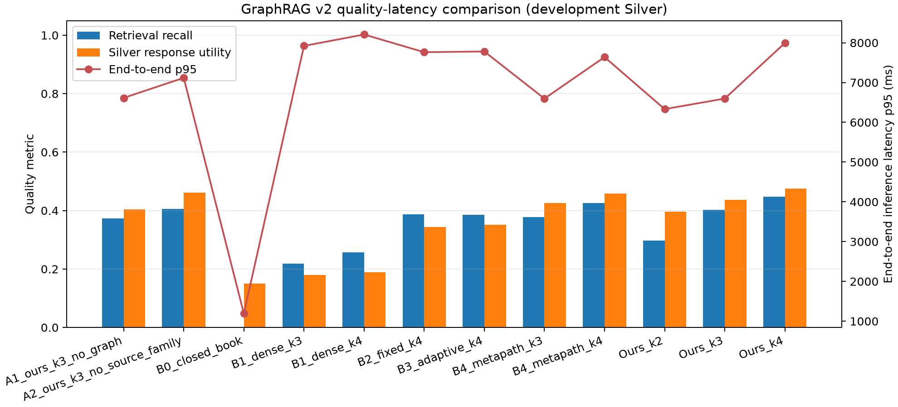
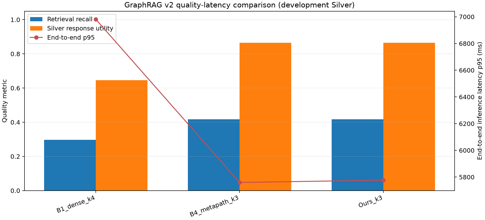

# 研究点二实验报告：面向本地7B大模型的证据预算型GraphRAG检索优化

## 摘要

本研究面向船舶机舱泵系故障辅助诊断，研究在本地Qwen2.5-7B-Instruct生成模型与BGE-M3嵌入模型下，如何通过受控的证据预算改善回答的证据支持质量，同时不引入额外的端到端时延开销。实验对比闭卷生成、稠密检索、固定跳数图扩散、自适应图检索、角色约束稠密检索以及本文方法，并完成模块消融、预算敏感性、600次交错顺序时延复测、双提示词Silver语义裁决与MP010–MP013隔离外部评价。

结果表明，Ours K3相对Dense K4将开发集Silver回答效用从0.189提高至0.437，引用F1从0.236提高至0.354，并在交错复测中将P50端到端时延从6217 ms降低至4814 ms。在外部来源集上，Ours K3相对Dense K4仍实现更高的Silver回答效用和更低的P95时延。但Ours K3相对强基线Dense + Role-Constrained K3的优势较小，外部集上两者基本等价。因此，本研究支持“相对普通Dense RAG提升有限证据预算下的回答效用与时延效率”，不支持“显著优于所有强图检索基线”。全部评价标签均为Silver，未经人工专家审核，不得解释为专家事实正确性。

## 1. 研究问题与假设

研究点二不以单纯减少Token为目标，而是考察在固定的本地7B模型下，受控证据选择能否提高回答效用，并使端到端在线推理时延不高于对照方法。核心假设为：

\[
\Delta U = U_{\mathrm{ours}}-U_{\mathrm{baseline}}>0,
\]

\[
T^{95}_{\mathrm{ours}}
\le (1+\epsilon)T^{95}_{\mathrm{baseline}},
\]

其中，\(U\)为基于冻结Silver引用、可回答性和正确拒答得到的回答效用，\(T^{95}\)为暖机后在线检索、提示构造、Tokenization与确定性生成的P95时延。

## 2. 数据、模型与防泄漏设计

- 主图仅由冻结构建集生成，所有图记录与评价标签均为Silver。
- 开发集包含10类泵系故障的症状、原因/机理、检查和维护共40个CQ查询。
- MP010–MP013在方法、阈值、证据预算与生成协议冻结后才首次解析，仅用于一次性外部评价，不进入主图，不回流调参。
- 嵌入模型为BAAI/bge-m3，生成模型为Qwen2.5-7B-Instruct。
- 正式运行设备为NVIDIA RTX 5880 Ada Generation 48 GB；运行记录显示嵌入和生成均位于`cuda:0`，无CPU或磁盘卸载。

## 3. 对比方法

### 3.1 Dense K4

使用BGE-M3进行全证据稠密检索，选取得分最高的4条证据。

### 3.2 Dense + Role-Constrained K3

实验配置中的`B4_metapath_k3`先完成稠密召回，再仅保留与问题角色一致的证据，即症状、原因/机理、检查或维护，最终选择3条。实现中该方法不访问图节点与图边，因此本报告使用“角色约束稠密检索”作为严谨名称，而不将其解释为经典多跳元路径遍历。

### 3.3 Ours K3

Ours K3从稠密检索结果中选择前8个证据锚点，沿实体图执行1跳预算约束扩散，扩散衰减系数为0.70。候选证据的基础分数为：

\[
S(e,q)=S_{dense}(e,q)+\lambda_g S_{graph}(e,q)+0.1C(e),
\]

其中，\(C(e)\)为证据置信度，\(\lambda_g=0.24\)。在最终证据选择中，使用来源族奖励与语义重复惩罚：

\[
G(e)=S(e,q)+\lambda_s I_{new\ family}-\lambda_rR(e,E_s).
\]

本次冻结配置中来源族奖励为0.06，每个来源族最多3条，最终证据预算为K=3。

## 4. 开发集主结果

| 方法 | Recall@Budget | MRR | NDCG | 引用F1 | Silver回答效用 | 生成记录P50/ms | 生成记录P95/ms |
|---|---:|---:|---:|---:|---:|---:|---:|
| Dense K4 | 0.257 | 0.507 | 0.406 | 0.236 | 0.189 | 6286 | 8207 |
| Dense + Role-Constrained K3 | 0.378 | 0.770 | 0.678 | 0.325 | 0.426 | **4688** | **6597** |
| Ours K3 | **0.402** | **0.794** | **0.698** | **0.354** | **0.437** | 4933 | 6597 |

Ours K3相对Dense K4的Silver回答效用提高0.248，95% Bootstrap置信区间为[0.135, 0.373]；引用F1提高0.118，95%置信区间为[0.036, 0.207]。对照Dense K4的联合质量—时延门槛通过。

Ours K3相对角色约束K3的回答效用仅提高0.011，95%置信区间跨过0，因此不能宣称显著优于该强基线。

## 5. 交错顺序重复时延实验

为排除方法执行顺序、GPU暖机状态与单次生成波动，对40个查询、3种方法各重复5次，共获得600条交错顺序记录。方法顺序按重复轮次和查询索引执行Latin rotation。

| 方法 | 样本数 | 平均生成Token | P50/ms | P95/ms | 相对Ours的查询级结果 |
|---|---:|---:|---:|---:|---|
| Dense K4 | 200 | 174.90 | 6217 | 8617 | Ours在75%查询上更快 |
| Dense + Role-Constrained K3 | 200 | 114.53 | **4610** | 6851 | Ours的查询中位差约+7 ms |
| Ours K3 | 200 | 123.05 | 4814 | **6847** | — |

Ours K3相对Dense K4的查询级中位时延减少约1644 ms，但相对角色约束K3没有稳定速度优势。Ours与该强基线的P95几乎相同，Ours的P50约高204 ms，差异主要由Ours平均生成了更多Token导致。

### 5.1 方法标签完整性审计

针对“Dense + Role-Constrained K3与Ours K3时延标签可能互换”的疑问，对原始`latency_replay.jsonl`进行了不改写审计：

1. 原始文件SHA-256为`2daa13142a38bce578181ca611a8d90af4c6db6d9e966b4f96f2fcf83bd5dd5f`。
2. 两种方法各自200/200条记录的提示Token数均与自身正式生成记录精确匹配。
3. 将两种方法交换后仅90/200条符合，这90条为两种方法恰好生成相同证据提示的查询。
4. 在单条记录内，检索、提示构造、生成、计时和方法标签均使用同一`scenario_id`。
5. 在线时延与生成Token数的相关系数在角色约束K3和Ours K3上分别为0.997和0.996，与当前标签下的生成量完全一致。

因此，审计不支持标签交换，原始时延记录不应被改写。

## 6. Silver语义支持审计

对Dense K4、角色约束K3和Ours K3的120条开发集回答，使用同一qwen3.7-max的两套独立裁决提示词进行Silver语义审计。该设计是双提示角色，不是双独立模型，也不是人工专家审核。

| 方法 | 双提示严格支持率 | 非不支持率 | Judge一致率 | 全回答严格支持率 |
|---|---:|---:|---:|---:|
| Dense K4 | 27.8% | 77.8% | 77.2% | 5.3% |
| Dense + Role-Constrained K3 | 40.0% | 82.5% | **81.2%** | **10.3%** |
| Ours K3 | **42.9%** | **85.7%** | 78.8% | 9.7% |

Ours K3的点级证据支持率最高，但全回答严格支持率仍较低。主要风险包括删除原文条件、将可能性改写为确定事实、扩大证据的适用范围和在摘要中增加原文未直接表达的信息。

## 7. 消融与来源治理结果

| 方法 | Silver回答效用 | 引用F1 | 平均来源族覆盖 | 平均端点重叠 |
|---|---:|---:|---:|---:|
| 去掉图扩散 | 0.404 | 0.315 | 2.88 | **0.023** |
| 去掉来源族约束 | **0.461** | **0.366** | 2.06 | 0.088 |
| Ours K3 | 0.437 | 0.354 | **2.71** | 0.042 |

去掉图扩散后，Ours的回答效用下降0.033，但改善集中在少数查询，Bootstrap置信区间下界为0，因此图扩散贡献为正但较弱。去掉来源族约束后，直接回答效用略高，但来源族覆盖下降、证据端点重叠明显升高。因此，来源族约束应被定位为“证据多源性与去重治理”模块，而不是直接提高回答准确性的模块。

## 8. MP010–MP013外部来源评价

外部流程从287条审计记录中发布81条外部评价Silver。所有Silver的原文、页码、URL与哈希完整率均为100%。40个CQ查询中仅7个可由该外部Silver子集回答。

| 方法 | Recall@Budget | MRR | NDCG | Silver回答效用 | 端到端P50/ms | 端到端P95/ms |
|---|---:|---:|---:|---:|---:|---:|
| Dense K4 | 0.298 | 0.500 | 0.353 | 0.646 | 1597 | 6981 |
| Dense + Role-Constrained K3 | **0.417** | **0.571** | **0.443** | **0.865** | **1234** | **5760** |
| Ours K3 | **0.417** | **0.571** | **0.443** | **0.865** | 1257 | 5776 |

Ours K3相对Dense K4的外部Silver回答效用提高0.219，95%置信区间为[0.106, 0.350]；P95时延降低约17.3%。但角色约束K3和Ours K3在36/40个查询中返回完全相同的证据顺序，39/40个最终回答完全相同，因此外部集不支持Ours优于该强基线。

同时，MP010–MP013全部属于MAIB来源族，不能在该外部集上评价来源族多样性收益。外部集的33个不可回答查询使总体效用受正确拒答率影响较大，外部效用不应与开发集数值直接比较。

## 9. 结论与可声明边界

### 9.1 绝对质量而非仅横向增益

Ours K3的Silver引用Precision、Recall和F1分别为0.742、0.307和0.354，可回答回答率为91.2%，不可回答正确拒答率为100%，输出契约通过率为97.5%。开发集34个可回答查询平均有7.24条Silver相关证据，K=3条件下的理论宏F1上限约为0.704，因此当前预算归一化F1约为0.503。Silver回答效用0.437对应的K3理论上限约为0.749，当前达到上限的58.4%。

这些结果表明，引用的准确性尚可，但对全部Silver相关证据的覆盖和综合效用仍为中等水平。更严格的双提示语义审计中，Ours的点级严格支持率为42.9%，整条回答全部严格支持率为9.7%。因此本研究只能声称相对Dense RAG的证据预算—质量—时延优化，不能将当前系统表述为已达到高可靠故障诊断水平。详细投稿门槛见`docs/research/RP2_PAPER_SUBMISSION_READINESS_REVIEW.md`。

实验支持以下结论：

1. 在相同的本地7B生成模型下，Ours K3相对Dense K4能以更小的证据预算获得更高的Silver回答效用和引用F1。
2. Ours K3相对Dense K4减少了提示长度与生成长度，在交错复测中同时降低P50和P95端到端时延。
3. Ours K3相对角色约束稠密K3在开发集上存在小幅质量改善和更高的来源族覆盖，但质量差异不显著，时延基本相当。
4. 外部集支持Ours相对Dense K4的迁移方向，但不支持Ours优于角色约束K3。
5. 来源族治理改善多源性并降低证据重叠，但不能声称其直接提高回答事实正确性。

本研究不支持以下过度声明：

- Ours显著优于所有GraphRAG强基线；
- Silver语义得分等于人工专家准确率；
- 外部集验证了多来源族约束的泛化收益；
- 图扩散在所有查询上都优于简单角色约束检索。

综合而言，研究点二已完成支撑硕士论文章节所需的主实验、对照、消融、敏感性、稳定时延和外部评价。后续应进入结果表格冻结、图表编辑与论文写作，不应再根据MP010–MP013调整方法参数。

## 10. 可复现性文件

- 开发集指标：`results/experiments/research_point_2/graphrag_v3_budget_effectiveness/metrics.json`
- 交错时延原始记录：`results/experiments/research_point_2/rp2_v3_interleaved_latency/latency_replay.jsonl`
- 时延标签完整性审计：`results/experiments/research_point_2/rp2_v3_interleaved_latency/latency_label_integrity_audit.json`
- Silver语义Judge：`results/experiments/research_point_2/rp2_v3_dual_prompt_semantic_judge/semantic_judge_summary.json`
- 外部评价：`results/experiments/research_point_2/graphrag_v3_external_source_heldout/metrics.json`
- 外部Silver质量：`results/experiments/heldout_external_v3/rp1_external_quality.json`
- 冻结协议：`configs/frozen/rp2_v3_frozen_protocol.json`
