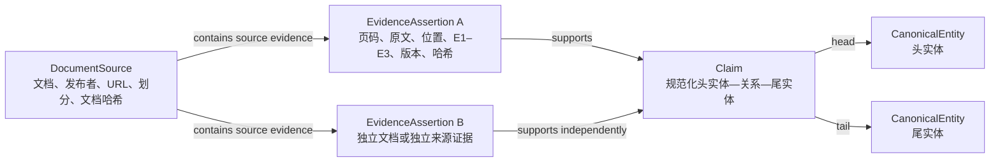

# 船舶机舱泵系证据图谱构建规范 V2

版本：`marine_pump_provenance_v2.1.0`

状态：正式规范

适用范围：研究点一“船舶机舱泵系低算力、低时延图谱证据检索与自适应剪枝”

配套机器可读规范：

`data/kg/marine_pump/schema/provenance_schema_v2.json`

## 1. 目的和规范用语

本规范用于约束文档解析、三元组抽取、实体规范化、证据校验、图谱构建和离线索引。目标是在不依赖完整人工标注的条件下，形成可复现、可审计、可按来源追溯的 Silver 证据图谱，并为后续 CPU 低时延检索提供稳定资产。

本文中的“必须”“不得”是强制要求，“应”是默认要求，“可”表示允许但不强制。

旧目录 `Edge_Fault_LLM` 仅可作为只读原型参考。旧图谱、旧三元组和旧轴承规则不得直接导入正式泵系图谱。

## 2. 核心原则

1. 原文证据是事实源，模型输出只是候选。
2. Claim 与 EvidenceAssertion 必须分层存储。
3. 同一 Claim 的多文档、多页面和多来源证据必须分别保留。
4. 页码、原文、来源 URL、发布者、来源家族和哈希必须在抽取时绑定，不得事后猜测。
5. 关系方向必须由关系注册表和原文语义决定，不得由频率或图拓扑决定。
6. 实体向量相似度只能用于生成同类型别名候选，不能直接触发实体合并。
7. 图谱构建不得删除低度但证据有效的节点或边，也不得为了得到 DAG 而删除证据。
8. 开发集和保留测试集不得补足构建集覆盖门槛。
9. 未进行完整人工标注的数据、图谱和基准统一称为 Silver。
10. 正式语义图的实体规范名、关系显示名和类型显示名统一使用中文；机器码保持稳定英文枚举。
11. 英文或中文来源的原文实体、证据文本和位置不得被中文译文覆盖。

## 3. 双层图谱模型



### 3.1 CanonicalEntity

CanonicalEntity 是规范化后的中文语义实体。每个正式实体必须具有稳定 `entity_id`、中文规范名称、实体类型、结构化来源词形、术语ID、术语版本、翻译方法、翻译状态、规范化版本和内容哈希。`language` 固定为 `zh`。

自动规范化只允许：

- 空白、Unicode和标点的确定性清理；
- 已审核的类型内术语表映射；
- 已审核通过的同类型别名映射。

不得因两个实体的向量相似度高于阈值就自动合并。不同实体类型之间不得进行别名合并。

### 3.2 Claim

Claim 是规范化语义三元组：

```text
CanonicalEntity(head) — canonical relation → CanonicalEntity(tail)
```

Claim 本身不是证据。正式 Claim 必须关联至少一条 EvidenceAssertion。Claim ID 应由以下内容确定性生成：

```text
schema major version
+ head_entity_id
+ canonical relation
+ tail_entity_id
```

重复出现次数只能作为派生统计，不能改变 Claim 的方向、关系类型或真实性。

### 3.3 EvidenceAssertion

EvidenceAssertion 表示某一份文档、某一物理页中的原文对某个 Claim 的一次支持。它是图谱的来源事实单元。

同一 Claim 在以下任一条件不同时，必须保留为不同 EvidenceAssertion：

- 文档不同；
- PDF物理页不同；
- 原文证据不同；
- 表格行或视觉区域不同；
- 发布者或来源家族不同；
- 解析、模型、提示词或校验版本不同且结果不可证明等价。

语义层可生成便于检索的聚合视图，但聚合不得覆盖或删除断言层记录。

### 3.4 中文语义层与多语言证据层

本项目采用“中文语义层 + 多语言原文证据层”：

```text
英文或中文原文
→ 原语言实体surface、原文证据、页码和bbox校验
→ 类型与关系语义校验
→ 类型约束的中文术语规范化与翻译等价校验
→ 中文CanonicalEntity和中文图谱投影
```

强制要求：

- `raw_head`、`raw_tail`、`evidence_text`及其哈希始终对应来源原文；
- `CanonicalEntity.canonical_label`必须为中文；
- 英文原词进入带语言和断言来源的 `source_forms`，不得丢弃；
- 可选 `evidence_translation_zh` 只供阅读，必须标记为非证据，不参与E1/E2定位、关系蕴含、证据哈希和覆盖统计；
- 实体类型与关系内部仍使用 `FaultMode`、`causes` 等稳定机器码，中文图谱分别显示“故障模式”“导致”等冻结标签；
- 仅模型自由翻译的实体不得直接发布，至少需要类型内术语词典命中或独立复核；
- NPSH、API、ISO、型号、单位等受保护词不得在中文规范化中丢失；
- 实体ID优先由 `entity_type + terminology_id` 生成，不得依赖可能改变的自由译名。

## 4. 节点类型

| 类型 | 含义 |
|---|---|
| `Equipment` | 泵、泵组、驱动设备或明确命名的泵系设备 |
| `Component` | 泵体、叶轮、轴承、机械密封、联轴器、电机、吸入/排出管路、阀门等部件 |
| `FaultMode` | 可观察或可诊断的故障状态 |
| `FailureMechanism` | 故障形成或演化的物理过程 |
| `Symptom` | 定性可观察表现 |
| `SignalFeature` | 测得或计算得到的诊断特征 |
| `Cause` | 原文明确陈述的起因，不得只是孤立部件名 |
| `OperatingCondition` | 流量、压力、温度、转速、负载、介质或环境条件 |
| `InspectionMethod` | 诊断或检查方法 |
| `InspectionAction` | 具体检查、确认或测量动作 |
| `MaintenanceAction` | 维修、调整、清理、更换或预防性维护动作 |
| `Standard` | 标准、规范、指南或验收准则 |
| `Risk` | 不良后果或风险状态 |

轴承可以作为泵系部件，轴承或润滑故障也可作为故障类别，但只有文档原文支持时才能进入图谱。不得默认注入轴承特征频率、演化链或旋转机械干扰分支。

## 5. 关系注册表

所有关系必须使用下表中的规范方向。模型若输出反向表达，本地校验器只能在原文语义无歧义时重定向，并必须记录 `normalization_actions`；否则进入待复核或拒绝。

| 关系 | 规范方向 | Domain | Range | 证据角色 |
|---|---|---|---|---|
| `contains` | 设备/部件 → 部件 | `Equipment`, `Component` | `Component` | structural_context |
| `located_in` | 部件 → 设备/部件 | `Component` | `Equipment`, `Component` | structural_context |
| `occurs_at` | 故障/机理 → 设备/部件 | `FaultMode`, `FailureMechanism` | `Equipment`, `Component` | structural_context |
| `causes` | 原因/机理/工况/故障 → 机理/故障/症状/风险 | `Cause`, `FailureMechanism`, `OperatingCondition`, `FaultMode` | `FailureMechanism`, `FaultMode`, `Symptom`, `SignalFeature`, `Risk` | cause_or_mechanism |
| `indicates` | 症状/信号特征 → 原因/机理/故障/风险 | `Symptom`, `SignalFeature` | `Cause`, `FailureMechanism`, `FaultMode`, `Risk` | symptom |
| `manifests_as` | 故障/机理 → 症状/信号特征 | `FaultMode`, `FailureMechanism` | `Symptom`, `SignalFeature` | symptom |
| `evolves_to` | 故障/机理 → 故障/机理/风险 | `FaultMode`, `FailureMechanism` | `FaultMode`, `FailureMechanism`, `Risk` | cause_or_mechanism |
| `diagnosed_by` | 诊断目标 → 检查方法/动作 | 原因、机理、故障、症状、信号特征、风险 | `InspectionMethod`, `InspectionAction` | inspection |
| `inspected_by` | 设备/部件/诊断目标 → 检查方法/动作 | 设备、部件、原因、机理、故障 | `InspectionMethod`, `InspectionAction` | inspection |
| `mitigated_by` | 原因/机理/故障/风险 → 维护动作 | `Cause`, `FailureMechanism`, `FaultMode`, `Risk` | `MaintenanceAction` | maintenance |
| `maintained_by` | 设备/部件 → 维护动作 | `Equipment`, `Component` | `MaintenanceAction` | maintenance |
| `operates_under` | 设备/部件 → 工况 | `Equipment`, `Component` | `OperatingCondition` | operating_condition |
| `increases_risk_of` | 原因/机理/故障/工况 → 风险 | `Cause`, `FailureMechanism`, `FaultMode`, `OperatingCondition` | `Risk` | risk |
| `specified_by` | 语义实体 → 标准 | 除 `Standard` 外的规范实体类型 | `Standard` | standard |

不设置通用 `related_to` 核心关系。无法确定具体语义的“相关”候选不得进入核心图谱。

## 6. 强制来源字段

每条 EvidenceAssertion 必须包含：

- `assertion_id`、`claim_id`；
- 原始头实体、原始尾实体、各自类型和规范关系；
- `document_id`、`document_split`；
- `publisher`、`source_family_id`；
- HTTP(S) `source_url`；
- `document_sha256`；
- `pdf_page_number`；
- `printed_page_label`及其核验状态；
- `page_text_sha256`；
- 不得改写的 `evidence_text`及其哈希；
- `source_language`、`raw_head_language`和`raw_tail_language`；
- 来源位置 `source_geometry`及其哈希；
- E1、E2或E3等级；
- evidence role；
- 是否为推断边、能否进入核心图和覆盖门槛；
- 模型置信度、校验状态和复核状态；
- 抽取运行、模型、提示词、解析器、后处理器、校验器和Schema版本；
- 断言内容哈希与生成时间。

PDF物理页码始终必须存在。印刷页码不存在时不得编造，应将 `printed_page_label` 设为 `null`，并记录 `absent_on_page` 或 `not_applicable`。

来源 URL 必须指向发布者原始页面、原始PDF或可验证存档。搜索结果页、本地路径和无来源文件名不能替代来源 URL。

## 7. E1–E3证据等级

| 等级 | 定义 | 强制位置数据 | 核心图资格 | 覆盖门槛资格 |
|---|---|---|---|---|
| E1 | 单个连续原文跨度完整支持Claim | 字符起止位置、页面文本哈希 | 校验通过后可进入 | 校验通过后可计入 |
| E2 | 同一视觉表格行或有界表格区域的原始单元格完整支持Claim | 表格ID、行ID、列名、单元格原文、bbox、视觉核验 | 结构校验通过后可进入 | 结构校验通过后可计入 |
| E3 | 需要同页多段组合或语义重建 | 每个原文片段及其位置和哈希 | 不自动进入 | 不计入 |

E1、E2只是证据形态，不自动代表语义正确。它们还必须通过实体类型、关系方向、Domain/Range、来源、页码、哈希和语义支持校验。

E2的 `evidence_text` 可按稳定分隔符序列化多个原始单元格，但每个单元格原文必须同时保存在 `cell_texts`，不得把模型概括写入原文字段。

E3只能保留为待复核或经复核后的背景上下文。E3和任何 `inferred_edge=true` 的记录必须同时设置：

```text
eligible_for_core_graph = false
eligible_for_coverage_gate = false
```

## 8. 文档划分和来源独立性

文档划分只允许：

- `build_train`
- `development`
- `held_out_test`

同一文档的不同页面不得跨集合。开发集用于提示词、解析器和规则调试；保留测试集只用于冻结后的评估。

构建集覆盖统计必须按 `source_family_id` 判断来源独立性，而不是按文件数判断。例如，同一制造商的两份手册是两份文档，但通常仍属于一个来源家族。

图谱发布包的 `manifest.build_split` 必须为 `build_train`。开发集和保留测试集可形成独立评估投影，但不得写入构建图及其线上索引。

## 9. 实体规范化和去重

### 9.1 实体规范化顺序

1. 在来源原语言中完成证据跨度、表格结构和关系蕴含校验；
2. 确定性文本清理与来源语言识别；
3. 类型判定；
4. 类型内中英术语表匹配；
5. 精确别名与受保护词检查；
6. 对未命中词典的中文规范名进行独立翻译等价复核；
7. 生成同类型向量相似候选，但不得自动合并；
8. 冻结术语ID、中文规范名、实体ID和规范化版本。

向量相似候选必须满足实体类型一致，并输出原实体、候选实体、相似度、模型版本和复核状态。没有复核结论时不得改变正式实体ID。

### 9.2 Claim去重

Claim按以下规范键去重：

```text
schema major version
+ canonical head entity ID
+ canonical relation
+ canonical tail entity ID
```

Claim聚合只合并语义身份，不合并 EvidenceAssertion。

### 9.3 EvidenceAssertion去重

只有以下字段均等价时，才可将两个断言视为重复：

```text
claim_id
+ document_id
+ pdf_page_number
+ evidence_text_sha256
+ source_geometry_checksum_sha256
```

不同文档、页面、表格行或来源位置的证据必须保留。相同表述来自两个独立发布者时是两个独立断言，不是重复数据。

## 10. 正式构建流程

### 阶段A：文档冻结

1. 登记文档、发布者、来源家族和URL；
2. 计算文档哈希；
3. 完成文档级划分；
4. 冻结来源清单版本。

### 阶段B：页级解析

1. 按PDF物理页生成页面记录；
2. 提取印刷页码；
3. 同时保存文本、表格、行列、单元格和bbox；
4. 计算页面文本及布局记录哈希；
5. 扫描件进入OCR专门流程并记录OCR版本，不得静默当作空页。

### 阶段C：候选抽取

1. 模型只进行来源约束抽取，不得补充常识链；
2. 输出原语言实体surface、稳定关系/类型机器码、中文规范名候选、原文和位置候选；
3. 保存模型、提示词、请求和运行版本；
4. 模型输出不得直接进入正式图谱。

### 阶段D：本地校验

依次校验：

1. 强制字段完整；
2. 关系在注册表中；
3. 头尾实体类型符合Domain/Range；
4. 方向符合规范方向；
5. 原文和位置能在指定物理页验证；
6. 文档哈希、页面哈希和证据哈希一致；
7. URL、发布者和来源家族有效；
8. 文档划分一致；
9. E1–E3分级正确；
10. 原文语义支持Claim。
11. 中文规范名命中冻结术语词典或已通过独立翻译等价复核。

任何一步失败都必须产生明确拒绝原因，不能静默修补。

### 阶段E：规范化与Claim生成

1. 对实体生成类型约束的中文规范化候选；
2. 冻结带术语ID、中文规范名和结构化来源词形的CanonicalEntity；
3. 按规范方向生成Claim；
4. 将每条通过校验的EvidenceAssertion绑定到Claim；
5. 计算独立文档数和来源家族数；
6. 生成覆盖矩阵。

### 阶段F：覆盖门槛

覆盖门槛必须按“故障类别 × evidence role × 独立文档 × 独立来源家族”统计。只有E1/E2且 `eligible_for_coverage_gate=true` 的构建集断言可计数。

门槛未通过时应定向补充文档或页面，不得通过以下方式制造通过：

- 重复计算同一证据；
- 使用开发集或保留测试集；
- 将同一发布者的多个文件当成多个独立来源家族；
- 注入常识三元组；
- 降低来源字段要求；
- 用E3或推断边补数。

### 阶段G：图谱发布

1. 冻结文档、实体、Claim和断言表；
2. 生成语义图和Claim—Assertion映射；
3. 运行关系、来源、划分和多来源保留审计；
4. 计算各表、图拓扑和完整包哈希；
5. 写入版本化只读目录；
6. 发布后不得原位覆盖，修订必须生成新图版本。

## 11. 图存储要求

推荐使用以下任一形式：

1. `MultiDiGraph`：每条Claim为语义关系，多条EvidenceAssertion作为独立边键或独立断言记录；
2. Claim节点模型：实体连接Claim，Claim再连接多条EvidenceAssertion；
3. 规范化表存储加只读检索投影。

无论采用何种实现，都必须满足：

- 一个头尾实体对可以存在多种关系；
- 一个Claim可以绑定多条独立证据；
- 删除聚合视图不会损失来源事实；
- 每个检索结果可以沿 `Claim → EvidenceAssertion → DocumentSource` 返回原文、双页码和URL；
- 语义图默认展示中文实体、中文关系名和中文类型名，同时能够返回未改写的英文或中文原文；
- 图可以包含合法环路；
- 低度有效证据必须保留；
- 检索权重和图谱事实分离，调权不得修改事实层。

## 12. CPU低时延索引

索引是图谱发布包的派生资产，不是事实源。索引构建必须离线完成，在线热路径不得调用大模型。

应优先生成：

- 类型分区的精确名称和别名索引；
- 类型分区的小型向量索引；
- 压缩邻接表或CSR邻接索引；
- Claim到EvidenceAssertion映射；
- 文档、来源家族和页面查找索引；
- 常用查询的有界缓存。

每个索引必须记录：

- `index_id`和`index_version`；
- 所属 `graph_version`和`schema_version`；
- 索引类型；
- CPU兼容标志；
- 来源图哈希；
- 节点顺序和ID映射哈希；
- 邻接、向量矩阵及最终索引文件哈希；
- 嵌入模型、修订版本、维度、数据类型和距离度量；
- 构建时间。

运行时加载索引前必须校验图版本和哈希。索引不得通过写回节点序号修改冻结图谱。图谱更新后必须整体生成新索引版本，禁止将旧图和新索引混用。

为了兼顾低算力和低时延，默认实现应：

- 支持CPU；
- 使用确定性节点排序；
- 采用内存映射或紧凑数组；
- 先进行类型和词法门控，再调用向量召回；
- 对扩展跳数、候选数和证据数设置硬上限；
- 支持达到证据充分性条件后的提前终止；
- 分阶段记录解析、锚点匹配、扩展、评分和序列化时延。

## 13. 明确禁止的旧流程做法

以下做法不得进入新流水线：

1. 为扩大图谱而固定注入故障、症状、原因、机理或维护链；
2. 先构图，再根据头尾实体或领域名称回填来源；
3. 按节点度删除证据；
4. 按出现次数决定因果方向；
5. 为强制生成DAG而删除合法边；
6. 仅凭无类型约束的向量聚类自动合并实体；
7. 使用普通单边图覆盖同一头尾实体间的其他关系；
8. 将多个独立来源折叠成一条无断言明细的边；
9. 将开发集或保留测试集证据写入构建索引；
10. 将模型常识补全、跨页拼接或无法定位的内容标为直接证据。

## 14. 发布验收清单

正式图谱版本发布前必须全部满足：

- [ ] 所有正式Claim至少关联一条EvidenceAssertion；
- [ ] 核心图仅使用通过校验的E1/E2非推断断言；
- [ ] 所有断言均有物理页码、原文、URL和来源家族；
- [ ] 所有正式实体均有中文规范名、术语ID、术语版本和合格翻译状态；
- [ ] 所有类型和关系机器码均有冻结中文显示名；
- [ ] 原文surface和evidence_text未被中文译文覆盖，可选译文明确标记为非证据；
- [ ] 英文来源词形、语言和关联断言ID均保留在 `source_forms`；
- [ ] 印刷页码缺失时有明确缺失状态，没有编造值；
- [ ] 所有关系通过Domain/Range及方向校验；
- [ ] 所有实体合并有确定性规则或复核记录；
- [ ] 多文档、多页面和多来源断言未被覆盖；
- [ ] 构建图不包含开发集或保留测试集证据；
- [ ] 覆盖矩阵只统计符合资格的构建集断言；
- [ ] 文档、实体、Claim、断言、图拓扑和完整包哈希齐全；
- [ ] 图版本与所有索引版本、哈希一致；
- [ ] CPU环境能够加载索引并完成受限检索；
- [ ] 没有固定规则注入、事后来源回填、按度删证据、频率定方向或强制DAG；
- [ ] 产物统一使用Silver口径。

## 15. 与V1的关系

V2保留了V1中的页码、原文、来源URL、关系类型约束和文档划分思想，并作出以下实质升级：

- 从扁平三元组升级为CanonicalEntity、Claim和EvidenceAssertion双层事实模型；
- 将来源从可选属性提升为抽取时必须绑定的事实单元；
- 增加多来源保留、E1–E3、位置哈希和断言哈希；
- 增加严格的关系方向及Domain/Range注册表；
- 增加图版本、索引版本和全链路checksum；
- 明确排除旧轴承规则注入和破坏证据的图拓扑过滤；
- 将CPU低时延索引作为版本化派生资产，而不是修改图谱本体。

V1可用于解释既有试抽取结果，但新一轮正式抽取、批量构图和索引必须以V2为准。
