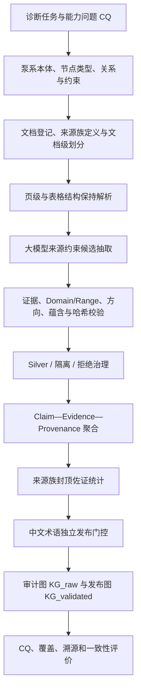

# 研究点一：船舶机舱泵系可追溯 Silver 证据知识图谱构建与质量治理方法

- 版本：V1.0
- 日期：2026-07-30
- 性质：硕士论文研究点重构与方法设计稿
- 适用范围：船舶机舱泵系；当前项目研究点一

## 0. 核心结论

研究点一不应表述为“调用大模型从 PDF 中抽取三元组并建立知识图谱”，而应重构为：

> **面向缺少完备人工标注、来源异构且必须保留诊断依据的船舶机舱泵系资料，研究一种基于本体约束、原文证据锚定、来源族独立性和双门控发布机制的可追溯 Silver 证据知识图谱构建与质量治理方法。**

建议采用的正式题目为：

> **基于本体约束与来源依赖感知治理的船舶机舱泵系故障知识图谱构建方法**

论文第 3 章可使用更完整的章名：

> **面向船舶机舱泵系故障辅助诊断的可追溯 Silver 证据知识图谱构建与质量治理方法**

这个定位的研究对象不再是“1698 条三元组”，而是一个知识生产与质量治理问题：如何把技术手册、船级社资料和事故报告中的异构陈述，转化为可验证、可追溯、可复现、可按任务发布的诊断知识。

本研究点独立解决“知识如何可靠地进入图谱”。后续研究点二再解决“图谱证据如何在算力和时延约束下被快速选出”，研究点三解决“证据选择与诊断能力如何蒸馏和受控使用”。三者形成：

```text
可信知识生产 → 低时延证据选择 → 能力蒸馏与风险控制
```

## 1. 问题定义与研究问题

### 1.1 问题定义

给定构建文档集合 \(\mathcal D_{\mathrm{build}}\)，其中包含不同发布者、不同语言、不同版式和不同来源族的船舶机舱泵系资料，目标不是直接生成一个扁平三元组集合，而是构造：

1. 可由原文逐条验证的语义主张；
2. 与每条主张绑定的页码、原文、版面位置、URL 和哈希；
3. 能区分跨来源族佐证与同源重复的来源结构；
4. 能区分候选、隔离、拒绝和 Silver 发布状态的质量治理记录；
5. 以中文为规范语义层、同时保留来源原语言证据的版本化图谱。

因此，研究对象可形式化为从文档集合到双层图谱的受约束映射：

\[
\mathcal M:
\mathcal D_{\mathrm{build}}
\longrightarrow
\left(G_{\mathrm{audit}},G_{\mathrm{release}}\right)
\tag{1}
\]

其中，\(G_{\mathrm{audit}}\) 保存完整处理轨迹，\(G_{\mathrm{release}}\) 只保存满足证据和中文术语发布门槛的 Silver 记录。

### 1.2 拟回答的研究问题

**RQ1：结构与语义可靠性。**

在正文、故障表、检查表和跨页表格混合存在时，如何通过本体 Domain/Range、关系方向、证据跨度和表格同行约束，降低无依据补全、关系错配和跨行拼接？

**RQ2：来源依赖与不确定性。**

在没有全量人工 Gold 标注的条件下，如何使同一发布者的多份文档不被机械地当作多份独立证据，并对支持、冲突、隔离和拒绝状态进行可计算治理？

**RQ3：任务完备性与中文发布。**

如何利用能力问题（Competency Questions，CQ）和故障—证据角色覆盖函数，判断图谱是否足以支持症状、原因机理、检查和维护类诊断任务；同时如何保证中文语义规范化不覆盖或篡改英文原文证据？

上述问题使研究点一具有独立的研究假设和评价指标，而不是后续检索实验的单纯数据准备。

## 2. 当前工程基础与数据口径

### 2.1 冻结的数据边界

- 主图谱构建集：MP001–MP007、MP015–MP022，共 15 份文档、1934 个物理页。
- 开发集：MP008，只用于解析器、提示词和规则调试。
- 保留测试集：MP009–MP013，在主图谱和方法参数冻结前不得进入构建、调参或覆盖补足。
- 排除项：MP014，不属于船舶机舱泵系正式证据文档。
- 构建集全量计划：1889 个抽取页，45 个确定性排除页。

### 2.2 当前产物必须区分的三个数量

| 层次 | 当前数量 | 含义 |
|---|---:|---|
| 完整审计记录 | 8003 | 包含 Silver、待审隔离和拒绝记录，用于复现与误差分析 |
| 证据合格 Silver 断言 | 1698 | 通过证据、类型、蕴含、划分和置信度门槛的原文证据断言 |
| 中文发布合格断言 | 208 | 在证据 Silver 基础上，两端中文规范术语也通过发布门槛的记录 |

模型全量提出 8071 条原始候选，经结构化清洗与治理后形成 8003 条审计记录，其中 1698 条为证据 Silver、881 条为待审隔离、5424 条被拒绝。`KG_v1_raw` 当前包含 8003 条 EvidenceAssertion、7651 个 Claim 和 9149 个实体记录；1698 条证据 Silver 包括 1550 条 E1 和 148 条 E2，对应 1650 个去重 Claim 和 2613 个实体。`KG_v1_validated` 当前包含 208 条 EvidenceAssertion、203 个 Claim 和 281 个中文规范实体，其中 E1 为 145 条、E2 为 63 条。

1698 不是“人工确认的 1698 个事实”，也不等于 1698 个互不重复的语义 Claim。它表示 1698 次通过自动质量门槛的来源证据断言；同一 Claim 可由不同文档、页面或来源族的多个断言支持。全部自动或半自动结果只能称为 **Silver**，不能称为 Gold。

### 2.3 当前方法已经具备的基础

当前实现已经包含：

- 13 类节点和 15 类关系的类型注册表及 Domain/Range；
- PDF 物理页、正文、表格、行列、bbox 和哈希绑定；
- E1 连续原文、E2 同表同行/同行组、E3 重建证据分级；
- 关系类型、方向、语义蕴含和表格对齐校验；
- Claim 与 EvidenceAssertion 分层和稳定 ID；
- 文档级构建、开发、保留测试划分；
- `source_family_id` 来源族标识；
- 证据 Silver 门槛与中文术语发布门槛分离；
- `KG_v1_raw` 与 `KG_v1_validated` 双图发布；
- 十类故障的症状、原因/机理、检查/维护和跨来源族覆盖门槛。

在上述基础上，`CQ_v1`、来源族封顶佐证函数和项目专用标准化约束报告已完成首版可执行实现。后续重点不应回到重复抽取，而应进入固定数据上的对照、消融和敏感性实验；跨文档冲突治理与 RDF/SHACL 互操作仍作为增强项。

## 3. 主张—证据—溯源—不确定性模型

### 3.1 Claim 与 EvidenceAssertion 分离

设第 \(i\) 条规范化语义主张为：

\[
c_i=(h_i,r_i,t_i)
\tag{2}
\]

其中 \(h_i\)、\(t_i\) 为类型化规范实体，\(r_i\) 为关系注册表中的稳定关系码。

仅有 \(c_i\) 不能证明该事实来自何处。为此，将一次来源支持建模为：

\[
a_i=
\left\langle
c_i,e_i,\pi_i,u_i
\right\rangle
\tag{3}
\]

其中：

- \(e_i=(s_i,d_i,p_i,b_i)\)：原文证据 \(s_i\)、文档 \(d_i\)、物理页 \(p_i\) 和版面位置 \(b_i\)；
- \(\pi_i=(url_i,f_i,H_i,v_i,m_i)\)：来源 URL、来源族 \(f_i\)、内容哈希 \(H_i\)、流水线版本 \(v_i\) 和模型/提示词版本 \(m_i\)；
- \(u_i=(q_i,l_i,\eta_i,z_i)\)：质量分数 \(q_i\)、证据等级 \(l_i\)、蕴含状态 \(\eta_i\) 和治理决策 \(z_i\)。

式（3）可称为 **CEPU（Claim–Evidence–Provenance–Uncertainty）证据断言模型**。它的关键不是创造新的图结构名词，而是将“语义事实”和“该来源在该页面对事实的支持”分开，使同一 Claim 的多来源支持、同源重复和相互冲突均可被保留和比较。

### 3.2 稳定身份与双层去重

Claim 的身份键定义为：

\[
\operatorname{ID}_{c}
=
\operatorname{Hash}
\left(
v_{\mathrm{schema}},
\operatorname{ID}_{h},
r,
\operatorname{ID}_{t}
\right)
\tag{4}
\]

EvidenceAssertion 的身份键定义为：

\[
\operatorname{ID}_{a}
=
\operatorname{Hash}
\left(
\operatorname{ID}_{c},
\operatorname{ID}_{d},
p,
H_{\mathrm{text}},
H_{\mathrm{geometry}}
\right)
\tag{5}
\]

式（4）只合并语义身份相同的 Claim；式（5）只去除来源位置和原文均等价的重复证据。不同文档、不同页面、不同表格行或不同来源族的断言必须保留，不能因语义三元组相同而覆盖。

## 4. 基于硬约束的 Silver 证据门控

### 4.1 结构质量分数

当前流水线采用“硬约束优先、分数其次”的策略。设大模型自报置信度为 \(\alpha_i\)，证据等级权重为 \(w_E\)，关系蕴含权重为 \(w_R\)，则当前实现中的启发式排序分为：

\[
q_i=\alpha_i\cdot w_E(l_i)\cdot w_R(\eta_i)
\tag{6}
\]

当前权重为：

\[
w_E(E1)=1,\quad
w_E(E2)=0.95,\quad
w_E(E3)=0.75
\tag{7}
\]

\[
w_R(\text{entailed})=1,\quad
w_R(\text{undetermined})=0.75,\quad
w_R(\text{not entailed})=0
\tag{8}
\]

这里的 \(q_i\) 只能称为用于自动治理的**启发式排序分**，不是经过统计校准的事实正确概率，也不是可跨数据集解释的通用质量分数。式（7）—（8）的权重来自当前工程规则，并无理论最优性；论文实验必须在 MP008 开发集或冻结的开发子集上对权重和 0.6/0.8 阈值进行敏感性分析。来源权威等级单独记录和审计，不用于把语义不充分的记录“加分”成 Silver。

### 4.2 Silver 硬门控函数

定义：

\[
\begin{aligned}
H_S(a_i)=&
I_{\mathrm{schema}}
I_{\mathrm{domain/range}}
I_{\mathrm{direction}}
I_{\mathrm{grounding}}
I_{\mathrm{entailment}}\\
&\cdot I_{l_i\in\{E1,E2\}}
I_{\mathrm{noninfer}}
I_{\mathrm{build}}
I_{\mathrm{familyID}}
I_{q_i\ge 0.8}
\end{aligned}
\tag{9}
\]

式中各 \(I\) 为取值为 0 或 1 的指示函数，\(I_{\mathrm{familyID}}\) 只表示来源族字段存在且有效，不表示单条断言必须由两个来源族支持。只有所有硬条件均成立时，\(H_S(a_i)=1\)，该记录才进入证据 Silver 层。

令 \(F(a_i)\) 表示 Schema 无效、Domain/Range 无效、原文不可定位、关系不蕴含或来源等级未知等致命错误。证据可定位但存在 E3、蕴含未决、推断边等情况属于可恢复或需隔离问题。自动治理状态按互斥顺序定义为：

\[
z_i=
\begin{cases}
\text{Rejected}, & F(a_i)=1\ \lor\ q_i<0.6\\
\text{Silver}, & F(a_i)=0\ \land\ H_S(a_i)=1\\
\text{Quarantine}, & F(a_i)=0\ \land\ H_S(a_i)=0\ \land\ q_i\ge0.6
\end{cases}
\tag{10}
\]

其中 E3 重建证据、蕴含不确定和推断边不能被分数自动越过。中文术语状态不参与证据 Silver 决策，只参与后续中文发布门控。该设计避免把一个不可解释的综合分数当作唯一真值判据；隔离集合还包括其他未通过 Silver 硬条件、且无致命错误的候选。

### 4.3 可执行标准化约束配置

当前以项目专用 Python 约束配置对 `KG_v1_raw` 和 `KG_v1_validated` 执行 36 项检查，覆盖分层文件完整性、稳定标识唯一性、Claim—Evidence 链接闭合、构建/开发/保留测试划分隔离、Silver 状态、E1/E2 与非推断门控、页码/URL/哈希溯源、关系 Domain/Range、中文端点发布和 Raw—Validated 原文不可变性。

在当前图谱上，33 项通过、2 项为信息性统计、1 项为非阻断警告，发布阻断项为 0，`release_blocked=false`。唯一警告来自 40 条非发布审计记录缺少 `evidence_text`；这些记录不属于 1698 条证据 Silver 或 208 条中文发布记录，因此保留为审计缺口而不阻断发布。该报告验证的是结构和治理约束一致性，不等价于事实正确性或专家审核。

当前主实现是 Python 约束配置，并引用现有 JSON Schema/注册表；它不是完整 JSON Schema 实例验证，也不是 RDF 或 SHACL 验证。除非后续真正生成 RDF 数据图和 `.ttl` shapes 并由 SHACL 引擎执行，否则论文不得声称“采用 SHACL 完成约束校验”。

## 5. 来源依赖感知的族内封顶佐证

### 5.1 为什么不能只数文档

同一制造商的多份安装手册可能共享内容、模板和技术立场。如果直接使用文档数 \(n_{\mathrm{doc}}\) 表示证据强度，同源复制会造成虚假的多源支持。因此，研究中以发布者和组织谱系定义来源族 \(f(d)\)，同时保留“文档数”和“来源族数”。

来源族只是来源依赖性的工程代理，不构成统计独立性的证明。不同发布者仍可能共同引用或复制同一标准，因此论文应使用“跨来源族佐证”或“来源依赖感知”，避免将其表述为严格的独立同分布证据。

### 5.2 来源族封顶佐证指数

对 Claim \(c\)，设其 Silver 断言集合为 \(\mathcal A(c)\)，来源族 \(f\) 下的断言集合为 \(\mathcal A_f(c)\)。首先只保留每个来源族的最佳支持：

\[
s_f(c)=
\max_{a_i\in\mathcal A_f(c)} q_i
\tag{11}
\]

再定义任务要求的来源族预算为 \(B\)，将各来源族得分降序排列为 \(s_{(1)},s_{(2)},\ldots\)，则来源族封顶佐证指数为：

\[
S_{\mathrm{fam}}^{(B)}(c)
=
\frac{1}{B}
\sum_{j=1}^{\min(B,|\mathcal F_c|)}
s_{(j)}(c)
\tag{12}
\]

其中 \(q_i\in[0,1]\)，因此 \(S_{\mathrm{fam}}^{(B)}(c)\in[0,1]\)；当 \(|\mathcal F_c|=0\) 时定义该指数为 0。当前可令 \(B=2\)，其依据是冻结的工程覆盖门槛，而不是理论常数，仍须在开发集上做 \(B\) 的敏感性分析。若十份文档均来自同一来源族，即使每份排序分很高，式（12）的最大值仍只有 \(0.5\)；只有至少两个来源族均提供高分证据时，该指标才接近 1。

式（12）已经实现为 Claim 级质量指标，并保持对既有 1698 条 Silver 标签只读。它首先用于：

1. 多来源 Claim 的质量分层；
2. 后续证据检索的来源多样性约束；
3. 同源重复与跨来源族佐证的消融比较。

当前以 \(B=2\) 对 1698 条合格 Silver 断言、1650 个精确 Claim 进行统计。真实数据中有 3 个 Claim 同时来自两份文档：MP004/MP005 的两个 DESMI Claim，以及 MP001/MP002 的一个 ABS Claim；三者的 `family_count` 均为 1，验证了多份同厂商手册不会被计为多个来源族。进一步的复制注入实验把断言数从 1698 增加到 3396，把 Claim 文档计数总和从 1653 增加到 3306，但来源族数和 \(S_{\mathrm{fam}}^{(2)}\) 均未变化，最大绝对变化为 0，验证了“同族重复不累加”的算法性质。\(B=1,2,3,4\) 时指数均值分别为 0.9221、0.4611、0.3074 和 0.2305，说明 \(B\) 是明确惩罚缺失来源族位置的任务预算。

需要同时报告一个重要限制：当前精确 `claim_id` 下，跨至少两个来源族的自然 Claim 为 0。因而现阶段已经验证的是复制注入不变性，尚未用自然跨族 Claim 证明区分效度。这不等于十类故障的类别级跨来源覆盖为零；前者要求语义 Claim 身份相同，后者只要求同一故障类别具有不同来源族证据。后续若开展自然跨族对照，必须先冻结可审计的近义 Claim 对齐规则，不能为提高指数而自动合并不同主张。

### 5.3 冲突保留作为扩展机制

当前工程尚未实现跨文档 Claim 冲突检测，因此不把冲突分数写入核心方法。后续若开展该扩展，必须先冻结“同设备—同工况—同适用范围”的上下文等价规则和关系/尾实体互斥表，再保留双方 Claim 与 EvidenceAssertion，并通过 `conflicts_with` 或独立冲突表记录竞争主张。未完成上述定义和实验前，论文只能声称“数据模型能够保留多来源断言，为冲突治理提供基础”，不能声称已经实现冲突消解。

## 6. 中文语义层与原文证据层的双门控发布

### 6.1 证据合格不等于中文发布合格

证据门控回答“原文是否支持该主张”，中文术语门控回答“该主张的规范实体能否安全地发布为中文语义节点”。两者不能合并。

对端点 \(x\in\{h_i,t_i\}\)，定义：

\[
T_{\mathrm{zh}}(x)=
I_{\mathrm{ChineseLabel}}
I_{\mathrm{TermID}}
I_{\mathrm{TypeMatch}}
I_{\mathrm{Status}}
I_{\mathrm{ProtectedTerms}}
\tag{13}
\]

中文发布门控为：

\[
H_{\mathrm{zh}}(a_i)
=
H_S(a_i)
\cdot T_{\mathrm{zh}}(h_i)
\cdot T_{\mathrm{zh}}(t_i)
\tag{14}
\]

其中，\(I_{\mathrm{Status}}\) 当前只允许 `source_zh_exact`、`dictionary_approved`、`secondary_ai_verified` 和 `human_approved` 四种冻结状态；`needs_review` 不可发布。\(I_{\mathrm{ProtectedTerms}}\) 要求 NPSH、API、ISO、型号和单位等受保护字符串在映射中不丢失。只有 \(H_{\mathrm{zh}}(a_i)=1\) 的断言进入 `KG_v1_validated`。英文 surface、原文证据、页码、bbox、URL 和哈希始终保持不变；中文规范名是语义投影，不是对原文的替换。

### 6.2 双图生命周期

设全部治理记录为 \(\mathcal A\)，则：

\[
G_{\mathrm{audit}}=\Phi_{\mathrm{raw}}(\mathcal A)
\tag{15}
\]

\[
G_{\mathrm{release}}
=
\Phi_{\mathrm{zh}}
\left(
\left\{
a_i\in\mathcal A
\mid
H_{\mathrm{zh}}(a_i)=1
\right\}
\right)
\tag{16}
\]

\(\Phi_{\mathrm{raw}}\) 保留原语言 surface 与全部治理状态，\(\Phi_{\mathrm{zh}}\) 则执行中文规范实体投影和 Claim 聚合。由于中文规范化可能合并多个来源 surface，\(G_{\mathrm{release}}\) 不是 \(G_{\mathrm{audit}}\) 的字面节点诱导子图；其必要性质是发布图中的每个实体、Claim 和断言都能通过稳定 ID 与谱系映射回溯到审计记录。

当前实现分别对应：

- `KG_v1_raw`：审计图，保留 Silver、隔离和拒绝状态；
- `KG_v1_validated`：中文发布图，只保留证据 Silver、非推断且中文端点合格的断言。

双图设计的意义是同时满足可复现性和可用性：审计图解释“哪些内容为什么没有发布”，发布图保证线上检索不混入未通过门槛的记录。

## 7. CQ 驱动的任务完备性

### 7.1 从“有多少三元组”转向“能回答什么问题”

图谱规模不能直接说明其是否能够支持故障辅助诊断。本项目在正式图谱方法实验和保留测试开始前冻结能力问题，使用 CQ 限定本体范围和评价图谱功能。由于 CQ v1 形成晚于首次图谱抽取，论文只能声称它在正式对照实验和保留测试前冻结，不能追溯声称其在全部数据生产前已经预注册。

`marine_pump_cq_v1@1.0.1` 冻结以下核心 CQ 模板：

| CQ | 自然语言问题 | 主要实体/关系 |
|---|---|---|
| CQ1 | 某故障通常表现为什么症状或信号特征？ | `manifests_as` |
| CQ2 | 某症状可能指示哪些故障或失效机理？ | `indicates` |
| CQ3 | 哪些原因、机理或工况会导致某故障？ | `causes` |
| CQ4 | 对某故障、原因或部件应采用什么检查方法？ | `diagnosed_by`、`inspected_by` |
| CQ5 | 某故障应采取什么缓解或维护动作？ | `mitigated_by`、`maintained_by` |
| CQ6 | 哪些措施可预防某类故障？ | `prevented_by` |
| CQ7 | 某故障可能增加什么风险或演化为什么状态？ | `increases_risk_of`、`evolves_to` |
| CQ8 | 某个答案由哪些原文、页面和跨来源族佐证支持？ | Claim–Evidence–Provenance |

具体配置按“10 类故障 × 症状、原因/机理、检查、维护 4 种角色”形成 40 个任务单元，并增加 3 个 Claim—EvidenceAssertion—来源谱系追溯 CQ。冻结文件为 `configs/competency_questions_marine_pump_v1.json`，SHA-256 为 `9d00fffa69022a99f9f92fd32cb0bb7c129966f923048973aece627578ee8de7`。后续修改故障类别、角色、合法元路径、划分或门控条件时必须发布新版本，不得覆盖 v1。

### 7.2 故障类别覆盖函数

对第 \(k\) 类故障，定义：

- \(n_s^k\)：症状证据单元数；
- \(n_c^k\)：原因或机理证据单元数；
- \(n_m^k\)：检查或维护证据单元数；
- \(n_d^k\)：独立文档数；
- \(n_f^k\)：来源族数。

当前冻结门槛对应的归一化覆盖分数为：

\[
C_k=
\min
\left(
1,
\frac{n_s^k}{5},
\frac{n_c^k}{3},
\frac{n_m^k}{2},
\frac{n_d^k}{2},
\frac{n_f^k}{2}
\right)
\tag{17}
\]

当且仅当 \(C_k=1\) 时，第 \(k\) 类故障通过覆盖门槛。总体通过率为：

\[
P_{\mathrm{gate}}
=
\frac{1}{K}
\sum_{k=1}^{K}
\mathbb I(C_k=1)
\tag{18}
\]

当前 \(K=10\)，证据层和中文发布层均达到 \(P_{\mathrm{gate}}=1\)，即 10/10 类通过。5/3/2/2/2 是在构建过程中冻结的工程门槛，不是理论常数；论文必须报告相邻阈值下的敏感性结果。该结论只表示冻结的任务覆盖门槛得到满足，不代表全部三元组正确，也不代表真实船舶运行安全性得到验证。

式（17）的现有实现将检查和维护合并计数，可能出现“检查证据充足但维护证据为零仍通过”的情况。为配合正式 CQ，建议在不篡改现有门槛历史的前提下增加四角色覆盖。令：

\[
\mathcal R=
\{\mathrm{symptom},\mathrm{cause/mechanism},
\mathrm{inspection},\mathrm{maintenance}\}
\]

并定义：

\[
C_k^{\mathrm{role}}
=
\min_{r\in\mathcal R}
\left\{
1,
\frac{n_{k,r}}{\tau_r},
\frac{n_{k,r}^{\mathrm{doc}}}{\delta_r},
\frac{n_{k,r}^{\mathrm{family}}}{\phi_r}
\right\}
\tag{19}
\]

其中 \(\tau_r\)、\(\delta_r\) 和 \(\phi_r\) 分别为角色级证据、文档和来源族门槛，必须在 MP008 上预先冻结，不能观察保留测试集后再调整。式（19）属于下一版 CQ 评价增强，不应倒写成当前 10/10 结论已经采用的规则。

### 7.3 可追溯结构 CQ 可回答率

设冻结 CQ 集为 \(\mathcal Q\)，对问题 \(q\)，如果图谱中存在至少一条满足类型约束、合法元路径和证据门控，且能够通过稳定谱系回溯到合格 EvidenceAssertion 的答案路径，则记为结构可回答。定义：

\[
A_{\mathrm{traceCQ}}(G)
=
\frac{1}{|\mathcal Q|}
\sum_{q\in\mathcal Q}
\mathbb I
\left[
\exists p\in\operatorname{Ans}(q,G),
\operatorname{ValidPath}(p)=1
\right]
\tag{20}
\]

其中：

\[
\operatorname{ValidPath}(p)
=
I_{\mathrm{type}}
I_{\mathrm{metapath}}
I_{\mathrm{silver}}
I_{\mathrm{lineage}}
\]

该指标把“图上存在合法路径”和“路径具有来源证据”同时纳入要求，比单纯实体数、边数或密度更适合评价证据型图谱。但一条结构合法路径仍可能包含事实错误，因此 \(A_{\mathrm{traceCQ}}\) 只能衡量**可追溯结构可回答性**，不能代替答案准确率或诊断有效性。实验还应同时报告每个 CQ 的答案数、来源族数和四角色宏平均结果。

当前 `KG_v1_validated` 的可执行结果为 34/40，\(A_{\mathrm{traceCQ}}=0.85\)。分角色结果为：症状 7/10、原因/机理 10/10、检查 7/10、维护 10/10；3 个来源追溯 CQ 均通过，GraphML 与分层 JSONL 拓扑一致性和主图划分审计均通过。6 个未回答任务均为“没有合法语义路径”，而不是执行器故障：

- 汽蚀—检查；
- 空气侵入或失去自吸—症状；
- 空气侵入或失去自吸—检查；
- 流道、叶轮、过滤器或管路堵塞—症状；
- 电机缺相、过载或电气驱动异常—症状；
- 电机缺相、过载或电气驱动异常—检查。

这 6 项是当前图谱的功能覆盖结果，应进入误差分析；不得通过降低证据门槛、改写 Silver 标签或观察保留测试集后修改 CQ v1 来隐藏。

## 8. 完整方法流程

### 8.1 方法框架



### 8.2 各模块的实现状态

| 模块 | 当前状态 | 论文中允许的表述 | 下一步 |
|---|---|---|---|
| 文档登记、来源族、文档划分 | 已实现并冻结 | 已完成 | 保持不变 |
| 页级、表格、bbox、哈希解析 | 主体已实现 | 已完成版面结构保持解析；尚非完整章节层次图 | 补 OCR、跨页章节和警告块能力时须单独标记 |
| 节点、关系、Domain/Range 本体约束 | 已实现为版本化 JSON 注册表 | 已完成“轻量本体/模式约束” | 可增加 RDF/OWL 导出 |
| E1/E2/E3、蕴含、表格对齐校验 | 已实现 | 已完成 | 用消融实验验证贡献 |
| Claim 与 EvidenceAssertion 分层 | 基础已实现 | 已完成稳定 ID 和分层表；尚非完整 PROV-O 模型 | 补 DocumentSource 节点及版本字段审计 |
| 审计图与中文发布图 | 基础已实现 | 已形成 GraphML 与分层 JSONL | 补 manifest、包哈希与不可变版本发布 |
| 十类故障覆盖门槛 | 已实现，10/10 | 已完成 | 转化为 CQ/覆盖实验 |
| 中文术语双门控 | 已实现核心覆盖，当前发布 208 条 | 已完成核心故障覆盖，不是全量术语治理 | 不必机械治理全部 1698 条 |
| CQ 清单与可执行查询 | `CQ_v1` 已冻结并执行，34/40 | 已完成可追溯结构查询；85% 不是准确率 | 对 6 个无合法路径任务做误差分析，不反向改写 v1 |
| 来源族封顶佐证指数 | 式（11）—（12）已实现；复制注入不变性通过 | 已验证同族重复不累加；尚未获得自然精确 Claim 跨族对照 | 完成与文档计数的消融；自然跨族效度作为限制或扩展 |
| 冲突检测与隔离 | 尚未系统实现 | 不能写成已完成 | 作为 P1 扩展，不阻塞核心方法 |
| 可执行标准化约束 | Python 约束报告已实现，36 项检查、0 项发布阻断 | 可写“项目专用 Python/JSON 注册表约束”；不能写成 SHACL | 保持为核心主实现并纳入每次版本发布 |
| RDF/SHACL 互操作约束 | 未实现 | 不能声称已采用 RDF/SHACL | 作为可选增强项，不阻塞核心实验 |
| 图谱方法对照与消融实验 | 离线B0–Ours、关键消融、敏感性和固定20页真实API对照已完成 | 可写为结构合规与证据Silver产出对照；不能写为事实准确率 | 保留页簇bootstrap区间和无专家Gold限制 |
| 人工专家审核 | 未进行 | 只能称 Silver | 可寻求少量外部专家抽样 |

这张表是论文诚信边界。特别是，当前 Python 校验器与 SHACL 的目标相似，但在真正生成 `.ttl` shapes 并用 SHACL 引擎验证之前，论文不能写“使用 SHACL 完成约束校验”。

### 8.3 统一复现实验入口

在仓库根目录运行：

```powershell
python scripts/run_research_point_1_graph_quality_v1.py
```

该入口仅读取现有图谱，不调用模型或网络；它依次执行 CQ v1、来源族封顶佐证和标准化约束，并将统一报告写入 `results/experiments/research_point_1/`。若约束出现发布阻断错误，统一入口以失败状态结束。

## 9. 可成立的创新点

### 创新点一：面向泵系文档页面/表格原文锚定的 Claim–Evidence 分层表示

针对泵系资料中正文、故障表和检查表混排的特点，提出页面/表格原文锚定的 Claim–Evidence–Provenance–Uncertainty 分层模型，将规范语义主张与来源断言分离。与仅保存 \((h,r,t)\) 的扁平图谱相比，该方法保留一条 Claim 的多文档、多页面、多来源族佐证及其治理状态，使诊断知识能够回溯到物理页、原文区域、URL 和内容哈希。创新对象是面向本领域的结构保持证据建模与治理组合，不将通用的 Claim/Evidence 分层概念宣称为首创。

可验证假设：

> 相比扁平三元组表示，页面/表格锚定的 CEPU 分层表示预期能够提高来源完整率、页面可定位率和多来源证据保留率；是否成立由固定页面对照和文档/页面级 bootstrap 置信区间判断。

### 创新点二：来源依赖感知与硬约束联合的 Silver 质量治理

提出“语义硬门控 + 来源族封顶佐证”的 Silver 治理策略。语义层通过证据等级、Domain/Range、关系方向和蕴含约束决定一条断言是否有资格进入 Silver；Claim 层通过式（12）限制同一来源族的重复增益。

可验证假设：

> 与按三元组排序分或文档计数的治理方式相比，来源族封顶能够抑制同源复制造成的伪多源膨胀：合成复制注入已验证断言数和文档计数增长时指数保持不变。与简单文档计数的正式消融仍待完成；由于当前精确 Claim 的自然跨来源族数量为 0，尚不能声称已经验证自然跨族区分效度。

### 创新点三：面向诊断任务的双门控图谱发布与功能覆盖评价

提出“证据合格门控—中文术语发布门控”的双门控机制，并以可追溯结构 CQ 可回答率和“故障类别 × 证据角色 × 跨来源族佐证”覆盖函数替代单纯规模指标。该机制允许英文原文证据和中文规范语义共存，避免把模型自由翻译直接冒充已确认中文术语。

可验证假设：

> 双门控机制预期能够在不篡改来源证据的前提下提高中文图谱的类型一致性、发布谱系完整性和术语可用性。当前 CQ v1 的结构可回答结果为 34/40，203 个任务作用域答案和 194 条计入评价的证据断言均通过相应谱系追溯 CQ；这些结果评价的是结构可追溯性和任务覆盖，不直接证明术语翻译正确或诊断答案正确。

### 创新表述边界

论文可以写“本文提出”“本文构建”“针对船舶机舱泵系场景设计”，但在没有系统文献检索和直接对比前，不应写“首次提出”或“国际首创”。创新性主要来自以下组合及其实证验证：

```text
船舶泵系任务本体
+ 页面/表格原文证据锚定
+ 来源依赖感知的 Silver 治理
+ 证据与中文术语双门控
+ CQ 功能完备性评价
```

## 10. 实验设计

### 10.1 实验目标

研究点一的实验应回答四个问题：

1. 结构保持与本体约束是否减少了结构违规和证据错位候选？
2. 来源族治理是否优于简单文档计数？
3. 双门控是否改善了中文发布图的一致性与可追溯性？
4. 最终图谱能否回答在正式对照实验和保留测试前版本冻结的诊断 CQ？

### 10.2 对照方法

| 方法 | 描述 |
|---|---|
| B0：扁平 LLM 抽取 | 仅提示模型输出三元组，不做表格同行、本体和证据锚定 |
| B1：Schema 约束抽取 | B0 + 节点/关系及 Domain/Range |
| B2：结构证据抽取 | B1 + 页级原文、bbox、E1/E2/E3 和表格同行校验 |
| B3：可追溯 Silver 治理 | B2 + 蕴含、划分、稳定 ID、Claim–Evidence 分层 |
| Ours：完整方法 | B3 + 来源族封顶佐证、双门控中文发布与结构 CQ 评价 |

为控制 API 成本，对照实验不必重跑全部 1889 页。可按文档类型、语言、正文/表格版式和十类故障分层抽取固定页面子集。全部方法必须使用相同页面、模型版本、温度、提示预算、候选上限和重试规则，避免由调用预算差异制造方法优势。

统计推断以文档或页面为重采样单元，报告 bootstrap 置信区间；不能把同一页面抽出的多条三元组当作彼此独立的统计样本。

MP008 只用于权重、阈值和规则敏感性分析。MP009–MP013 仅在方法、Schema、CQ 和阈值全部冻结后执行一次外部结构泛化评价，其记录不得进入主图谱，也不得反向修改方法。构建集子集上的结果只能说明内部消融效果，不能包装为跨来源泛化性能。

当前已经完成固定候选离线 B0–Ours 累计治理对照、关键模块消融、参数敏感性、CQ v1 基线、同来源族复制注入不变性和 Python 标准化约束报告。在同一 8003 条审计候选上，B0、B1、B2、B3、Ours 分别保留 8003、6711、2505、1698 和 208 条断言；该结果隔离的是现有治理门控的结构效应，不是采用不同提示词重新抽取后的模型端精度对照。自然跨族精确 Claim 仍为 0，因此只能报告复制不变性，不能声称自然跨来源族区分效度已经得到验证。完整结果见 `results/experiments/research_point_1/b0_ours_ablation_v1/rp1_b0_ours_experiment_report.md`。

补充的固定20页真实API对照中，B0/B1/B2/B3/Ours分别产出0/50/31/32/148条严格Silver。Ours的严格Silver数为最强数量基线B1的2.96倍，Silver/原始提议率为40.3%，且每API分钟产出8.23条严格Silver。页簇成对bootstrap中，Ours相对B1的Silver/原始提议率差为24.3个百分点，95%区间为[3.9, 41.6]个百分点；但Silver/规范化候选率的差异区间仍包含0，不声称该指标已统计显著。完整结果见 `results/experiments/research_point_1/api_prompt_comparison_v1/rp1_api_prompt_comparison_report.md`。

### 10.3 消融实验

- 去除 Domain/Range 与关系方向约束；
- 去除表格同行/同行组校验；
- 将 E3 与 E1/E2 一并自动发布；
- 将文档数代替来源族数；
- 将 Claim 与 EvidenceAssertion 扁平合并；
- 去除中文术语独立发布门控；
- 去除 CQ，仅用实体数和三元组数判断图谱完成度。

### 10.4 评价指标

**结构与证据指标**

\[
R_{\mathrm{schema}}
=
\frac{N_{\mathrm{domain/range\ pass}}}{N_{\mathrm{candidate}}}
\tag{21}
\]

\[
R_{\mathrm{prov}}
=
\frac{
N_{\mathrm{page+text+URL+hash\ complete}}
}{
N_{\mathrm{released}}
}
\tag{22}
\]

\[
R_{\mathrm{ground}}
=
\frac{
N_{\mathrm{E1/E2\ verifiable}}
}{
N_{\mathrm{released}}
}
\tag{23}
\]

**来源与治理指标**

- 跨来源族覆盖率；
- 同源重复放大率；
- Claim 平均来源族数；
- 来源族封顶佐证指数 \(S_{\mathrm{fam}}^{(2)}\)；
- Silver、隔离和拒绝比例；
- 同一来源族复制注入前后的佐证指数变化。

**中文发布指标**

- 中文端点合格率；
- 术语 ID 完整率；
- 受保护词保持率；
- 原语言 surface 保留率；
- 证据 Silver 到中文发布图的投影率。

**功能指标**

- 十类故障门槛通过率 \(P_{\mathrm{gate}}\)；
- 可追溯结构 CQ 可回答率 \(A_{\mathrm{traceCQ}}\)；
- 可追溯答案率；
- 症状、原因/机理、检查、维护四类 CQ 的分项覆盖率。

### 10.5 人工评价边界

用户本人不需要承担轮机专业人工审核，但若论文要报告“事实准确率、Precision 或专家一致性”，仍建议邀请轮机专业教师、同学或外部工程人员，对分层抽样的少量记录进行盲审。建议规模为 100–200 条，覆盖十类故障、正文/表格、E1/E2 和不同来源族。

如果最终无法获得任何专家审核，则：

- 数据仍全部称为 Silver；
- 可以报告结构合规、原文可定位、双路提示角色一致性和 CQ 可回答率；
- 不报告以 Gold 为基础的事实准确率；
- 不声称图谱能够替代轮机人员或提供真实船舶安全保证。

## 11. 论文写作结构

建议把研究点一写成独立章节：

### 3.1 问题描述与总体框架

说明异构技术文档、表格错配、同源重复、无完整 Gold 和中文发布之间的矛盾，提出式（1）的双图构建任务。

### 3.2 CQ 驱动的泵系故障本体

给出十类故障、13 类节点、15 类关系、Domain/Range、关系方向和 CQ 模板。

### 3.3 CEPU 可追溯证据表示

给出式（2）—（5），说明 Claim、EvidenceAssertion、Provenance 和 Uncertainty 的区别。

### 3.4 结构保持抽取与 Silver 证据门控

描述页级/表格解析、大模型候选抽取、E1/E2/E3、蕴含和式（6）—（10）。

### 3.5 来源依赖感知的族内封顶佐证

给出式（11）—（12），说明同一厂商多份手册为何不能机械累加；跨文档冲突治理作为扩展研究单列。

### 3.6 中文术语双门控与版本化图谱发布

给出式（13）—（16），说明审计图与发布图的生命周期。

### 3.7 任务覆盖与实验分析

给出式（17）—（23），完成对照、消融、CQ 和错误类型分析。

### 3.8 本章小结

总结该方法如何为研究点二提供冻结、可追溯且具备来源结构的检索对象，但不在本章开展低时延检索算法。

## 12. 可直接用于论文的创新点表述

> （1）针对船舶机舱泵系技术资料中语义主张与来源依据易被扁平化混合的问题，构建了 Claim–Evidence–Provenance–Uncertainty 分层证据模型，将规范三元组与页级原文断言分离，并通过物理页、版面位置、来源 URL、来源族和内容哈希实现诊断知识的细粒度追溯。
>
> （2）针对缺少全量人工 Gold 标注以及同一发布者多份资料可能造成伪多源支持的问题，提出了语义硬约束与来源族封顶佐证相结合的 Silver 质量治理方法。该方法以证据等级、关系类型、Domain/Range、语义蕴含和文档划分作为发布硬门槛，并限制同源重复证据对 Claim 佐证指数的累积。
>
> （3）针对英文原始资料与中文诊断图谱之间的语义一致性问题，提出了证据合格和中文术语合格相互独立的双门控发布机制，并采用可追溯结构 CQ 可回答率及“故障类别—证据角色—跨来源族佐证”覆盖函数评价图谱任务完备性，使图谱质量评价由规模统计转向结构功能、发布谱系和来源依赖评价。

上述表述必须与实验结果同时出现：同族复制不变性已验证，但自然跨来源族精确 Claim 的区分效度尚未验证；CQ v1 为 34/40 的结构可回答结果，而非 85% 的答案准确率；全部记录仍为 Silver，未经过领域专家审核。

## 13. 下一步实施顺序与停止条件

### P0：形成可发表的方法闭环

1. 已完成：冻结 `CQ_v1`，形成 40 个故障—证据角色任务单元和 3 个来源追溯 CQ。
2. 已完成：实现式（11）—（12）的来源族封顶佐证统计与同族复制注入验证。
3. 已完成：生成 Python 标准化约束报告和统一版本化质量报告；RDF/SHACL 不作为核心闭环前置条件。
4. 已完成：在固定候选集合上完成 B0–Ours 累计治理对照、关键消融、聚类 bootstrap、参数敏感性，并在固定20个分层页面上完成真实API提示词对照。
5. 下一步：对 6 个 CQ 空缺和“自然精确 Claim 跨族为 0”开展误差分析，决定作为数据/对齐限制报告，还是在不观察保留测试集的前提下发布新版本修复。
6. 完成实验协议和版本清单后冻结 `KG_v1_validated`，再构建 Silver EvidenceBench 并进入研究点二。

### P1：增强但不阻塞研究点二

- RDF/OWL 互操作导出；
- 保留测试文档上的跨来源泛化分析；
- 少量外部专家抽样；
- 冻结互斥规则后的 Claim 级冲突图和适用范围建模。

### 明确停止继续“造图”的条件

满足以下条件后，研究点一的数据生产阶段应停止扩张，转入方法实验和研究点二：

- 十类故障证据覆盖 10/10；
- 冻结 CQ v1 已形成可复现基线，未回答项均有机器可读原因且不通过降门槛隐藏；
- 发布图的来源、页码、原文和哈希完整率达到 100%；
- 主实现的 Python 标准化约束检查无阻断级错误；若后续实现 SHACL，其结果另行报告；
- 来源族封顶佐证和双门控内部消融完成；
- 图谱版本、术语版本和文档划分冻结。

现阶段不应把以下工作设为进入研究点二的前置条件：

- 将全部 1698 条 Silver 断言的所有端点都人工式中文统一；
- 继续无目标地新增文档或扩大三元组数量；
- 迁移到复杂图数据库；
- 引入 GNN、多智能体或新的大模型重新抽取全量语料。

## 14. 理论与标准依据

1. Zhang, B., & Soh, H. (2024). [Extract, Define, Canonicalize: An LLM-based Framework for Knowledge Graph Construction](https://aclanthology.org/2024.emnlp-main.548/). EMNLP 2024. 该工作说明 LLM 知识图谱构建不能只关注开放抽取，还需要显式 Schema 定义与规范化阶段。
2. W3C. [Shapes Constraint Language (SHACL)](https://www.w3.org/TR/shacl/). SHACL 为使用 shapes 验证 RDF 数据图提供标准约束语言。
3. W3C. [PROV-O: The PROV Ontology](https://www.w3.org/TR/prov-o/). PROV-O 为实体、活动、主体及其来源关系提供标准化溯源表示基础。
4. Monfardini, G. K. Q., Salamon, J. S., & Barcellos, M. P. (2023). [Use of Competency Questions in Ontology Engineering: A Survey](https://nemo.inf.ufes.br/wp-content/papercite-data/pdf/use_of_competency_questions_in_ontology_engineering__a_survey_2023.pdf). 该研究表明 CQ 主要用于界定本体范围和评价概念化结果。
5. Pan et al. (2025). [Taxonomy-Driven Knowledge Graph Construction for Domain-Specific Scientific Applications](https://aclanthology.org/2025.findings-acl.223/). 该研究为领域分类体系约束下的知识图谱构建提供了近期参考。
6. Jarnac, Chabot, and Couceiro (2025). [Uncertainty Management in the Construction of Knowledge Graphs: A Survey](https://drops.dagstuhl.de/entities/document/10.4230/TGDK.3.1.3). 该综述说明异构来源、冲突和不确定性需要在知识图谱构建过程中显式治理。

## 15. 最终定位

研究点一最终要形成的不是“一个由 qwen3.7-max 抽出来的中文图谱”，而是：

> **一套面向船舶机舱泵系异构技术资料、可在无全量 Gold 标注条件下运行的可追溯 Silver 知识生产方法，以及由该方法构建、验证和版本化发布的证据知识图谱。**

它的理论载体是 CEPU 证据断言模型、Silver 硬门控、来源族封顶佐证函数、双门控发布模型和 CQ 功能覆盖函数；它的工程载体是当前已经实现的页级解析、结构抽取、证据校验、术语治理、双图发布流水线、CQ v1、来源族封顶统计和 36 项 Python 标准化约束。RDF/SHACL 尚未实现，不能写入已完成方法。研究点一的创新性仍必须通过对照、消融、覆盖与溯源实验来证明，而不能仅由三元组数量、现有描述性结果或系统流程图来宣称。
