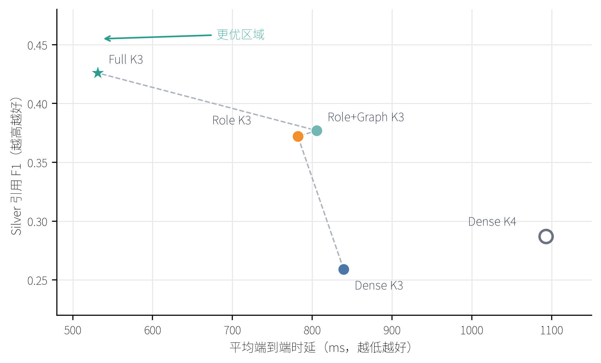

# 面向本地7B模型可追溯问答的预算约束向量—图证据检索

**Budgeted Hybrid Vector–Graph Evidence Retrieval for Provenance-Grounded QA with a Local 7B LLM**

> 中文重构稿 v2。目标：D2AI 2026 Short Paper。正文按 IEEE 双栏短文组织，最终投稿时仅保留英文摘要并压缩至4页（含参考文献）。本文报告的相关性、引用质量与语义支持均为 Silver 评价，不等同于领域专家确认的事实正确率。

**作者：** [作者姓名]，[导师/合作者姓名]

**单位：** [学院、学校，城市，国家]；[联合培养单位，城市，国家]

**邮箱：** [通信作者邮箱]

## 摘要

本地大语言模型问答的主要在线开销并不只由模型规模决定，还取决于送入模型的证据数量与有效性。普通稠密检索容易在有限证据预算内混入角色错配、故障范围错配或缺少来源锚点的文本，既削弱引用质量，又增加验证时延。本文提出一种面向可追溯故障问答的预算约束向量—图证据检索方法。系统以 Entity–Claim–Evidence Assertion–Source Family–Provenance 数据模式统一图结构、向量索引和页级来源锚点；在线阶段由 BGE-M3 完成稠密召回，再结合诊断角色、一跳图传播、故障实体亲和度和来源族新颖性，在最大预算 K=3 下选择紧凑证据集。Qwen2.5-7B-Instruct 仅输出逐证据二进制判定，对首阶段否决项执行召回导向复核，确定性渲染器随后输出带证据 ID 的原子回答或拒答。在包含10类泵系故障、4类证据角色的40条开发查询上，完整方法相对 Dense K3 将 Recall 从0.218提高到0.431、NDCG从0.406提高到0.822、引用F1从0.259提高到0.426，同时将平均端到端时延从839.4 ms降至531.2 ms；配对类簇 Bootstrap 对四项差异均给出不跨零的95%区间。角色+图方法相对同预算角色基线显著提高 Recall 和 NDCG，说明图传播的增益首先体现在证据召回与排序。完整方法还实现34/34可回答查询覆盖和6/6不可回答查询拒答；同模型双提示一致性审计得到91.0%的原子主张严格支持率和82.4%的整段文本严格支持率。结果表明，来源可追溯的向量—图联合选择能够在不微调本地7B模型的条件下形成更优的质量—时延运行点。

**关键词：** GraphRAG；混合检索；证据预算；来源谱系；可追溯问答；本地大语言模型

## I. 引言

检索增强生成（Retrieval-Augmented Generation, RAG）通过外部非参数化记忆为大语言模型提供可更新知识[1]。在工业故障辅助问答中，检索结果还必须回答“证据说明的是症状、原因、检查还是维护”以及“证据来自哪份文档、哪一页、哪个独立来源”等问题。仅按向量相似度截取 Top-k，可能把词面相近但关系角色错误的证据送入模型；当在线模型固定为本地7B参数规模时，无效证据还会直接转化为更长提示、更多验证调用和更高时延。

图增强 RAG 通过实体关系组织检索上下文[2]，[5]–[7]，但现有方法多关注深层路径推理、全局摘要或可训练子图检索。本文研究一个更窄且可操作的数据系统问题：在最大证据预算固定的条件下，能否联合向量相似度、局部图结构、证据角色和来源谱系，只把少量可追溯证据交给本地模型，从而同时改善证据选择质量和在线时延？围绕这一问题，本文提出三个研究问题：RQ1，同预算下图、角色与故障范围信号能否提高检索和引用质量；RQ2，本地7B证据验证与确定性拒答能否改善支持性和安全覆盖；RQ3，质量收益是否能够覆盖混合检索带来的额外开销。

本文贡献有三点。第一，提出面向可追溯 RAG 的混合数据模式，把中文规范实体、语义主张、原文证据断言、来源族和页级 provenance 与稠密向量索引统一起来。第二，提出最大预算 K=3 的向量—图选择与两阶段证据验证流程：图传播负责扩大结构相关召回，故障与角色约束负责压缩候选，本地7B只执行二进制支持判定，避免自由生成引入额外事实。第三，建立可复现的同预算评价协议，分别报告检索、引用、拒答、语义支持和分阶段时延，并增加80条未参与调参的自然语言改写及此前固定协议上的外部来源描述性检查。

## II. 相关工作

RAG 奠定了检索记忆与生成模型联合建模的基本范式[1]。BGE-M3支持多语言、多功能和多粒度表示[3]，本文仅使用其归一化 dense representation。Qwen2.5提供开放权重的多规模指令模型[4]；本文固定 Qwen2.5-7B-Instruct，不通过模型替换或微调获得增益。与直接扩展模型上下文不同，LLMLingua表明压缩输入可减少推理开销[12]。本文不压缩原文 Token，而是在检索层减少无效证据及后续模型调用。

Graph RAG、Think-on-Graph、G-Retriever 和 KG²RAG 分别从全局摘要、图上搜索、相关子图和知识图谱引导检索等角度利用结构信息[2]，[5]–[7]。本文不追求多跳开放推理，而把一跳图接近度作为固定预算下的排序信号，并把 provenance 作为在线可返回的数据对象。ALCE强调生成文本的引用完整性和正确性[8]，RAGAs区分检索相关性、回答相关性与忠实性[9]；Selective QA与Self-RAG进一步说明拒答和自检机制对可信问答的重要性[10]，[11]。本文据此将“检索到什么”“引用了什么”“回答是否被引用原文支持”分层评价。

## III. 系统与方法

### A. 可追溯数据模式与查询契约

发布子图记为 \(\mathcal G=(\mathcal V,\mathcal C,\mathcal A,\mathcal S,\mathcal P)\)。其中 \(\mathcal V\) 为中文规范实体，\(\mathcal C\) 为去重语义主张，\(\mathcal A\) 为保留原文的证据断言，\(\mathcal S\) 为文档与来源族，\(\mathcal P\) 保存 PDF 页码、URL、文档哈希和页面哈希。该模式遵循“一个 Claim 可由多个 Assertion 支持”的设计，使语义去重不破坏来源独立性和页级追溯[13]，[14]。评价子图包含281个实体、203项主张和208条证据断言，来自14份文档和10个来源族；208条证据均具备原文、文档、页码、URL和来源族字段。

查询定义为 \(q=(x,f,r)\)，其中 \(x\) 为自然语言问题，\(f\) 为已知故障范围，\(r\in\{\text{症状, 原因/机理, 检查, 维护}\}\) 为目标证据角色。本文评价的是结构化故障证据检索子系统，\(f,r\) 是系统输入而非隐藏相关性标签；从任意问句自动解析 \(f,r\) 不在当前实验范围内。系统输出至多 K 条证据及其规范回答点，每个回答点必须绑定唯一 evidence ID。

### B. 预算约束的向量—图选择

BGE-M3首先对查询和证据编码，取稠密 Top-32 形成候选池，并以前8条证据的头尾实体作为图锚点。锚点分数沿实体邻接关系传播一跳，衰减系数为0.70；证据的图接近度 \(s_g(e,q)\) 取其两个端点传播分数的最大值。关系类型被映射为四类诊断角色；若候选池存在目标角色，系统执行角色门控，否则保留原池以避免空结果。

对候选证据 \(e\)，基础分数为

\[
b(e,q)=s_d(e,q)+0.24s_g(e,q)+0.10c(e)+0.35a(e,q), \tag{1}
\]

其中 \(s_d\) 为稠密相似度，\(c(e)\) 为发布图置信先验，\(a(e,q)\) 为故障名称与证据端点中文字符二元组 Dice 相似度。完整方法保留 \(a(e,q)\geq0.03\) 的候选，再按

\[
\Delta(e\mid S,q)=b(e,q)+0.06\,\mathbb I[\phi(e)\notin\Phi(S)] \tag{2}
\]

贪心选择至多 K=3 条证据，其中 \(\phi(e)\) 是来源族，第二项是未出现来源族的新颖性先验。K=3 是最大预算而非强制填满：当故障范围约束淘汰不合格证据时，系统允许少选，从而同步减少提示长度和验证调用。来源族新颖性属于完整系统排序先验；本文不把它单独解释为已证实的独立主效应。

### C. 本地7B验证与确定性输出

Qwen2.5-7B不直接生成诊断全文。第一阶段针对全部候选输出等长0/1掩码；对判为0的候选，第二阶段逐条执行召回导向复核，仍只允许输出单个0/1。非法 JSON、长度不一致或非二进制结果均按拒绝处理。最终判定使用单次在线运行，不对多次生成做投票或融合。

确定性渲染器仅接收角色一致、故障亲和度不低于0.05且未重复的通过证据，将规范 Claim 映射为中文原子回答点并附 evidence ID；若没有合格证据，则输出“现有证据不足，无法回答”。因此回答契约只有两种有效状态：带可核验引用的有限回答，或明确拒答。图1给出了数据流及真实查询示例。

**图1  来源可追溯的预算检索流程及“不对中症状”示例。Dense K3 的三个候选分别属于原因、维护和检查角色，完整方法在最大 K=3 下只保留两条症状证据。**

## IV. 实验设计

### A. 数据、基线与运行环境

开发评价由10类泵系故障与4类证据角色构成40条受控查询，其中34条在固定 Silver 图中可回答，6条用于检验拒答。在线阶段禁止读取 Silver 相关 evidence ID 及候选记录内部的 `fault_class_ids`，仅使用查询显式提供的 \(f,r\) 与公开表面字段。为检验措辞敏感性，每条原问题生成2条确定性改写，共80条；改写保持 \(f,r\) 不变，且不参与参数选择。MP010–MP013只出现在先前固定的 v3 协议的一次性隔离外部检查中；其结果不用于本轮参数选择，也不与本轮时延合并比较。

主比较统一最大预算 K=3：Dense K3仅使用稠密相似度；Role K3增加角色门控；Role+Graph K3增加一跳图传播；Full K3进一步加入故障亲和度和来源新颖性。Dense K4仅作为次要的跨预算质量—成本运行点，不用于归因图模块。所有方法共享相同 BGE-M3 索引、Qwen2.5-7B验证器、输出契约和拒答规则。

正式实验运行于 NVIDIA RTX 5880 Ada Generation 48 GB。Qwen2.5-7B以 BF16 完整加载到 cuda:0，无 CPU 或磁盘卸载；生成采用确定性解码。图谱文件约2.00 MB，1024维向量索引约0.86 MB。在线时延包含检索、提示构造、两阶段模型验证和渲染，不包含模型加载、索引构建与预热。

### B. 指标与统计协议

检索层报告 Recall@K 和 NDCG@K；引用层在34条可回答查询上报告宏平均 Precision、Recall 和 F1，对被错误拒答的可回答查询记零分。可回答查询覆盖以 Answer Recall 表示，不可回答查询以 Abstention Precision/Recall 表示。语义支持采用 same-model, dual-prompt consistency audit：同一 qwen3.7-max 以两个预定义提示角色进行离线一致性审计，只有两者均判为支持且返回片段可在引用原文中匹配时才记为严格支持。该模型不参与在线检索、回答或时延统计，也不构成双模型或专家评审。

质量结果只使用预先指定的 repeat=0。每个方法—查询组合另外按轮换顺序独立运行3次用于时延测量，不进行多数投票；先取单查询三次时延中位数，再计算方法级均值和p95。差异采用按故障类别成簇的5000次配对 Bootstrap，报告95%置信区间。

## V. 结果与分析

### A. RQ1：同预算检索与引用质量

**表I  同一最大证据预算 K=3 的主结果**

| 方法 | Recall | NDCG | 引用P/R/F1 | 可答覆盖/不可答拒答 | E2E均值/p95 ms |
|---|---:|---:|---:|---:|---:|
| Dense K3 | 0.218 | 0.406 | .574/.197/.259 | 0.676/1.000 | 839.4/1113.1 |
| Role K3 | 0.378 | 0.678 | .721/.299/.372 | 0.853/1.000 | 782.1/1109.6 |
| Role+Graph K3 | 0.405 | 0.716 | .750/.302/.377 | 0.882/1.000 | 805.5/1101.6 |
| Full K3 | **0.431** | **0.822** | **.799/.370/.426** | **1.000/1.000** | **531.2/892.5** |

Full K3 相对 Dense K3 的 Recall、NDCG 和引用F1分别提高0.2127、0.4166和0.1672，平均端到端时延降低308.2 ms；四项配对95%区间均不跨零。更重要的是，Role+Graph K3 相对 Role K3 的 Recall 增益为0.0268，95% CI为[0.0031, 0.0616]；NDCG增益为0.0381，95% CI为[0.0059, 0.0804]。这为图传播提高结构相关证据召回和排序提供了同预算证据。两者引用F1差异未显著，说明图传播的直接作用首先发生在检索层，而最终引用还受故障范围选择和7B验证影响。

Full K3 相对 Role+Graph K3 的 NDCG 提高0.1064，95% CI为[0.0245, 0.1899]；Recall和引用F1点估计更高，但区间跨零。本文据此把完整方法的优势表述为更好的系统运行点，而不把每个附加模块都解释为独立显著增益。

### B. RQ2：验证、支持性与拒答

**表II  固定 Full K3 候选的本地7B验证器消融**

| 策略 | 引用P/F1 | 可答覆盖/不可答拒答 | 调用数 | 生成p95 ms |
|---|---:|---:|---:|---:|
| 直接渲染 | 0.735/0.463 | 1.000/0.667 | 0.00 | 0.1 |
| 首阶段掩码 | **0.818**/0.370 | 0.971/1.000 | 0.90 | 436.3 |
| 掩码+召回复核 | 0.799/0.426 | **1.000/1.000** | 1.80 | 872.6 |

直接渲染具有较高F1，但引用精确率较低，且只能正确拒绝三分之二的不可回答问题。首阶段掩码提高精确率与拒答率，却损失一条可回答查询；召回复核补回首阶段假阴性，使34条可回答查询全部作答、6条不可回答查询全部拒答。该模块的价值不是单独最大化F1，而是在有限调用下实现更可靠的覆盖—拒答平衡。

双提示 Silver 审计覆盖四种 K3 方法的160条输出和323个审计项。Full K3 的原子主张严格支持率为91.0%，整段回答文本严格支持率为82.4%，所有原子主张均受支持的回答比例为88.2%，引文片段原文核验率为100%，两提示判定一致率为96.0%。Dense K3在较少回答上具有更高支持率，但只回答23条；Full K3回答全部34条可回答问题并维持较高支持性，体现的是覆盖与忠实性的联合优势。

### C. RQ3：质量—时延权衡

Full K3 的平均候选数为2.25，低于最大预算3；每查询跨第一阶段与复核阶段累计的提示长度为634.7 Token，而 Dense K3 为1066.7 Token。相应地，每查询平均模型调用数由2.95降至1.80，全部模型调用的累计推理均值由794.6 ms降至495.7 ms。混合检索本身的平均时延为28.7 ms，与 Dense K3 的28.2 ms接近，新增图与约束开销远小于节省的验证开销。图2显示 Full K3 位于更优的引用F1—平均时延区域；Dense K4的跨预算结果仅用于展示额外证据并不必然带来更好运行点。

**图2  同一验证器下的引用F1—平均端到端时延。实心点为主比较的K=3方法，空心点为次要Dense K4运行点。**

### D. 措辞稳健性与外部来源检查

在80条未参与调参的改写查询上，Full K3取得0.383的Recall和0.737的NDCG，高于Role+Graph K3的0.338和0.645；其证据集合与原问题的平均 Jaccard 为0.742，Top-1一致率为0.725，也均为四种方法最高。这说明完整方法的排序优势不依赖单一固定句式，但由于结构化 \(f,r\) 保持不变，该实验不代表任意自然语言解析能力。

先前固定的 v3 协议所形成的隔离外部集合只有7条可回答查询。Ours-v3 K3与Role-v3 K3取得相同的Recall（0.417）、NDCG（0.443）和引用F1（0.274），高于Dense-v3 K4的引用F1（0.230）。由于该检查沿用较早的生成契约，本文不把其时延与本轮等预算重测合并，也不将其作为 v6 方法的直接泛化证据；它仅说明整个隔离评价流程能够运行于新来源。样本量不足以支持显著性或强泛化结论。

## VI. 讨论与局限

实验揭示了一个对本地 RAG 有实际意义的机制：图检索不必通过更深遍历或更长上下文体现价值。角色门控和一跳传播先提高候选排序，故障范围约束再允许证据集主动欠填，本地7B只对较小集合执行支持判定。最终收益来自“数据模式—检索—验证—渲染”的协同，而不是增加模型参数或压缩原文 Token。所有输出均可沿 evidence ID 回溯到原文、PDF页码、URL和来源族，这使引用核验成为系统接口的一部分，而非生成后的附加说明。

当前评价仍有三项边界。第一，40条开发查询是10类故障×4类角色的受控能力测试，\(f,r\) 作为结构化输入；后续需评价自动意图解析和更自然的复合问题。第二，EvidenceBench、引用与语义审计均为自动治理得到的 Silver 标签，尚无轮机专家盲审，因而本文结论是证据选择一致性和引用支持性，不等同于轮机专家确认的诊断正确率。第三，外部集合只有7条可回答查询，现阶段只能作为描述性验证。上述边界不影响同一固定开发协议内的公平比较，但限制结论的外推范围。

## VII. 结论

本文提出一种面向本地7B模型的预算约束向量—图证据检索系统。该系统把稠密向量、一跳图传播、诊断角色、故障范围和来源 provenance 统一到最大 K=3 的证据选择中，再以两阶段7B判别和确定性渲染实现带引用回答或拒答。同预算实验表明，完整方法相对 Dense K3 显著提高检索、排序和引用F1，同时降低平均端到端时延；Role+Graph相对Role基线的检索增益为图传播的独立排序作用提供了同预算统计证据。措辞改写和语义审计说明该运行点兼具一定稳健性与较高引用支持性。该结果支持把预算化、来源可追溯的混合检索作为本地工业问答的数据基础设施，而非单纯扩大上下文窗口。

## 数据与声明

**数据可用性：** 固定配置、代码、Silver EvidenceBench和聚合实验结果计划随匿名/公开仓库提供；受版权约束的原始PDF不再分发，URL、页码与哈希随证据记录保留。

**伦理与作者贡献（待确认）：** 本研究不涉及人体、动物实验或个人敏感数据。[作者姓名]负责概念、方法、软件、数据治理、实验与初稿；[导师/合作者]负责监督、方法复核与修改。

**利益冲突、资助与AI披露（待确认）：** 作者声明无已知利益冲突；资助信息将在投稿前填写。生成式AI用于代码辅助、实验日志整理和语言组织；研究设计、实验执行、统计核验、引用核查和最终责任由作者承担。

## 参考文献

[1] P. Lewis et al., “Retrieval-augmented generation for knowledge-intensive NLP tasks,” in *Advances in Neural Information Processing Systems*, vol. 33, pp. 9459–9474, 2020.

[2] D. Edge et al., “From local to global: A Graph RAG approach to query-focused summarization,” arXiv:2404.16130, 2024, rev. 2025, doi: 10.48550/arXiv.2404.16130.

[3] J. Chen, S. Xiao, P. Zhang, K. Luo, D. Lian, and Z. Liu, “M3-Embedding: Multi-linguality, multi-functionality, multi-granularity text embeddings through self-knowledge distillation,” in *Findings of ACL 2024*, pp. 2318–2335, 2024, doi: 10.18653/v1/2024.findings-acl.137.

[4] A. Yang et al., “Qwen2.5 technical report,” arXiv:2412.15115, 2024, rev. 2025.

[5] J. Sun et al., “Think-on-Graph: Deep and responsible reasoning of large language model on knowledge graph,” in *Proc. ICLR*, 2024.

[6] X. He et al., “G-Retriever: Retrieval-augmented generation for textual graph understanding and question answering,” in *Advances in Neural Information Processing Systems*, vol. 37, 2024, doi: 10.52202/079017-4224.

[7] X. Zhu, Y. Xie, Y. Liu, Y. Li, and W. Hu, “Knowledge graph-guided retrieval augmented generation,” in *Proc. NAACL-HLT*, vol. 1, pp. 8912–8924, 2025, doi: 10.18653/v1/2025.naacl-long.449.

[8] T. Gao, H. Yen, J. Yu, and D. Chen, “Enabling large language models to generate text with citations,” in *Proc. EMNLP*, pp. 6465–6488, 2023, doi: 10.18653/v1/2023.emnlp-main.398.

[9] S. Es, J. James, L. Espinosa Anke, and S. Schockaert, “RAGAs: Automated evaluation of retrieval augmented generation,” in *Proc. EACL System Demonstrations*, pp. 150–158, 2024, doi: 10.18653/v1/2024.eacl-demo.16.

[10] A. Kamath, R. Jia, and P. Liang, “Selective question answering under domain shift,” in *Proc. ACL*, pp. 5684–5696, 2020, doi: 10.18653/v1/2020.acl-main.503.

[11] A. Asai, Z. Wu, Y. Wang, A. Sil, and H. Hajishirzi, “Self-RAG: Learning to retrieve, generate, and critique through self-reflection,” in *Proc. ICLR*, 2024.

[12] H. Jiang, Q. Wu, C.-Y. Lin, Y. Yang, and L. Qiu, “LLMLingua: Compressing prompts for accelerated inference of large language models,” in *Proc. EMNLP*, pp. 13358–13376, 2023, doi: 10.18653/v1/2023.emnlp-main.825.

[13] G. Buchgeher, D. Gabauer, J. Martinez-Gil, and L. Ehrlinger, “Knowledge graphs in manufacturing and production: A systematic literature review,” *IEEE Access*, vol. 9, pp. 55537–55554, 2021, doi: 10.1109/ACCESS.2021.3070395.

[14] T. Lebo, S. Sahoo, and D. McGuinness, Eds., “PROV-O: The PROV Ontology,” W3C Recommendation, Apr. 30, 2013.
