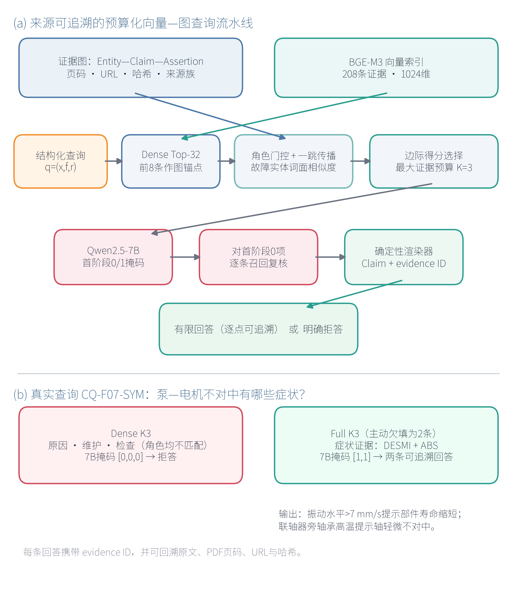

# 面向资源受限本地7B故障问答的预算约束型向量与图协同证据检索

**Budgeted Provenance-Aware Vector–Graph Evidence Retrieval for Resource-Constrained QA with a Local 7B LLM**

> 中文修订工作稿 v5，面向 D2AI 2026 Short Paper。实验结果取自已固定的 v6 与 v6.1 协议，不再依据40条开发查询调整参数。所有数据、相关性标签和审计结论均为 Silver，尚未经轮机领域专家人工确认。

**作者：** [作者姓名]，[导师/合作者姓名]

**单位：** [学院、学校，城市，国家]；[联合培养单位，城市，国家]

**邮箱：** [通信作者邮箱]

## 摘要

在资源受限平台上部署本地大语言模型时，问答效率不仅取决于模型规模，还受证据数量、有效证据比例和验证次数影响。普通稠密 Top-k 检索容易在有限预算中混入诊断角色错误、故障范围不符或来源重复的文本。这些文本会降低引用质量，并增加本地模型的推理负担。针对这一问题，本文提出一种具有来源追溯能力的预算约束型向量与图协同证据检索方法。系统采用 Entity-Claim-Evidence Assertion-Source Family-Provenance 数据模式，统一管理图结构、向量索引和页级来源锚点。在线检索先由 BGE-M3 完成稠密召回，再综合诊断角色、一跳图传播、故障实体亲和度和来源族新颖性，在 K=3 的最大证据预算内选择紧凑证据集。Qwen2.5-7B-Instruct 仅负责逐条判断候选证据是否直接支持问题。确定性渲染器随后生成带 evidence ID 的原子回答；无合格证据时，系统明确拒答。开发集由10类泵系故障和4类证据角色组成，共40条查询。完整方法相对 Dense K3 将 Recall 从0.218提高到0.431，将 NDCG 从0.406提高到0.822，将引用 F1 从0.259提高到0.426。平均端到端时延由839.4 ms降至531.2 ms。四项配对类簇 Bootstrap 差异的95%置信区间均不跨零。检索层消融显示，Role+Graph K3 相对 Role K3 显著提高 Recall 和 NDCG。Full-NoGraph K3 单变量对照给出了更严格的结论。图传播在完整系统中的宏平均增益未达到显著水平，但补回了一个无图方法漏答的尾部检查问题。可回答查询覆盖率由33/34提高到34/34，平均时延仅增加14.2 ms。实验表明，图传播适合作为稀疏尾部证据的补充召回机制；完整系统的主要优势来自数据模式、预算约束、来源治理和本地7B验证的协同作用。

**关键词：** 混合检索；证据预算；来源追溯；GraphRAG；可追溯问答；本地大语言模型

## I. 引言

检索增强生成（Retrieval-Augmented Generation，RAG）利用外部非参数化记忆为大语言模型提供可更新的知识[1]。工业故障辅助问答对证据提出了更严格的要求。系统不仅要找到语义相关文本，还要区分症状、原因或机理、检查和维护等诊断角色，并给出文档、页码和独立来源。单纯依赖向量相似度的 Top-k 检索可能返回词面相近但角色错误的内容。在线模型固定为本地7B规模时，无效证据还会延长提示文本，增加验证次数，不利于低时延运行。

图增强 RAG 可利用实体关系补充向量检索[2]，[5]-[7]。然而，已有系统往往同时改变证据数量、角色过滤、提示长度和模型调用次数，图结构的独立作用难以判断。本文研究固定最大证据预算下的证据选择问题：如何联合向量相似度、局部图结构、诊断角色和来源追溯信息，为本地模型提供少量、有效且可核查的证据，并改善质量与时延的平衡？

围绕上述问题，本文设置三个研究问题。RQ1考察同一证据预算下，结构与治理约束能否改善 Silver 证据的召回、排序和引用一致性。RQ2考察本地7B证据验证能否同时保证可回答查询覆盖和不可回答查询拒答。RQ3分析图结构及治理模块带来的质量收益与在线时延成本。

本文的主要工作包括三方面。第一，设计可追溯故障问答的数据模式，将中文规范实体、语义陈述、原文证据断言、来源族、页级来源信息和稠密向量索引纳入统一数据层。第二，提出最大预算 K=3 的向量与图协同选择方法，并设计两阶段证据验证流程。角色门控、故障范围约束和主动欠填共同减少无效证据及模型调用。第三，采用完整基线、检索层消融、Full-NoGraph 单变量对照、尾部案例和分阶段时延构成实验依据。该设计既评价完整系统的实际运行点，也分别分析图传播的检索层作用和系统内边际作用。

## II. 相关工作

RAG建立了检索记忆与生成模型协同工作的基本范式[1]。BGE-M3支持多语言、多功能和多粒度文本表示[3]。本文固定使用其归一化稠密向量。Qwen2.5提供多种规模的开放权重指令模型[4]。实验固定使用 Qwen2.5-7B-Instruct，不通过更换更大模型或微调获得性能增益。LLMLingua等方法通过压缩提示词加快模型推理[12]。本研究不改写或压缩原文证据，而是在检索阶段限制证据数量，并控制后续验证次数。

Graph RAG、Think-on-Graph、G-Retriever 和 KG²RAG分别利用全局摘要、图搜索、相关子图和知识图谱引导检索[2]，[5]-[7]。本研究不进行深层开放路径推理，而是将一跳图接近度用于候选补充和固定预算排序。ALCE关注生成文本的引用完整性与正确性[8]。RAGAs将检索相关性、回答相关性和忠实性分开评价[9]。Selective QA与Self-RAG说明，拒答和自检有助于提高问答可信度[10]，[11]。基于这些研究，本文分别评价证据记录完整性、Silver检索一致性、回答引用支持性和拒答行为，避免用单项指标概括全部质量。

## III. 系统与方法

### A. 可追溯数据模式

面向在线问答的发布子图记为 \(\mathcal G=(\mathcal V,\mathcal C,\mathcal A,\mathcal S,\mathcal P)\)。其中，\(\mathcal V\) 表示中文规范实体，\(\mathcal C\) 表示去重后的语义陈述，\(\mathcal A\) 表示保留原文的证据断言。\(\mathcal S\) 表示文档及来源族。\(\mathcal P\) 表示页级来源追溯信息，包括 PDF 页码、URL、文档哈希和页面哈希。一条语义陈述可以关联多条证据断言。该设计在消除重复语义的同时，保留不同来源和不同页面的独立证据[13]，[14]。

用于评价的子图包含281个实体、203条语义陈述和208条证据断言，覆盖14份文档与10个来源族。图文件约为2.00 MB，BGE-M3索引约为0.86 MB。每条发布记录 \(t\) 必须满足

\[
I(t)=S(t)\land E(t)\land R(t)\land D(t)\land N(t)\land P(t)\land V(t), \tag{1}
\]

其中，\(S\) 表示模式及关系域值合法；\(E\) 表示中文规范实体已完成锚定；\(R\) 表示原文直接支持该语义陈述；\(D\) 表示规范化后的关系方向一致。\(N\) 表示记录不是推断边；\(P\) 表示记录具有 E1 文本区间，或 E2 表格同行、边界框和页面锚点；\(V\) 表示文档、来源族、URL、页码和哈希字段完整。七项约束均有208条记录通过。该结果证明这些 Silver 记录满足结构与来源合同，但不能代替领域专家对事实正确性的确认。

查询表示为 \(q=(x,f,r)\)。其中，\(x\) 是自然语言问题，\(f\) 是已知故障范围，\(r\in\{\text{症状，原因/机理，检查，维护}\}\) 是目标证据角色。本实验评价结构化故障证据检索子系统，因此 \(f\) 和 \(r\) 作为显式输入提供。如何从任意用户问句中自动识别 \(f\) 和 \(r\)，不在本次实验范围内。

### B. 固定预算下的向量与图协同选择

BGE-M3先检索稠密 Top-32 候选，并以排名前8的证据端点实体作为图锚点。锚点分数沿实体邻接关系传播一跳，衰减系数设为0.70。证据 \(e\) 的图接近度 \(s_g(e,q)\) 取其两个端点传播分数的较大值。候选池中存在目标角色时，系统启用角色门控；否则保留原候选，防止规则过滤产生空结果。

候选证据的基础分数定义为

\[
b(e,q)=s_d(e,q)+0.24s_g(e,q)+0.10c(e)+0.35a(e,q), \tag{2}
\]

其中，\(s_d\) 表示稠密相似度，\(c(e)\) 表示发布子图中的置信先验，\(a(e,q)\) 表示故障名称与证据端点之间的中文字符二元组 Dice 相似度。系统保留 \(a(e,q)\geq0.03\) 的候选，再按照

\[
\Delta(e\mid S,q)=b(e,q)+0.06\,\mathbb I[\phi(e)\notin\Phi(S)] \tag{3}
\]

贪心选择不超过3条证据。\(\phi(e)\) 表示证据所属来源族，第二项奖励当前集合中尚未出现的来源族。K=3是最大预算，不要求每次填满。故障范围约束删除不合格证据后，系统可保留少于3条证据，从而缩短提示并减少验证负担。

### C. 本地7B验证与回答规则

Qwen2.5-7B不负责自由生成诊断文本。第一阶段读取全部候选，只输出等长的0/1支持掩码。第二阶段对首阶段判为0的候选逐条复核，输出仍限定为单个0或1。非法 JSON、长度不一致及非二进制输出均按不支持处理。

确定性回答渲染器只接收三类证据：诊断角色一致、故障亲和度不低于0.05且内容不重复。渲染器将通过验证的规范语义陈述转换为中文原子回答点，并附上 evidence ID。没有证据满足条件时，系统输出“现有证据不足，无法回答”。

**图1  预算约束型可追溯向量与图协同检索流程。在线7B模型仅判断候选证据是否支持问题，最终回答由确定性渲染器生成。**

## IV. 实验设计

### A. 数据、基线与固定协议

开发集包含40条受控查询，由10类泵系故障与4类证据角色组合而成。其中34条可由固定 Silver 图回答，另有6条用于检验拒答。在线阶段不得读取 Silver 相关 evidence ID，也不得使用候选记录内部的 `fault_class_ids`。检索仅使用查询显式给出的 \(f,r\) 和公开表面字段。每个原问题另设2条确定性改写，共80条。这些改写不参与参数调整，仅用于评价系统对措辞变化的稳定性。MP010-MP013只用于固定协议后的一次隔离外部检查，不参与参数选择。

主实验统一设置最大证据预算 K=3。Dense K3只采用稠密相似度。Role K3在此基础上加入角色门控。Role+Graph K3继续加入一跳图传播。Full K3再加入故障亲和度、来源新颖性、主动欠填和两阶段7B验证。单变量对照 Full-NoGraph K3保留 Full K3的角色、故障、来源、欠填、验证器和 K=3预算，仅关闭一跳图传播及图接近度分数。Full K3和 Full-NoGraph K3使用相同的检索回放、查询顺序和模型输出规则。

正式结果及其配置、检索回放、语义审计、稳健性评价和外部评价共13项关键文件已写入 SHA-256 清单。测试开始前，算法、阈值、提示词和评价协议均已固定。论文修订只重新组织文本与派生表，不改动开发集结果。

### B. 指标、统计方法与运行环境

评价指标分为三个层次。证据完整性对应公式(1)中的发布约束。检索效用包括 Recall@K、NDCG@K和引用 Precision、Recall、F1。回答行为包括可回答查询覆盖、不可回答查询拒答、原子陈述严格支持率和端到端时延。引用指标在34条可回答查询上计算宏平均，错误拒答按零分计。

语义支持性采用同模型双提示一致性审计（same-model, dual-prompt consistency audit）。同一 qwen3.7-max 分别使用两个预先设定的提示角色进行离线判断。只有两个提示均判定为支持，且返回片段能够在引用原文中匹配时，该项才记为严格支持。该过程属于自动 Silver 审计，不是双模型评审，也不是领域专家评审。

质量指标只采用预先指定的 repeat=0。时延测试中，每个“方法-查询”组合按轮换顺序独立执行3次，不进行投票或答案融合。先计算单条查询3次测量的中位数，再汇总方法级均值和p95。方法差异采用按10类故障成簇的5000次配对 Bootstrap，并报告95%置信区间。

系统的目标场景是计算、内存和时延预算受限的船舶机舱本地问答平台。本轮实验使用 NVIDIA RTX 5880 Ada Generation 48 GB进行可控单GPU测量，以减少设备抢占、CPU卸载和驱动差异的影响。Qwen2.5-7B以 BF16 完整加载到 `cuda:0`，未发生CPU或磁盘卸载。RTX 5880本身不属于资源受限硬件。本实验只比较固定模型和固定证据预算下的算法相对效率。在线时延包含检索、提示构造、两阶段验证和回答渲染，不包含模型加载、索引构建与预热。

## V. 结果

### A. 完整系统与基线比较

**表I  相同最大证据预算 K=3 下的主实验结果**

| 方法 | Recall | NDCG | 引用P/R/F1 | Answer R/Abstain R | E2E均值/p95 ms |
|---|---:|---:|---:|---:|---:|
| Dense K3 | 0.218 | 0.406 | 0.574/0.197/0.259 | 0.676/1.000 | 839.4/1113.1 |
| Role K3 | 0.378 | 0.678 | 0.721/0.299/0.372 | 0.853/1.000 | 782.1/1109.6 |
| Role+Graph K3 | 0.405 | 0.716 | 0.750/0.302/0.377 | 0.882/1.000 | 805.5/1101.6 |
| Full K3 | **0.431** | **0.822** | **0.799/0.370/0.426** | **1.000/1.000** | **531.2/892.5** |

Full K3相对 Dense K3的 Recall、NDCG和引用 F1分别提高0.2127、0.4166和0.1672，平均端到端时延降低308.2 ms。四项差异的配对95%置信区间依次为[0.1496, 0.2748]、[0.3184, 0.4940]、[0.1075, 0.2298]和[-395.3, -217.2] ms，均不跨零。完整系统没有通过增加证据数量换取质量。它在提高 Silver 证据一致性的同时，减少了提示长度和验证负担。

检索层消融用于分析图结构的作用。Role+Graph K3相对 Role K3的 Recall提高0.0268，95%置信区间为[0.0031, 0.0616]；NDCG提高0.0381，95%置信区间为[0.0059, 0.0804]。引用 F1仅提高0.0049，且置信区间跨零。图传播主要改善候选召回和排序。最终引用结果还会受到故障范围、来源约束和7B验证的共同影响。

### B. Full-NoGraph单变量对照

**表II  完整系统中图传播的单变量对照结果**

| 方法 | Recall | NDCG | 引用P/R/F1 | Answer P/R | Abstain P/R | E2E均值/p95 ms |
|---|---:|---:|---:|---:|---:|---:|
| Full K3 | 0.431 | 0.822 | 0.799/0.370/0.426 | 1.000/1.000 | 1.000/1.000 | 544.4/903.1 |
| Full-NoGraph K3 | 0.429 | 0.800 | 0.784/0.369/0.423 | 1.000/0.971 | 0.857/1.000 | 530.2/907.8 |

在其他模块保持不变时，图传播对 Recall、NDCG和引用 F1的增量分别为0.0018、0.0225和0.0032，三项95%置信区间均跨零。平均端到端时延增加14.2 ms，95%置信区间为[-3.4, 34.1] ms。现有结果不足以证明图传播能在完整系统中普遍提高宏平均指标。

图传播仍影响了可回答查询覆盖。Full K3回答了全部34条可回答查询，Full-NoGraph K3回答了33条。两者的拒答精确率分别为1.000和0.857。40条查询中，只有4条的排序受到图传播影响。最清晰的成功案例是 `CQ-F07-INS`。Full K3通过图邻接检索到“不对中可由时域波形分析诊断”的检查证据并正确作答，而无图方法未保留合格候选，因而错误拒答。

图传播也可能引入噪声。在 `CQ-F03-CAUSE` 中，它加入了“腐蚀导致泵卡死”的候选。该候选不在固定的 Silver 相关集合中，使该查询的 Silver 引用 F1低于无图方法。其余两条排序变化没有改变总体引用效用。正反案例说明，一跳传播可能决定少量尾部查询能否得到回答，但仍需更严格的图边故障范围约束。

### C. 本地7B验证与回答支持性

**表III  固定 Full K3候选下的验证器消融结果**

| 策略 | 引用P/F1 | Answer R/Abstain R | 平均调用数 | 生成p95 ms |
|---|---:|---:|---:|---:|
| 直接渲染 | 0.735/0.463 | 1.000/0.667 | 0.00 | 0.1 |
| 首阶段掩码 | **0.818**/0.370 | 0.971/1.000 | 0.90 | 436.3 |
| 掩码+召回复核 | 0.799/0.426 | **1.000/1.000** | 1.80 | 872.6 |

直接渲染获得较高的引用 F1，但引用精确率较低，只能正确拒绝三分之二的不可回答查询。首阶段掩码提高了引用精确率和拒答表现，但造成一条可回答查询的假阴性。第二阶段召回复核补回了这条查询，使34条可回答查询全部作答，6条不可回答查询全部拒答。两阶段验证器的作用是平衡回答覆盖与可靠拒答，而不是单独追求最高引用 F1。

同模型双提示一致性审计覆盖4种 K3方法的160条输出，共323个审计项。Full K3的原子陈述严格支持率为91.0%，整段回答严格支持率为82.4%，所有原子陈述均获支持的回答比例为88.2%。引文片段原文核验率为100%，两种提示的判定一致率为96.0%。这些结果反映自动 Silver 支持性，不代表专家确认的诊断正确率。

### D. 分阶段时延

**表IV  Full与Full-NoGraph的配对时延分解（ms/query）**

| 方法 | 检索 | 提示构造 | 首阶段验证 | 召回复核 | 生成流水线 | 端到端 |
|---|---:|---:|---:|---:|---:|---:|
| Full K3 | 29.391 | 1.505 | 297.362 | 196.205 | 513.178 | 544.397 |
| Full-NoGraph K3 | 29.341 | 1.512 | 283.157 | 199.323 | 496.384 | 530.228 |

关闭图传播后，平均检索时延只减少0.05 ms。一跳图计算不是在线开销的主要来源。14.2 ms的端到端差异主要来自候选变化所触发的不同7B验证路径，也包含少量运行波动。Full K3和 Full-NoGraph K3的p95端到端时延分别为903.1 ms和907.8 ms，尾部时延接近。

主实验中，Full K3平均保留2.25条证据，累计提示长度为634.7 Token，平均模型调用数为1.80。Dense K3对应的提示长度为1066.7 Token，平均模型调用数为2.95。Full K3相对 Dense K3的时延优势主要来自主动欠填和较少的验证工作量，而不是图检索本身更快。

### E. 措辞稳定性与外部来源评价

在80条未参与参数调整的改写查询上，Full K3的 Recall为0.383，NDCG为0.737；Role+Graph K3分别为0.338和0.645。Full K3检索证据集合与原问题结果的平均 Jaccard相似度为0.742，Top-1一致率为0.725。系统的排序优势不依赖单一固定句式，但这些改写仍保留结构化输入 \(f,r\)，不能据此推断任意自然语言意图解析能力。

固定协议在MP010-MP013外部来源上仅得到7条可回答查询。Ours-v3 K3与 Role-v3 K3的 Recall均为0.417，NDCG均为0.443，引用 F1均为0.274；Dense-v3 K4的引用 F1为0.230。外部样本较少，且沿用早期回答规则。该实验只说明协议没有根据外部来源回流调参，并能在新来源上运行，不用于显著性分析或强泛化结论。

## VI. 讨论

各组实验揭示了不同模块的作用。Full K3相对 Dense K3同时改善质量和平均时延，说明预算约束型联合系统获得了更好的运行点。Role+Graph K3相对 Role K3显著提高 Recall和 NDCG，表明图传播能够改善检索层的结构相关性。Full-NoGraph单变量对照则显示，故障亲和度、来源治理和7B验证已经承担了大部分平均增益。图传播在完整系统中的新增价值主要体现在少量尾部查询。因此，更准确的定位是将图传播视为成本较低的结构化补充召回机制，而不是完整系统全部收益的来源。

系统贡献不局限于单个排序公式。D2AI关注向量、关系和图数据的协同管理，也关注来源追溯与可信 RAG。本研究建立了可执行的数据接口：每个在线原子回答点都关联语义陈述和证据断言，并可追溯到原文、PDF页码、URL、来源族及哈希。向量索引负责宽召回，图邻接补充结构候选，角色与故障约束压缩证据预算，本地7B判断证据是否直接支持问题。来源核验由此成为在线问答流程的一部分，而不是事后补充信息。

本研究仍有三项边界。第一，40条开发查询属于“10类故障×4类角色”的受控能力测试，结构化 \(f,r\) 由系统直接提供。自动意图解析和复合问题尚未评价。第二，EvidenceBench、引用相关性和双提示语义审计均采用 Silver 标签，尚无轮机专家盲审，不能将结果解释为专家确认的诊断正确率。第三，外部来源仅有7条可回答查询，只能用于描述性检查。实验在 RTX 5880上控制变量，尚未在实际船载受限硬件上测量绝对时延。当前结论支持固定模型、固定预算条件下的相对效率，不直接代表船载设备上的绝对性能。

## VII. 结论

本文提出一种面向资源受限本地7B故障问答的预算约束型向量与图协同证据检索方法。在相同的最大证据预算 K=3下，完整系统相对 Dense K3显著提高 Silver 证据召回、排序和引用一致性，并通过缩短提示、减少验证调用来降低平均端到端时延。检索层消融表明，一跳图传播显著改善 Recall和 NDCG。Full-NoGraph单变量对照进一步说明，图传播在完整系统中的平均边际增益有限，但能够补回无图方法遗漏的尾部检查证据。综合来看，数据模式、预算选择、来源治理和本地7B验证构成系统的主要贡献，图传播则为稀疏尾部证据提供结构化补充召回。

## 数据与声明

**数据可用性：** 固定配置、代码、Silver EvidenceBench、聚合实验结果和结果清单计划通过匿名或公开仓库提供。受版权约束的原始 PDF 不再分发，证据记录保留来源 URL、页码和哈希。

**伦理与作者贡献（待确认）：** 本研究不涉及人体、动物实验或个人敏感数据。[作者姓名]负责概念设计、方法、软件、数据治理、实验和初稿撰写；[导师/合作者]负责研究监督、方法复核和论文修改。

**利益冲突、资助与AI披露（待确认）：** 作者声明不存在已知利益冲突。资助信息将在投稿前补充。生成式AI用于代码辅助、实验日志整理和语言组织；研究设计、实验执行、统计核验、引用核查及论文最终责任由作者承担。

## 参考文献

[1] P. Lewis et al., “Retrieval-augmented generation for knowledge-intensive NLP tasks,” in *Advances in Neural Information Processing Systems*, vol. 33, pp. 9459-9474, 2020.

[2] D. Edge et al., “From local to global: A Graph RAG approach to query-focused summarization,” arXiv:2404.16130, 2024, rev. 2025, doi: 10.48550/arXiv.2404.16130.

[3] J. Chen, S. Xiao, P. Zhang, K. Luo, D. Lian, and Z. Liu, “M3-Embedding: Multi-linguality, multi-functionality, multi-granularity text embeddings through self-knowledge distillation,” in *Findings of ACL 2024*, pp. 2318-2335, 2024, doi: 10.18653/v1/2024.findings-acl.137.

[4] A. Yang et al., “Qwen2.5 technical report,” arXiv:2412.15115, 2024, rev. 2025.

[5] J. Sun et al., “Think-on-Graph: Deep and responsible reasoning of large language model on knowledge graph,” in *Proc. ICLR*, 2024.

[6] X. He et al., “G-Retriever: Retrieval-augmented generation for textual graph understanding and question answering,” in *Advances in Neural Information Processing Systems*, vol. 37, 2024, doi: 10.52202/079017-4224.

[7] X. Zhu, Y. Xie, Y. Liu, Y. Li, and W. Hu, “Knowledge graph-guided retrieval augmented generation,” in *Proc. NAACL-HLT*, vol. 1, pp. 8912-8924, 2025, doi: 10.18653/v1/2025.naacl-long.449.

[8] T. Gao, H. Yen, J. Yu, and D. Chen, “Enabling large language models to generate text with citations,” in *Proc. EMNLP*, pp. 6465-6488, 2023, doi: 10.18653/v1/2023.emnlp-main.398.

[9] S. Es, J. James, L. Espinosa Anke, and S. Schockaert, “RAGAs: Automated evaluation of retrieval augmented generation,” in *Proc. EACL System Demonstrations*, pp. 150-158, 2024, doi: 10.18653/v1/2024.eacl-demo.16.

[10] A. Kamath, R. Jia, and P. Liang, “Selective question answering under domain shift,” in *Proc. ACL*, pp. 5684-5696, 2020, doi: 10.18653/v1/2020.acl-main.503.

[11] A. Asai, Z. Wu, Y. Wang, A. Sil, and H. Hajishirzi, “Self-RAG: Learning to retrieve, generate, and critique through self-reflection,” in *Proc. ICLR*, 2024.

[12] H. Jiang, Q. Wu, C.-Y. Lin, Y. Yang, and L. Qiu, “LLMLingua: Compressing prompts for accelerated inference of large language models,” in *Proc. EMNLP*, pp. 13358-13376, 2023, doi: 10.18653/v1/2023.emnlp-main.825.

[13] G. Buchgeher, D. Gabauer, J. Martinez-Gil, and L. Ehrlinger, “Knowledge graphs in manufacturing and production: A systematic literature review,” *IEEE Access*, vol. 9, pp. 55537-55554, 2021, doi: 10.1109/ACCESS.2021.3070395.

[14] T. Lebo, S. Sahoo, and D. McGuinness, Eds., “PROV-O: The PROV Ontology,” W3C Recommendation, Apr. 30, 2013.
