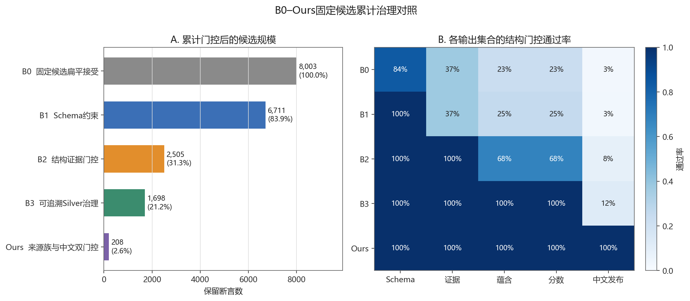
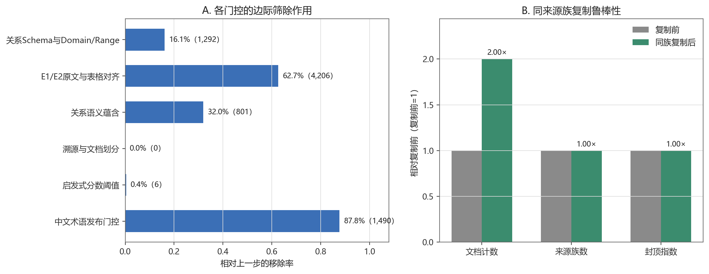
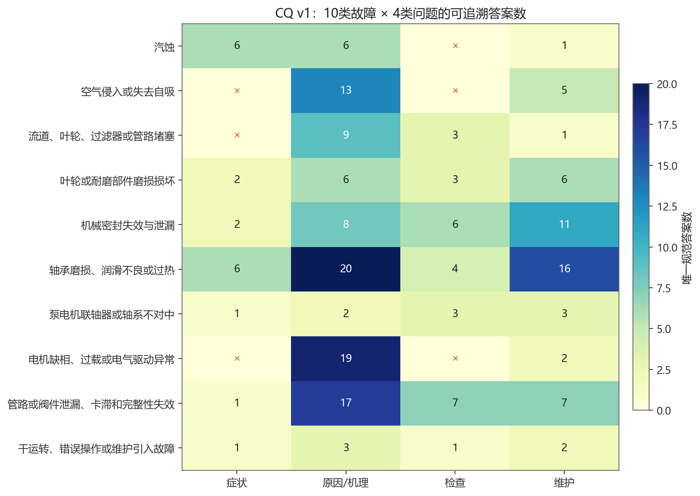
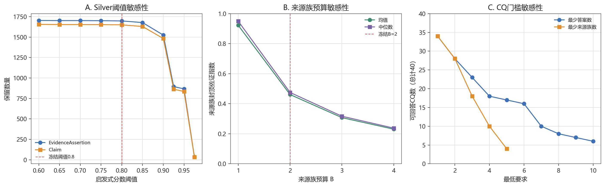

# 研究点一 B0–Ours 对照、关键消融与敏感性实验报告

- 实验版本：`marine_pump_rp1_b0_ours_ablation_v1`
- 生成时间：`2026-07-30T12:41:11.342725+00:00`
- 对象：船舶机舱泵系可追溯 Silver 证据知识图谱
- 标签政策：仅 Silver，绝不称 Gold；未进行领域专家审核。
- 执行方式：纯本地固定候选离线实验；未调用模型或网络。

## 摘要

本实验在同一批8003条全量审计候选上执行累计治理对照，避免不同模型调用、提示词和页面预算造成混杂。B0、B1、B2、B3和Ours分别保留8003、6711、2505、1698和208条断言。Schema门控移除1292条关系类型或Domain/Range不合规记录；E1/E2原文及表格对齐门控进一步移除4206条；关系蕴含门控移除801条；冻结分数阈值0.8再隔离6条；中文术语发布门控从1698条证据Silver中发布208条中文就绪记录。

来源族实验中，真实的3个多文档精确Claim均只计为1个来源族；合成同族复制使文档计数达到2.00倍，但来源族数和封顶指数不变。CQ v1可回答34/40，结构可回答率为85.0%，按故障类聚类bootstrap的95%区间为[72.5%, 97.5%]。这些指标验证结构门控、谱系和功能覆盖，不是事实准确率。

## 1. 实验问题与假设

本实验回答以下问题：

1. 累积Schema、证据、蕴含、溯源和中文发布门控后，候选规模与结构合规性如何变化？
2. 哪个治理模块产生最大的边际筛除作用？
3. 同一厂商资料复制时，来源族封顶指标是否保持不变？
4. 分数阈值、来源族预算和CQ最低证据要求变化时，结论是否稳定？
5. 中文发布图能够回答十类故障中的哪些症状、原因、检查和维护问题？

## 2. 实验设计与诚信边界

### 2.1 固定候选离线对照

| 方法 | 累计模块 | 本实验中的操作化定义 |
|---|---|---|
| B0 | 无治理门控 | 接受8003条结构化审计候选，仅作为固定候选参照 |
| B1 | 关系Schema | 要求关系、头尾类型及Domain/Range合法 |
| B2 | B1 + 结构证据 | 要求E1/E2、连续原文或表格同行证据可验证 |
| B3 | B2 + Silver治理 | 增加关系蕴含、构建集/溯源、非推断和分数阈值 |
| Ours | B3 + 来源族/中文双门控/CQ | 发布中文规范子图，并执行来源族和功能覆盖评价 |

> 本实验是固定候选集合上的治理反事实，不是重新使用不同提示词执行B0–Ours模型抽取。因此可以解释各门控对现有候选的结构效应，不能解释为提示词或模型端抽取精度的因果提升。

### 2.2 数据划分与统计单元

- 仅使用主图构建集MP001–MP007、MP015–MP022，共15份文档。
- MP008开发集和MP009–MP013保留测试集均未进入候选、调参或评价。
- 置信区间按文档聚类重采样；CQ区间按十类故障聚类重采样。
- Bootstrap重复2000次，随机种子20260730。
- 因无人工Gold，不报告Accuracy、Precision、Recall或事实正确率。

## 3. B0–Ours累计对照

| 方法 | 断言 | Claim | 实体 | 文档 | 来源族 | 相对B0保留率（95%文档聚类CI） |
|---|---:|---:|---:|---:|---:|---:|
| B0 | 8,003 | 7,651 | 9,149 | 15 | 10 | 100.0% [100.0%, 100.0%] |
| B1 | 6,711 | 6,384 | 7,726 | 15 | 10 | 83.9% [80.9%, 88.2%] |
| B2 | 2,505 | 2,424 | 3,712 | 15 | 10 | 31.3% [20.9%, 40.4%] |
| B3 | 1,698 | 1,650 | 2,613 | 15 | 10 | 21.2% [14.9%, 27.6%] |
| Ours | 208 | 203 | 281 | 14 | 10 | 2.6% [1.5%, 4.3%] |

B0中的Schema、证据和蕴含通过率分别为83.9%、37.1%和22.9%。B3对所有发布硬条件达到100%，但仅12.25%的证据Silver同时满足中文术语发布门控。该12.25%是双门控投影率，不应解释为其余87.75%的原文证据错误。

## 4. 关键模块消融

### 4.1 累计序列中的边际筛除

| 模块 | 输入 | 输出 | 移除 | 移除率 |
|---|---:|---:|---:|---:|
| 关系Schema与Domain/Range | 8,003 | 6,711 | 1,292 | 16.1% |
| E1/E2原文与表格对齐 | 6,711 | 2,505 | 4,206 | 62.7% |
| 关系语义蕴含 | 2,505 | 1,704 | 801 | 32.0% |
| 溯源与文档划分 | 1,704 | 1,704 | 0 | 0.0% |
| 启发式分数阈值 | 1,704 | 1,698 | 6 | 0.4% |
| 中文术语发布门控 | 1,698 | 208 | 1,490 | 87.8% |

结构证据门控的边际筛除最大（4206条，62.7%），说明当前候选噪声主要来自原文定位、表格同行/同行组和E1/E2资格，而不是最终0.8分数阈值。分数阈值只额外隔离6条，表明“硬约束优先、分数其次”的实际行为与方法设计一致。溯源与文档划分在该顺序中移除0条，是因为这些字段已在上游构图时作为全量记录不变量写入，不能据此解释为溯源模块没有必要。

### 4.2 特定模块去除的可观测代价

| 消融 | 可观测代价 | 解释 |
|---|---|---|
| 将E3并入自动发布 | 400 条E3重建证据失去人工隔离 | 这些记录不应被自动等同于E1/E2。 |
| 扁平化Claim与Evidence | 48 条额外来源断言被覆盖 | 30个多证据Claim受到影响。 |
| 以文档数代替来源族 | 100.0% 文档计数相对放大率 | 同族复制后文档计数翻倍，但来源族封顶指数变化为0。 |
| 去除中文术语发布门控 | 1,490 条非中文发布就绪记录会混入 | 证据Silver不等于中文规范实体发布就绪。 |
| 去除CQ功能评价 | 6 个功能缺口将不可见 | 图谱规模不能替代可回答问题覆盖。 |

Claim–Evidence扁平化会覆盖48条额外来源断言，涉及30个多证据Claim；这直接削弱多页、多文档证据保留。去除中文术语门控会使1490条尚未满足中文端点发布规则的记录混入中文发布图，但不会增加原文证据层本身的事实可靠性。

## 5. 来源族封顶佐证实验

- 证据Silver：1,698条；精确Claim：1,650个。
- 真实多文档Claim：3个，其中3个全部只计为一个来源族。
- 同族复制后文档计数放大到2.00倍，封顶指数最大变化为0.000000。
- 精确Claim跨至少两个来源族：0个。

结果支持“同一厂商多份手册不重复累加”的算法性质，但当前没有自然跨族精确Claim，尚不能验证指数对自然跨来源族佐证的区分效度，也不能证明不同来源族统计独立。

## 6. CQ功能覆盖

当前可回答34/40，可追溯结构可回答率85.0%；故障类聚类95%区间为[72.5%, 97.5%]。

| 角色 | 可回答任务 | 可回答率 |
|---|---:|---:|
| 症状 | 7/10 | 70.0% |
| 原因/机理 | 10/10 | 100.0% |
| 检查 | 7/10 | 70.0% |
| 维护 | 10/10 | 100.0% |

未形成合法证据路径的任务：

- 汽蚀—检查：`no_legal_semantic_path`
- 空气侵入或失去自吸—症状：`no_legal_semantic_path`
- 空气侵入或失去自吸—检查：`no_legal_semantic_path`
- 流道、叶轮、过滤器或管路堵塞—症状：`no_legal_semantic_path`
- 电机缺相、过载或电气驱动异常—症状：`no_legal_semantic_path`
- 电机缺相、过载或电气驱动异常—检查：`no_legal_semantic_path`

## 7. 参数敏感性

### 7.1 Silver分数阈值

| 阈值 | 断言 | Claim | 故障类别 |
|---:|---:|---:|---:|
| 0.600 | 1,704 | 1,656 | 10 |
| 0.650 | 1,702 | 1,654 | 10 |
| 0.700 | 1,702 | 1,654 | 10 |
| 0.750 | 1,701 | 1,653 | 10 |
| 0.800 | 1,698 | 1,650 | 10 |
| 0.850 | 1,678 | 1,630 | 10 |
| 0.900 | 1,525 | 1,483 | 10 |
| 0.925 | 895 | 863 | 10 |
| 0.950 | 867 | 835 | 10 |
| 0.975 | 36 | 34 | 8 |

阈值从0.8提高到0.85仅减少20条断言；提高到0.9则累计减少173条。0.975时故障类别覆盖由10降为8，说明过高阈值会明显损害长尾覆盖。

### 7.2 来源族预算

| B | 指数均值 | 中位数 | ≥0.5 Claim |
|---:|---:|---:|---:|
| 1 | 0.9221 | 0.9500 | 1,650 |
| 2 | 0.4611 | 0.4750 | 0 |
| 3 | 0.3074 | 0.3167 | 0 |
| 4 | 0.2305 | 0.2375 | 0 |

B从1增至4时指数均值单调下降，因为当前精确Claim均只有一个来源族，缺失族位置按0计。B=2与冻结的两来源族任务预算一致，但不是理论最优常数。

### 7.3 CQ最低要求

最低答案数由1提高到2时，可回答任务由34降为28；要求至少2个来源族时同样为28，至少3个来源族时降为18。CQ覆盖结论对门槛敏感，因此论文必须同时报告门槛和分项结果。

## 8. 约束与复现审计

- 标准化约束：36项；发布阻断0项；`release_blocked=false`。
- CQ、来源族和约束报告均通过输入图谱SHA-256交叉校验。
- 所有CSV使用UTF-8 BOM，JSON/JSONL保持UTF-8。
- 本实验未修改任何Silver标签、原文、页码、URL或哈希。
- 当前约束为项目专用Python/JSON注册表实现，不是RDF/SHACL。

## 9. 有效性威胁

1. **非事实准确率**：没有轮机专家Gold，结构门控通过不能证明主张事实正确。
2. **固定候选偏差**：B0–Ours共用最终抽取候选，不能评价不同提示词对召回率的影响。
3. **门控顺序依赖**：边际筛除量依赖预先冻结的累计顺序，不等同于完全析因实验。
4. **来源族代理限制**：发布者/组织谱系只是依赖性代理，不能证明统计独立。
5. **自然跨族样本缺失**：精确Claim跨来源族为0，当前只验证复制不变性。
6. **开发时序偏差**：Schema、门控和阈值曾在构建流程中迭代，当前构建集结果不是盲测性能。
7. **构建集内部结果**：MP009–MP013尚未用于一次性外部泛化评价。

## 10. 结论与下一步

本轮实验支持以下结论：

1. 在固定候选上，Schema、原文证据和关系蕴含门控具有显著的结构筛除作用，其中结构证据门控贡献最大。
2. 0.8分数阈值只承担次级隔离作用，不能替代硬约束。
3. 来源族封顶能够抵抗同厂商文档复制导致的伪多源膨胀。
4. 双门控避免把证据Silver直接冒充中文发布图；CQ揭示了6个图谱规模统计无法发现的功能缺口。
5. 这些结果足以形成研究点一的内部结构实验，但尚不足以声称事实准确率、自然跨族区分效度或外部泛化。

建议下一步：

- 将本报告作为研究点一内部对照与消融结果写入论文；
- 不修改CQ v1，保留6个缺口作为误差分析；若发布CQ v2，必须单独版本化；
- 如论文需要证明抽取提示词本身优于B0，应在冻结页面子集上另做真实API提示词对照；
- 在所有Schema、阈值和CQ冻结后，才对MP009–MP013执行一次性外部评价；
- 研究点一仍不能标记为完成，直到论文所需实验表、图和结论边界最终冻结。
