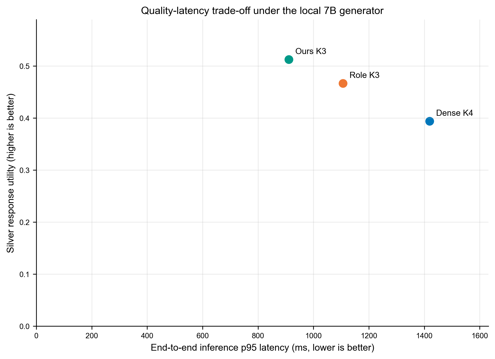
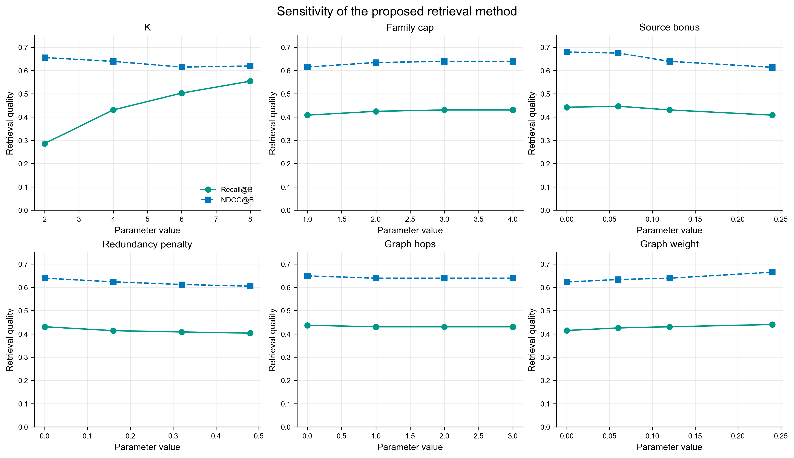
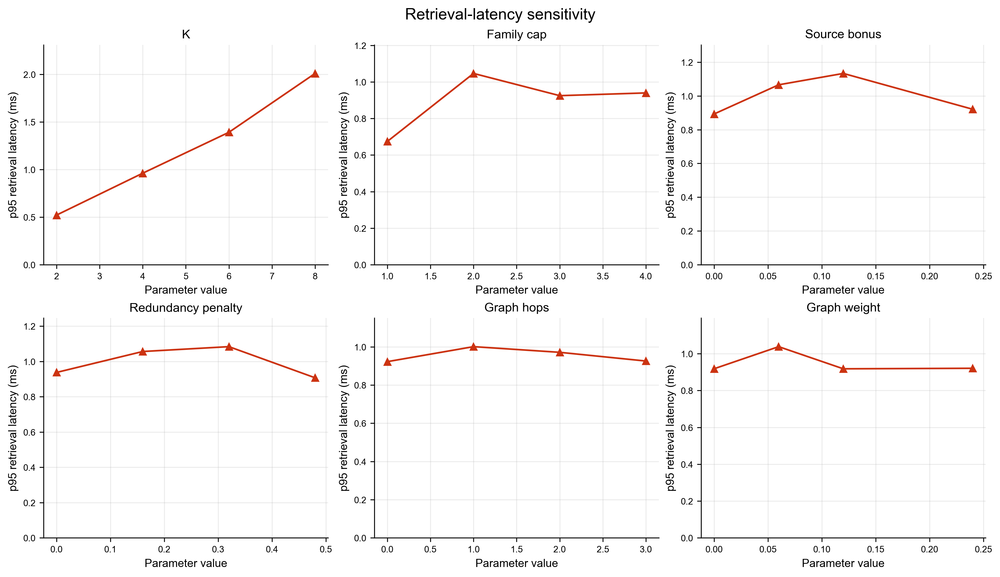

# RP2 v5.2 冻结实验包与论文结果说明

本目录只包含由冻结结果确定性生成的论文表格和图。所有事实标签均为 Silver，未经过领域专家人工审核，不得表述为 Gold 或专家确认正确率。

## 1. 冻结边界

- 开发评价：40个受控能力查询，其中34个可回答、6个不可回答。
- 最终协议：紧凑第一阶段判别 + 第一阶段0候选的独立召回复核，三方法采用同一复核器。
- 时延协议：三次轮换交错执行，逐查询取中位数后统计方法p95。
- 冻结后不再根据开发集修改提示词、阈值、图检索参数或评价规则。
- 标签政策：Silver only; never Gold。

## 2. 主实验

| Method | Recall@B | MRR | NDCG@B | Silver P | Silver F1 | Norm F1 | Utility | Strict point | p95 ms |
|---|---|---|---|---|---|---|---|---|---|
| Dense K4 | 0.257 | 0.507 | 0.406 | 0.848 | 0.287 | 0.369 | 0.394 | 0.935 | 1418.6 |
| Role K3 | 0.378 | 0.770 | 0.678 | 0.845 | 0.372 | 0.529 | 0.467 | 0.904 | 1106.4 |
| Ours K3 | 0.431 | 0.926 | 0.822 | 0.799 | 0.426 | 0.605 | 0.512 | 0.910 | 910.8 |

Ours K3相对Dense K4的Silver回答效用差为0.118，配对Bootstrap 95% CI为[0.047, 0.197]；p95端到端时延减少507.8 ms。该比较支持相对Dense的质量提升与时延优势。

Ours K3相对Role K3的效用点估计提高0.046，但95% CI为[-0.010, 0.107]，跨越0。因此论文只能表述为“质量点估计相当、时延更低”，不能声称回答质量显著优于Role K3。

## 3. 检索消融

| Method | Recall@4 | MRR | NDCG@4 | Families | p95 ms |
|---|---|---|---|---|---|
| Fixed-hop diffusion | 0.262 | 0.647 | 0.580 | 1.118 | 3.153 |
| Adaptive pruning | 0.320 | 0.721 | 0.571 | 2.471 | 4.051 |
| Role/metapath top-K | 0.470 | 0.863 | 0.674 | 2.500 | 1.269 |
| Ours w/o candidate index | 0.352 | 0.814 | 0.535 | 4.000 | 2.056 |
| Ours w/o role gate | 0.461 | 0.858 | 0.648 | 3.706 | 1.838 |
| Ours w/o source-family cap | 0.470 | 0.863 | 0.659 | 2.765 | 1.484 |
| Ours w/o redundancy control | 0.468 | 0.858 | 0.667 | 3.500 | 1.548 |
| Ours (complete) | 0.466 | 0.858 | 0.660 | 3.500 | 1.549 |

消融实验属于检索层评价，采用早期冻结的K=4协议，不与v5.2生成层数值混合计算。其作用是解释候选索引、角色门控、来源族约束和冗余控制分别影响召回、排序、来源多样性与检索时延。

## 4. 敏感性分析

敏感性实验覆盖K、来源族上限、来源奖励、冗余惩罚、图跳数和图权重六个参数。曲线同时报告Recall@B、NDCG@B和检索p95时延，用于展示参数变化的趋势，不用于在冻结后重新选择参数。

## 5. 外部来源描述性验证

| Method | Answerable | Recall@B | NDCG@B | Silver F1 | p95 ms |
|---|---|---|---|---|---|
| Dense K4 | 7 | 0.298 | 0.353 | 0.230 | 6981.1 |
| Role K3 | 7 | 0.417 | 0.443 | 0.274 | 5759.7 |
| Ours K3 | 7 | 0.417 | 0.443 | 0.274 | 5776.4 |

MP010—MP013在开发协议冻结后才进入外部评价，不回流提示词、阈值或检索参数。外部集合只有7个可回答查询，因此上述数值仅用于描述无回流条件下的泛化行为，不用于强显著性推断。

## 6. 论文可用结论与限制

可用结论：在相同本地7B生成器下，Ours K3相对Dense K4取得更高的Silver回答效用和更低的端到端p95时延；相对Role K3保持相近的回答质量点估计，同时降低时延。双提示语义Judge用于Silver忠实性审计，不等同于专家事实核验。

必须披露的限制：Silver标签、40个开发CQ、外部可回答查询仅7个、Ours与Role K3质量差异未达到统计显著、内部预算归一化F1目标未完全达到。
